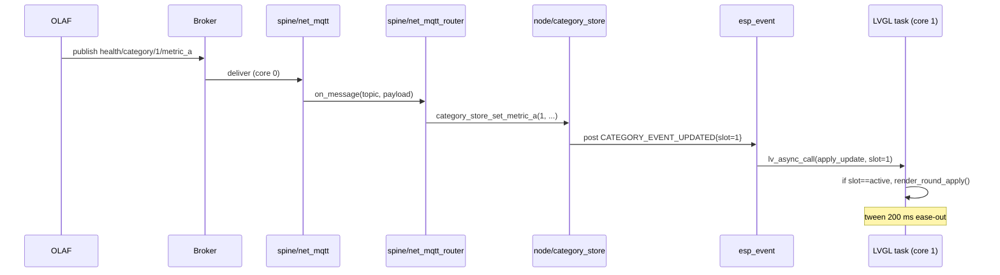
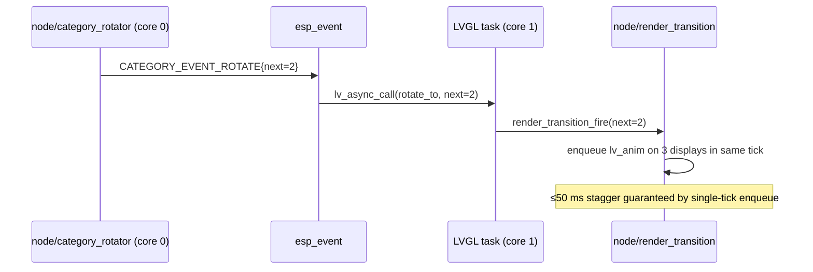
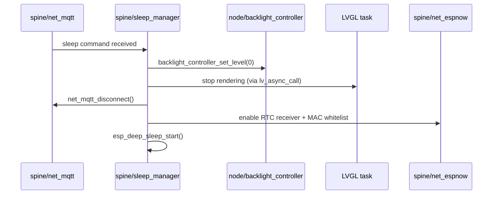
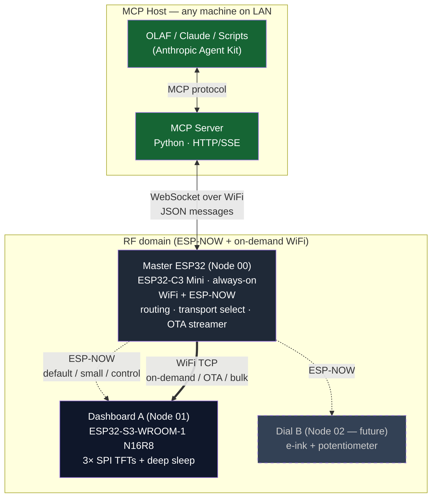
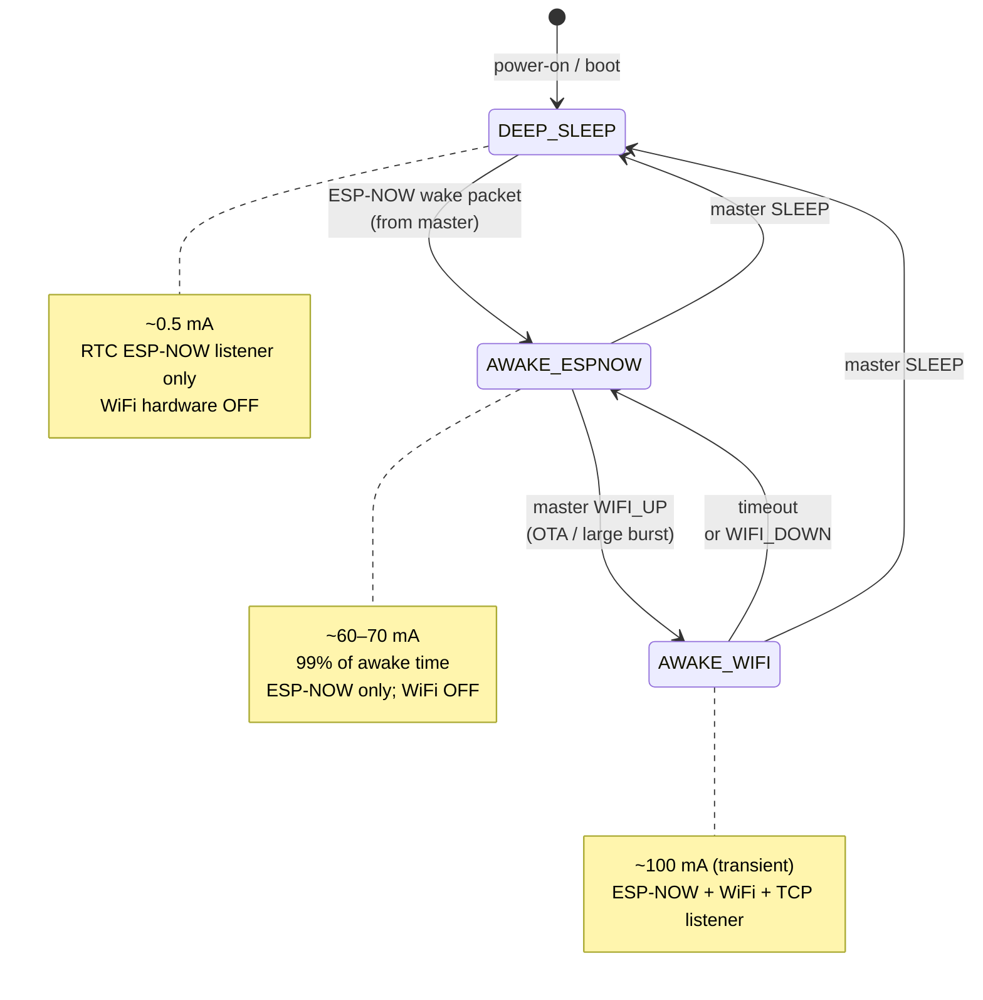
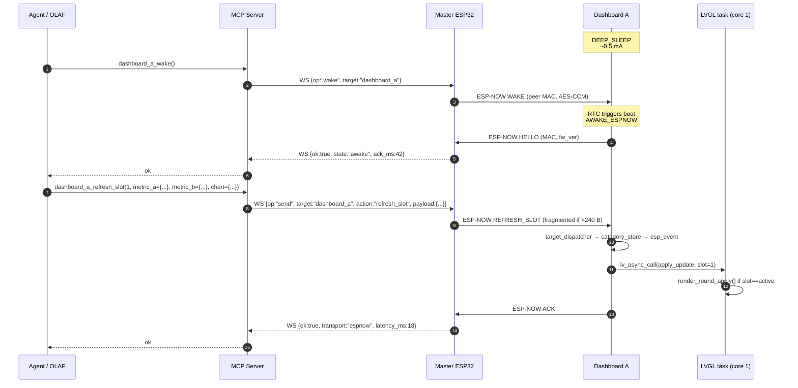
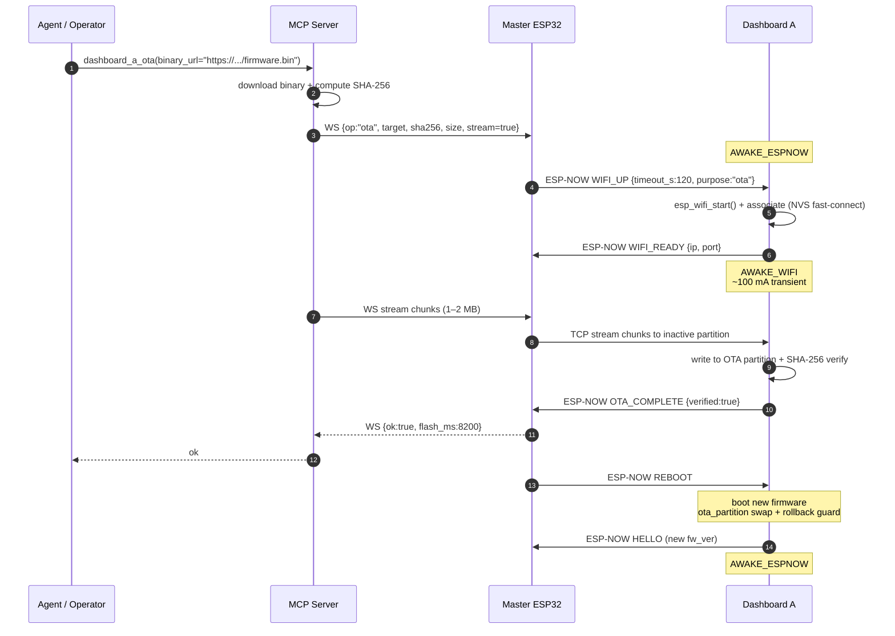
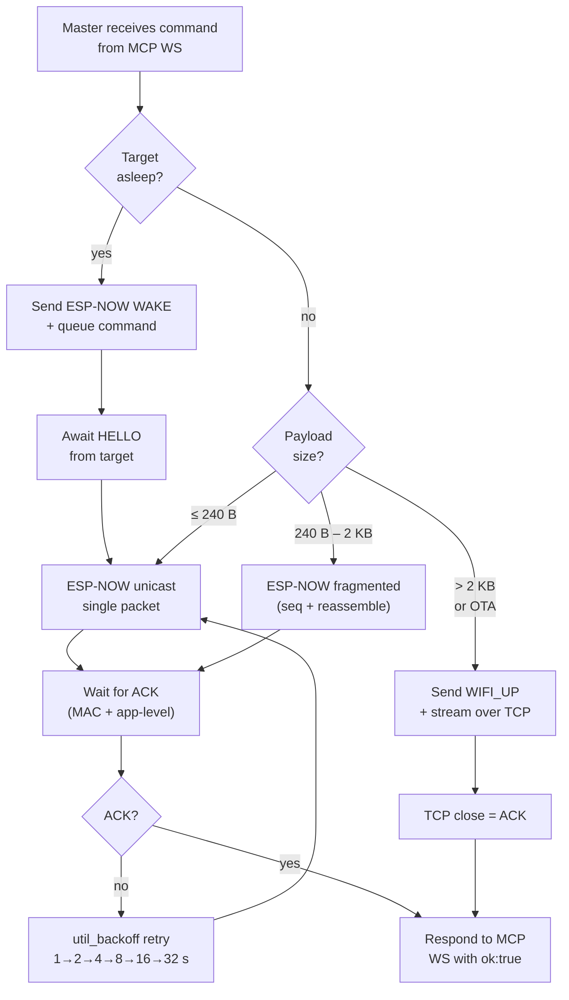

# Architecture Decision Document

_This document builds collaboratively through step-by-step discovery. Sections are appended as we work through each architectural decision together._

## Project Context Analysis

### Requirements Overview

**Functional Requirements.** 41 FRs across 8 categories: content rendering (8), category management & rotation (8), dashboard configuration (3), state & power management (4), network & communication (6), degraded & recovery behaviour (5), firmware lifecycle (5), and observability (2). The FR structure maps cleanly to the module breakdown previewed in the PRD (Category Manager, Rotation Timer, Round Renderer, Chart Renderer, Transition Controller, Backlight Controller, Sleep Manager, MQTT/WiFi client, ESP-NOW receiver, LKG cache, OTA).

**Non-Functional Requirements.** ~35 NFRs spanning:

- **Performance** (6): glance time ≤2 s; wake-to-first-render ≤3 s; transition coordination ≤50 ms stagger; config directive responsiveness ≤500 ms; per-display redraw ≤100 ms; boot-to-first-render ≤5 s.
- **Reliability** (6): ≥99% uptime; automatic WiFi/MQTT recovery ≤60 s; degraded-state correctness with zero tolerance for blank or fabricated displays; no memory leaks over 7-day run; graceful OTA failure with rollback; payload robustness against malformed input.
- **Power** (6): ≤420 mA full bright; ~100 mA backlight-off idle; ≤0.5 mA deep sleep; thermal ceiling 60 °C; inrush within USB-C 2 A.
- **Security** (6): NVS credential storage; MQTT over TCP on LAN (TLS if broker ever routes externally); SHA-256 OTA verification; ESP-NOW MAC whitelist; no unauthenticated remote surfaces; secrets never logged.
- **Integration** (6): MQTT 3.1.1 broker-agnostic; forward-compat schema with leniency on unknown fields, missing fields, unknown enums; stand-in-publisher interchangeability.
- **Maintainability** (4): Kamal-in-6-months single-file chart-type addition; module boundaries match brief; zero category strings in firmware; spine modules extractable for Node 2.
- **Aesthetic** (4): typography, colour palette, ring geometry, motion timing — UX spec is canonical and binding on firmware.

### Scale & Complexity

- **Primary technical domain:** embedded IoT (ESP32-S3 firmware, 3× SPI displays, WiFi + ESP-NOW, MQTT client, OTA).
- **Complexity level:** Medium. Lean product scope, dense technical surface.
- **Estimated architectural modules:** ~12 (ESP-NOW RX, WiFi/MQTT client, MQTT router, LKG cache, category store, rotation timer, transition orchestrator, round renderer, chart renderer, backlight controller, sleep manager, OTA manager) plus cross-cutting support (theme/token module, logger, staleness monitor, payload validator).

### Technical Constraints & Dependencies

**Hardware envelope (locked).**
- ESP32-S3-WROOM-1 N16R8 — 16 MB flash, 8 MB OctalPSRAM, PCB-trace antenna
- 2× GC9A01 (240×240 round, SPI) + 1× ILI9341 (240×320, SPI, operated in portrait) on a shared SPI bus
- USB-C 5 V / 2 A always-on, existing 3D-printed plastic faceplate
- Plastic enclosure only (no metal) — preserves WiFi and ESP-NOW through the PCB antenna

**Platform posture (locked in architecture kickoff).**
- PlatformIO as the build system
- WiFi-only in field after first flash; serial is a one-shot factory channel
- Level-1 dynamic rendering (fixed compositions, data-driven content — chart type from the PRD semantic catalog: line / scatter / bar)

**External dependencies.**
- OLAF (Raspberry Pi 5 + Hailo + ROS2, separate project) publishes all data and directives over MQTT. OLAF is the sole controller.
- Home MQTT broker (assumed Mosquitto, colocated with OLAF).
- LVGL graphics library (committed in UX spec) — custom `olaf_dark` theme.
- Inter font family (SIL OFL, pre-rasterised into firmware via `lv_font_conv`).

**Non-functional hard gates.**
- Deep sleep ≤0.5 mA and wake-to-first-render ≤3 s are testable MVP exit gates — architecture must reach them, not approximate them.
- No fabricated data under any degraded condition. This is absolute.
- Zero category-specific strings in firmware (verified by grep at every commit).

### Cross-Cutting Concerns

Threads that are not owned by any single module but shape every decision:

1. **Dumb-renderer discipline.** Firmware holds no content-domain semantics. OLAF pushes values, status tokens, chart specs; firmware renders. Enforced by naming convention and grep-based review rule.
2. **Spine / Node-1 separation.** Platform modules (ESP-NOW, WiFi/MQTT, LKG cache, sleep manager, OTA) are isolated from form-factor modules (round renderer, chart renderer, rotation timer, faceplate layout). Enables copy-paste reuse into Node 2 without refactoring.
3. **Three degraded visual states.** Fresh-boot placeholder (grey, "—", "waiting for OLAF"), stale-cached (dim rings, visible timestamp), and live-current are three distinct states with explicit transition rules.
4. **Coordinated multi-display transitions.** Scheduler-level concern: single event triggers three simultaneous redraws across a shared SPI bus with ≤50 ms stagger and no tearing.
5. **Forward-compat payload parsing.** Unknown fields additive; missing required fields default to Unknown; unknown enum values default to safe rendering. Never crash, never mis-render.
6. **No-serial-in-field posture.** Provisioning, logging, diagnostics, OTA trigger, crash capture all flow over WiFi/MQTT. Amplifies OTA reliability requirement — no physical recovery path.
7. **Dual-radio management.** ESP-NOW RTC receiver during deep sleep; WiFi + ESP-NOW time-slice on the shared PCB antenna while awake; clean radio state handoff at every sleep/wake boundary.
8. **Memory stability.** 8 MB PSRAM relieves framebuffer pressure but does not guarantee leak-free operation over a 7-day run — heap monitoring and discipline are still required.
9. **OTA integrity.** Dual-partition A/B with rollback, SHA-256 verification, and a visually distinct "updating" state. The no-serial posture promotes this from nice-to-have to must-work.
10. **Aesthetic invariants as architecture.** Theme and token layer must mechanically enforce the UX spec's hex palette, ring geometry, typography, and motion timings — not rely on developer discipline.

## Starter Template Evaluation

### Primary Technology Domain

Embedded IoT on ESP32-S3 with multi-display SPI rendering, WiFi/MQTT connectivity, ESP-NOW wake, and OTA firmware distribution. No equivalent of a "create-app" CLI exists for this domain — the "starter" is a composed PlatformIO project scaffold with pinned framework, graphics library, and display driver components.

### Starter Options Considered

| Option | Summary | Decision |
|---|---|---|
| A — PlatformIO + Arduino + LovyanGFX + LVGL-Arduino | Easy on-ramp, big community, but obscures IDF power/radio/OTA APIs critical to this project's NFRs | Rejected |
| B — PlatformIO + ESP-IDF 5.5 + esp_lcd + esp_lvgl_port + LVGL 9.5 | Native APIs for every cross-cutting concern (sleep, OTA, ESP-NOW, crash dump, component manager) | **Selected** |
| C — PlatformIO + Arduino-as-IDF-component (hybrid) | Unnecessary complexity; no Arduino-only dependency we need | Rejected |
| D — SquareLine Studio export | Generates widget code that bypasses the token-first `olaf_dark` theme architecture | Rejected |

### Selected Starter: PlatformIO + ESP-IDF 5.5 + LVGL 9.5 Composed Stack

**Rationale for Selection**

This project has a dense technical surface (coordinated tri-display rendering on a shared SPI bus, dual-radio with ≤0.5 mA deep-sleep RTC ESP-NOW receiver, OTA with rollback, no-serial-in-field logging/diag). Every one of these benefits from ESP-IDF's native APIs and Espressif-blessed components. Arduino's abstraction layer would add friction at each of these boundaries without adding value.

ESP-IDF 5.5.3 is the current stable version shipped by PlatformIO's `platform-espressif32`. ESP-IDF 6.0 (released March 2026) is too new to rely on through PlatformIO and brings no feature we need for this MVP.

**Initialization Approach**

Custom PlatformIO scaffold (no CLI generator — defined directly as `platformio.ini` + `idf_component.yml` + `partitions.csv`). The following stanza is the committed starting configuration:

```ini
; platformio.ini (committed scaffold)
[env:olaf_healthdash_node1]
platform = espressif32
framework = espidf
board = esp32-s3-devkitc-1

; ESP32-S3-WROOM-1 N16R8 (16 MB flash + 8 MB OctalPSRAM)
board_build.flash_size = 16MB
board_build.flash_mode = qio
board_build.psram_type = opi
board_build.arduino.memory_type = qio_opi
board_build.partitions = partitions.csv
board_upload.flash_size = 16MB
board_upload.maximum_size = 16777216
board_upload.maximum_ram_size = 524288

monitor_speed = 115200
upload_speed = 921600

build_flags =
  -DBOARD_HAS_PSRAM
  -DCONFIG_SPIRAM_MODE_OCT=1
  -DCONFIG_SPIRAM_USE=1

; Components are declared in idf_component.yml (managed by component manager)
```

**Component dependencies** (declared in `main/idf_component.yml`):

```yaml
dependencies:
  lvgl/lvgl: "~9.5.0"
  espressif/esp_lvgl_port: "*"
  espressif/esp_lcd_gc9a01: "*"
  espressif/esp_lcd_ili9341: "*"
  idf: ">=5.5.0"
```

**Partition table** (committed to `partitions.csv`):

```
# Name,    Type, SubType, Offset,   Size,     Flags
nvs,       data, nvs,     0x9000,   0x6000,
phy_init,  data, phy,     0xf000,   0x1000,
otadata,   data, ota,     0x10000,  0x2000,
app0,      app,  ota_0,   0x20000,  0x400000,
app1,      app,  ota_1,   0x420000, 0x400000,
coredump,  data, coredump,0x820000, 0x10000,
spiffs,    data, spiffs,  0x830000, 0x7D0000,
```

Two 4 MB app partitions for OTA A/B, 1 MB for core dump, rest for SPIFFS (pre-rasterised Inter fonts, LVGL assets, diagnostics log ring buffer).

### Architectural Decisions Provided by This Scaffold

**Language & Runtime**
- Primary: C (ESP-IDF native). C++ permitted for LVGL bindings and specific modules where it improves clarity.
- C++ standard: C++17.
- FreeRTOS as the task runtime (built into ESP-IDF).

**Graphics Stack**
- LVGL 9.5 via `espressif/esp_lvgl_port` — multi-display registration, PSRAM buffer allocation, tearing avoidance, task pinning.
- `esp_lcd` SPI bus abstraction with DMA transfers.
- `esp_lcd_gc9a01` (rounds) and `esp_lcd_ili9341` (rect, 90° portrait) as panel drivers. Shared `esp_lcd_panel_handle_t` interface — three display handles registered to one shared SPI bus, with per-display CS/DC/RST.

**Build Tooling**
- PlatformIO as the build driver (invokes ESP-IDF under the hood).
- Component manager handles all Espressif/third-party components.
- Ninja + cmake via ESP-IDF's build system.

**Testing Framework**
- Unity (bundled with ESP-IDF) for unit tests runnable on-device or via QEMU. Rendering and hardware-integration tests exercised on-device only.

**Code Organization**
- `main/` — app entry point.
- `components/` — custom components following spine/node-1 separation (see cross-cutting concern #2). Each module is a directory with its own `CMakeLists.txt` and `idf_component.yml`.
- `partitions.csv`, `sdkconfig.defaults` at project root.
- `assets/fonts/` — pre-rasterised Inter binaries committed to the repo and compiled into firmware.

**Development Experience**
- Serial monitor via `pio device monitor` during factory flash only.
- After first flash, all diagnostics flow over MQTT.
- `pio run -t menuconfig` for ESP-IDF sdkconfig adjustments when needed.
- OTA upload path post-MVP: `pio run -t upload --upload-port <node-ip>` or MQTT-directed.

**Note:** Project initialization using this scaffold should be the first implementation story in the backlog.

## Core Architectural Decisions

### Decision Priority Analysis

**Critical Decisions (Block Implementation):**
- Framebuffer strategy and SPI bus configuration
- MQTT client library, topic dispatch, QoS/retain policy
- LVGL task model and core pinning
- OTA download + verification mechanism
- NVS schema for factory provisioning
- Node ID derivation

**Important Decisions (Shape Architecture):**
- JSON library choice
- Theme and token layer structure
- Animation coordination approach
- Diagnostics and crash-capture flow
- Log topic schema

**Deferred Decisions (Post-MVP or Tunable at Runtime):**
- Staleness thresholds (ring-dim and Unknown-demote) — module implemented, thresholds tunable by OLAF via `health/staleness_threshold`; no fixed values committed in architecture
- TLS MQTT transport — compiled in, enabled only if NVS config specifies `mqtts://` broker
- NVS encryption + secure boot v2 — deferred to Growth
- RSA/ECDSA OTA signing — deferred to Growth (SHA-256 for MVP)

### Data Architecture (Memory & Storage)

| Decision | Choice | Rationale |
|---|---|---|
| Framebuffer | Full-screen double-buffer in PSRAM per display (2× buffers × 3 displays × 16-bit) | ~1.8 MB total — trivial in 8 MB PSRAM; eliminates tearing; frees internal SRAM for network stacks |
| SPI DMA transfer buffer | ~4 KB ping-pong in internal SRAM per display | DMA sources must live in internal SRAM; small buffer sufficient for tile-stream output |
| LKG cache | RAM-only — never persisted to flash | Avoids flash-wear death; OLAF re-pushes on wake; matches PRD |
| NVS schema (factory-written, read-only in field) | `wifi/ssid`, `wifi/pwd`, `mqtt/host`, `mqtt/port`, `olaf/mac` | Anonymous MQTT on LAN; no credentials stored; `mqtt/user`/`mqtt/pwd` keys available but unpopulated |
| SPIFFS contents | Pre-rasterised Inter fonts, LVGL binary assets, diagnostics log ring buffer | Keeps app partitions under 4 MB with headroom; fonts swappable without rebuilding app |
| Inter font set | Pre-rasterised at 56, 44, 36, 22, 14, 12, 10 px via `lv_font_conv` | Matches UX spec type scale; set is frozen — adding a size requires OTA |

### Authentication & Security

| Decision | Choice | Rationale |
|---|---|---|
| MQTT broker auth | **Anonymous** (no username/password) | Single-household trusted LAN; matches broker topology |
| MQTT transport | Plain TCP on LAN; TLS support compiled in, activated only if NVS broker URL specifies `mqtts://` | Future-proof for broker ever going external without MVP cost |
| ESP-NOW wake authenticity | MAC whitelist only (OLAF's MAC pre-programmed); payload unencrypted | Single packet, no content, single-home — encryption cost exceeds threat model |
| NVS encryption | Disabled for MVP (deferred to Growth) | Physical access implies trust; flash encryption + secure boot v2 is a one-way door worth doing deliberately |
| OTA binary verification | SHA-256 hash vs OLAF-supplied expected value; mismatch aborts flash | PRD NFR-S3 |
| OTA code signing (RSA/ECDSA) | Deferred to Growth | Hash-only verification is sufficient for single-home MVP |
| Secret redaction in logs | `LOG_SAFE()` macro wraps all publish calls; strips known secret keys before emit | Mechanical NFR-S6 enforcement, not convention |
| No unauthenticated remote surfaces | No TCP listener, no HTTP server, no telnet in production build | NFR-S5 |

### API & Communication (MQTT Contract)

| Decision | Choice | Rationale |
|---|---|---|
| MQTT client library | `esp_mqtt_client` (ESP-IDF built-in) | 3.1.1 compliant, async event model, built-in reconnection and LWT |
| JSON parser | cJSON (bundled with ESP-IDF) | Small footprint; handles forward-compat leniency (unknown-field ignore, missing-field default) cleanly |
| QoS policy | QoS 1 for state topics (category metric_a/b/chart, rotation config); QoS 0 for ephemeral (`health/brightness`, `health/pause_category`) | Matches PRD recommendation; broker queue pressure stays low |
| Retain policy | OLAF retains state topics; node retains its own `health/node/{id}/status` (LWT), `fw_version`, `diag` | Guarantees fresh-booted node renders within one subscription cycle |
| Node ID | `health_<MAC suffix 6 hex lowercase>`, derived at boot via `esp_read_mac(ESP_MAC_WIFI_STA, ...)` | Deterministic, zero-configuration, matches PRD recommendation |
| LWT | Topic `health/node/{id}/status`, payload `"offline"`, retain=true, QoS 1; node publishes `"online"` after successful subscribe | Broker-side node-liveness signal without polling |
| Topic dispatch | Compile-time-hashed prefix dispatch (FNV-1a); `strcmp` only for suffix disambiguation | Predictable per-message CPU cost |
| Subscribe pattern | `health/#` (single wildcard) | Covers current schema and all future subtopics without re-subscription |
| Malformed payload policy | Log at WARN, drop payload, preserve existing LKG for that topic | NFR-R6 + NFR-I3 |
| Reconnection backoff | Exponential 1 → 2 → 4 → 8 → 16 → 32 s (cap), retry forever, no give-up | First-pass target for NFR-R2 ≤60 s recovery |
| OTA trigger schema | `health/cmd` payload `{"op":"ota","url":"http://...","sha256":"..."}` | Single command topic keeps vocabulary small |
| `health/cmd` operations | `sleep` \| `ota` \| `diag` | Growth additions reuse this topic |

### Frontend Architecture (Rendering Stack)

| Decision | Choice | Rationale |
|---|---|---|
| LVGL task model | Single LVGL task pinned to core 1, serving all three `lv_disp_t` instances | `esp_lvgl_port` pattern; avoids cross-task sync for coordinated transitions |
| Core pinning | Core 0 = WiFi/MQTT/app logic; Core 1 = LVGL render | WiFi stack expects core 0; isolates rendering jitter |
| SPI host | `SPI2_HOST` (ESP32-S3's general-purpose SPI) | Dedicated bus, DMA capable |
| SPI clock | 40 MHz initial; bench-test ≥60 MHz inside the closed enclosure; push higher only on RF-clean + transition-stagger verification | Meets NFR-P5 with margin at 40 MHz; headroom available |
| SPI bus sharing | One bus, three `esp_lcd_panel_handle_t`, per-panel CS/DC/RST GPIOs; `esp_lcd` queues transactions sequentially | Matches PRD wiring; DMA pipelines per-panel writes |
| Theme | Single `olaf_dark` theme registered to `lv_theme_default_init()`; applied to all three displays | UX spec commitment; mechanically enforces NFR-U1–U4 |
| Token layer | `olaf_tokens.h` header: hex palette, font sizes, ring geometry, motion durations; referenced by all compositions | Single source of truth; drift-proof |
| Widget compositions | C structs `round_composition_t` + `rect_composition_t`, populated by category data via setters; no category knowledge inside | Enforces dumb-renderer boundary (NFR-M3) |
| Animation coordination | `TransitionOrchestrator::fire(target_category)` enqueues `lv_anim_t` for all three displays in a single LVGL task tick | Guarantees ≤50 ms stagger (NFR-P3) — animations are enqueued in the same tick, starting synchronously |
| Chart widget | `lv_chart` themed with no gridlines, no axis ticks, single-series stroke in category accent | Matches UX spec ChartCanvas |
| Staleness monitor | Dedicated module in the MQTT task; on threshold cross, publishes internal event consumed by renderer; thresholds OLAF-tunable via `health/staleness_threshold` | Renderer stays dumb; threshold values deferred |

### Infrastructure & Deployment

| Decision | Choice | Rationale |
|---|---|---|
| MQTT broker | Mosquitto on Pi hosting OLAF (anonymous, LAN-only) | PRD assumption; no separate infra |
| OTA binary hosting | HTTP server on OLAF's Pi (or Nginx on home LAN) | Single-home, no CDN |
| OTA download | `esp_https_ota` (built into ESP-IDF) with configurable URL | Handles dual-partition write + rollback natively |
| Firmware version | Semver `MAJOR.MINOR.PATCH` from CMake `PROJECT_VER`; published on boot to `health/node/{id}/fw_version` retained | PRD FR41 |
| Log topic schema | `health/node/{id}/log`; lines JSON `{"lvl":"WARN","t":<ms>,"tag":"wifi","msg":"..."}`; default emit ERR+WARN only | Minimises broker noise; INFO on demand |
| Diagnostics topic | `health/node/{id}/diag`, retained JSON snapshot — IP, RSSI, heap free, PSRAM free, uptime, build version, last reset reason | Cadence: every 5 min + on-demand via `health/cmd: "diag"` |
| Crash capture flow | ESP-IDF `esp_core_dump` → flash partition → on next boot: base64-encode, publish retained to `health/node/{id}/coredump`, then clear partition | No-serial rescue mechanism |
| Factory flash procedure | Single Makefile target `make factory-flash`: full erase + flash + NVS partition pre-write from `factory/credentials.env` (gitignored) | One-shot, reproducible, no hand-edit |
| Monitoring for Kamal | Subscribes to `health/node/+/log`, `health/node/+/diag`, `health/node/+/status`, `health/node/+/coredump` with any MQTT client | Single pane of glass via any MQTT explorer |

### Decision Impact Analysis

**Implementation Sequence (ordered by dependency):**

1. PlatformIO scaffold + partition table + NVS factory-flash procedure (unblocks everything on-device)
2. SPI bus + `esp_lcd` panel drivers for all three displays (hardware verification — proves wiring + enclosure RF)
3. LVGL + `esp_lvgl_port` registration + `olaf_dark` theme + token header (unblocks all rendering work)
4. Round and Rectangle compositions (hardcoded data) — visual verification against UX spec
5. WiFi/MQTT client + topic dispatch + LKG cache (unblocks OLAF integration)
6. Category store, rotation timer, transition orchestrator (behavioural verification)
7. Sleep manager + ESP-NOW RTC receiver (power-budget verification)
8. OTA pipeline end-to-end (must land before wall install — NFR-R5)
9. Log + diagnostics + coredump MQTT flows (observability before wall install)

**Cross-Component Dependencies:**

- **LVGL task ↔ MQTT task** communicate via LVGL's `lv_async_call()` (cross-thread safe) — no shared state outside LVGL's object pool.
- **Category store ↔ Renderers** decouple via pull-model: orchestrator reads from store, binds to widget; store itself has no renderer references.
- **Sleep manager ↔ everything** — sleep manager is the choreographer of teardown order: backlight → LVGL stop → MQTT disconnect → WiFi off → ESP-NOW RTC active → `esp_deep_sleep_start()`. No module shuts itself down; sleep manager directs each.
- **Theme tokens ↔ all compositions** — one-way dependency, compositions reference tokens; tokens reference nothing.

## Implementation Patterns & Consistency Rules

### Conflict Points Identified

Twelve drift surfaces where independent AI agents (or future-Kamal) could make different choices that would compound into an inconsistent codebase:

1. Module and file naming
2. C/C++ symbol conventions (functions, types, constants, macros)
3. ESP-IDF component layout inside `components/`
4. MQTT topic string formation
5. JSON payload key conventions (inbound and outbound)
6. Error return convention
7. Heap allocation policy (internal SRAM vs PSRAM vs DMA-capable)
8. Logging macros and TAG conventions
9. LVGL cross-thread safety pattern
10. Resource lifecycle (init/deinit pairing)
11. Retry and backoff implementation
12. Task creation and core pinning

### Naming Patterns

**Modules (one per ESP-IDF component in `components/`)**

Spine modules — named by *capability*, not domain:

- `net_wifi`, `net_mqtt`, `net_espnow`
- `store_lkg`
- `ota_manager`, `sleep_manager`, `diag_manager`
- `util_backoff`, `util_json`

Node-1 form-factor modules:

- `ui_theme`, `ui_tokens` (canonical palette, fonts, geometry)
- `ui_composition_round`, `ui_composition_rect`
- `render_round`, `render_chart`, `render_transition`
- `category_store`, `category_rotator`, `backlight_controller`

Names contain no category strings (glucose, weight, cycling, fasting). Grep-enforced at every commit (NFR-M3).

**Files**

- One module per directory.
- Public API in `include/<module>.h`.
- Private impl in `<module>.c`.
- Optional `<module>_priv.h` for module-internal types.
- Unity tests in `test/test_<module>.c`.
- Header guards use `#pragma once` throughout (no include-guard macros).

**C symbols**

- Functions: `<module>_<verb>[_<object>]` — `mqtt_publish_diag()`, `render_round_set_status()`, `store_lkg_get_category()`. No camelCase.
- Types: `<module>_<name>_t` — `mqtt_event_t`, `category_payload_t`.
- Enums: `<MODULE>_<NAME>_<VARIANT>` — `CATEGORY_STATUS_GOOD`, `MQTT_EVENT_CONNECTED`. Never `StatusOK` or `kGood`.
- Constants and macros: `<MODULE>_<NAME>` — `NET_WIFI_RETRY_MAX`.
- Design tokens: all tokens from `ui_tokens.h` use prefix `UI_TOKEN_*` — `UI_TOKEN_COLOR_STATUS_GOOD`, `UI_TOKEN_RING_RADIUS_OUTER`.
- Private (module-local) functions: prefix `s_` (static) — `s_parse_payload()`.

**MQTT topics**

- Lowercase, slash-separated, no abbreviation.
- Exactly as PRD schema defines — no variants, no versions.
- Per-node topics use `health/node/{id}/<suffix>` — node ID format `health_<6 hex lowercase>`.

### Structure Patterns

**Repository layout**

Authoritative repo tree is in §Project Structure & Boundaries below. The platform is a multi-node monorepo with `spine/` (shared ESP-IDF components) + `nodes/` (per-node firmware and hardware) + `docs/` (platform-wide docs). This section defines only the *canonical component layout* that applies inside every component directory — whether in `spine/components/` or in a node's `firmware/components/`.

**Component layout (canonical)**

```
components/<module>/
├── CMakeLists.txt
├── idf_component.yml          # only if external deps
├── include/
│   └── <module>.h             # public API
├── <module>.c                 # impl
├── <module>_priv.h            # optional
└── test/
    └── test_<module>.c
```

**Dependency rules**

- Spine modules (`net_*`, `store_*`, `ota_*`, `sleep_*`, `diag_*`, `util_*`) MUST NOT depend on form-factor modules (`ui_*`, `render_*`, `category_*`, `backlight_*`). Enforced via CMake `REQUIRES` review.
- No circular dependencies.
- Form-factor modules may depend on spine, never the other direction.

### Format Patterns

**JSON payload conventions**

- Key naming: `snake_case` throughout (matches PRD examples).
- Inbound keys from OLAF parsed via cJSON with leniency (see Process Patterns → Forward-Compat Parsing).
- Outbound keys (node → OLAF) identical style.
- Timestamps outbound: field `t` is `uint64_t` uptime milliseconds.
- Timestamps inbound: string, human-formatted by OLAF (node never parses).

**Status tokens**

Exactly these four strings, lowercase, no variants: `"good"` | `"warn"` | `"bad"` | `"unknown"`.

Never `"warning"`, `"ok"`, `"danger"`, `"nodata"`. Firmware rejects unknown values by rendering as `"unknown"` (NFR-I3).

**Chart type tokens**

Exactly these three strings, lowercase, no variants: `"line"` | `"scatter"` | `"bar"`.

Unknown chart type renders the chart canvas as a "waiting for OLAF" placeholder, not a crash.

**Colour literals**

Always 6-digit hex with hash: `"#30D158"`. Shorthand (`"#3D5"`), rgb triples, and named colours are forbidden.

**Error return convention**

- Every function that can fail returns `esp_err_t`.
- `ESP_OK` on success; standard `ESP_ERR_*` values where applicable; module-specific errors declared via `ESP_ERR_<MODULE>_BASE` offset in `<module>.h`.
- `ESP_ERROR_CHECK()` permitted only at init-time where failure is fatal.
- All other call sites propagate or handle.
- Never return `void` from a function that has any failure path.
- Never silently swallow an error — log at minimum WARN and propagate.

### Communication Patterns

**Internal inter-module events**

- One-to-many: ESP-IDF `esp_event` loop — typed event base + event ID per module. E.g., `CATEGORY_EVENT_UPDATED`, `MQTT_EVENT_CONNECTED`.
- One-to-one: FreeRTOS queue. Declared at receiver; sender holds handle via init.
- Never use global mutable state for cross-module communication.

**LVGL thread safety**

- LVGL calls are made **only** from the LVGL task (pinned to core 1).
- Other tasks (MQTT, WiFi, sleep manager) schedule UI updates via `lv_async_call(fn, user_data)`.
- No locks on LVGL primitives — the async-call pattern serialises writes.
- Every module header documents its thread-safety contract in a comment block at the top: "Thread-safe: yes" or "Thread-safe: no — caller must invoke from LVGL task only".

**Logging**

- `ESP_LOGx()` family (ESP-IDF) with per-module `static const char *TAG`.
- Levels used: `ESP_LOGE` (error), `ESP_LOGW` (warn), `ESP_LOGI` (info), `ESP_LOGD` (debug). `ESP_LOGV` forbidden.
- Production build emits ERR + WARN to MQTT via `diag_manager`; INFO + DEBUG are compile-time-gated.
- All log lines describing credentials or payloads containing secrets go through `LOG_SAFE()` macro which strips known secret keys (`wifi_pwd`, `mqtt_pwd`, `auth_*`).

**MQTT outbound payload formation**

- Built exclusively via `util_json` helpers (thin cJSON wrappers) — no string concatenation of JSON.
- Every outbound topic declared in one header (`net_mqtt_topics.h`); string literals of topic names not permitted elsewhere.

### Process Patterns

**Forward-compat JSON parsing**

Every payload parser follows this pattern (enforced by code review):

1. Unknown top-level keys: **ignore** silently.
2. Missing required key: log WARN, render affected element as Unknown (grey ring / placeholder), preserve existing LKG if present.
3. Unknown enum value (status, chart_type): render as safe default (Unknown status / waiting-for-OLAF placeholder).
4. Malformed JSON: log WARN, drop payload, preserve existing LKG.
5. Parser never crashes; never throws abort.

**Resource lifecycle**

- Every `<module>_init()` has a matching `<module>_deinit()`.
- Every `<module>_create_foo()` has a matching `<module>_destroy_foo()`.
- `sleep_manager` invokes deinit in reverse order of init. No module shuts itself down autonomously; sleep manager directs teardown.

**Heap allocation**

- `malloc()`, `calloc()`, `realloc()`, `free()` — **forbidden** direct use. Enforced by CI grep.
- Use `heap_caps_malloc(size, caps)` with explicit capability flags:
  - Framebuffers, LVGL object pool: `MALLOC_CAP_SPIRAM`
  - DMA transfer buffers: `MALLOC_CAP_INTERNAL | MALLOC_CAP_DMA`
  - Small per-module state: `MALLOC_CAP_DEFAULT` (internal SRAM)
- Every heap allocation has a documented lifetime and owner.
- Static allocation preferred where size is known at compile time.

**Task creation**

- `xTaskCreatePinnedToCore()` only — never `xTaskCreate()` (unpinned).
- Core 0: WiFi, MQTT, application logic, sleep manager, diag manager.
- Core 1: LVGL render task (single task serving all three displays).
- Task stack sizes explicit, not defaulted.
- Task names follow `<module>_task` convention.

**Retry and backoff**

- All retryable operations use `util_backoff` helper.
- Exponential 1 → 2 → 4 → 8 → 16 → 32 s cap, with 10% jitter.
- Retry forever; no give-up threshold (matches offline-contract stance).

### Enforcement Guidelines

**All contributors (human and AI) MUST:**

- Run `scripts/lint-no-domain-strings.sh` before commit — zero matches for category-specific strings outside `test/` and `docs/`.
- Run `pio run -t check` (cppcheck) — no new warnings.
- Run `clang-format` — repo `.clang-format` governs.
- Maintain `include/` public-API hygiene — no leaking private types.
- Declare thread-safety contract in every public header.

**CI/review gates:**

| Check | Tool | Failure |
|---|---|---|
| Zero domain strings in firmware | grep script | block merge |
| No bare `malloc`/`printf`/`fprintf` | grep script | block merge |
| clang-format clean | clang-format --dry-run | block merge |
| cppcheck warnings | `pio check` | block merge |
| Build clean | `pio run` | block merge |
| Binary size headroom | custom size check | warn at >3.5 MB per partition |

**Pattern update process:**

A pattern change is an architecture change. Update `architecture.md` first, then propagate to code. Do not invert this order.

### Pattern Examples

**Good — forward-compat parsing**

```c
esp_err_t category_payload_parse(cJSON *root, category_payload_t *out) {
    cJSON *value_node = cJSON_GetObjectItem(root, "value");
    if (!cJSON_IsString(value_node)) {
        ESP_LOGW(TAG, "payload missing 'value' field");
        out->status = CATEGORY_STATUS_UNKNOWN;
        return ESP_ERR_INVALID_ARG;  // caller preserves LKG
    }
    strlcpy(out->value, value_node->valuestring, sizeof(out->value));

    cJSON *status_node = cJSON_GetObjectItem(root, "status");
    out->status = parse_status_token(status_node);  // defaults to UNKNOWN

    // Unknown top-level keys — ignored silently (forward-compat).
    return ESP_OK;
}
```

**Anti-pattern — hardcoded domain knowledge**

```c
// NEVER — firmware has no business knowing what "glucose" means
if (strcmp(category->label, "Glucose") == 0) {
    threshold_good_max = 7.0;
}
```

**Good — LVGL cross-thread update**

```c
// Called from MQTT task
static void s_apply_brightness_ui(void *param) {
    uint8_t *level = (uint8_t *)param;
    backlight_controller_set_level(*level);
    free(level);
}

void on_brightness_payload(uint8_t level) {
    uint8_t *heap_level = heap_caps_malloc(1, MALLOC_CAP_DEFAULT);
    *heap_level = level;
    lv_async_call(s_apply_brightness_ui, heap_level);  // serialised to LVGL task
}
```

**Anti-pattern — direct LVGL call from wrong task**

```c
// NEVER — mqtt task calling LVGL directly = race, crash, tearing
void on_brightness_payload(uint8_t level) {
    lv_obj_set_style_bg_opa(backlight_obj, level, 0);
}
```

## Project Structure & Boundaries

### Repo Shape — One Spine, Many Forms

The repository is a **multi-node monorepo** expressing the PRD's platform thesis in directory shape:

- `spine/` — code, assets, and scripts shared across every node
- `nodes/` — one folder per node, each self-contained (firmware + hardware + factory provisioning)
- `docs/` — platform-wide documentation that applies to all nodes

Looking at the repo root tells you immediately: this is a platform, Node 1 lives there, future nodes go here, shared code lives there.

### Complete Project Directory Structure

```
olaf_external_support/
│
├── README.md                             # Platform overview + node index
│
├── spine/                                # "One spine" — shared across all nodes
│   ├── README.md                         # What lives in spine and why
│   ├── components/                       # EXTRA_COMPONENT_DIRS target for all nodes
│   │   ├── net_wifi/
│   │   ├── net_mqtt/
│   │   ├── net_espnow/
│   │   ├── store_lkg/
│   │   ├── ota_manager/
│   │   ├── sleep_manager/
│   │   ├── diag_manager/
│   │   ├── util_backoff/
│   │   └── util_json/
│   ├── assets/
│   │   └── fonts/                        # Inter binaries at 56, 44, 36, 22, 14, 12, 10 px
│   └── scripts/
│       ├── factory-flash.sh
│       ├── lint-no-domain-strings.sh
│       ├── lint-no-bare-malloc.sh
│       └── gen-nvs-partition.py
│
├── nodes/                                # "Many forms" — one folder per node
│   ├── README.md                         # Node index + status of each
│   │
│   └── node-01-health-dashboard/         # Current build — ESP32-S3 + 3 SPI displays
│       ├── README.md                     # What this node is + build/flash/install
│       │
│       ├── firmware/
│       │   ├── platformio.ini            # References spine via EXTRA_COMPONENT_DIRS
│       │   ├── partitions.csv
│       │   ├── sdkconfig.defaults
│       │   ├── .clang-format             # (symlink to repo root)
│       │   ├── main/
│       │   │   ├── CMakeLists.txt
│       │   │   ├── idf_component.yml
│       │   │   ├── main.c                # init order + watchdog loop
│       │   │   └── app_init.h
│       │   └── components/               # NODE-1 ONLY form-factor modules
│       │       ├── ui_tokens/
│       │       ├── ui_theme/
│       │       ├── ui_composition_round/
│       │       ├── ui_composition_rect/
│       │       ├── render_round/
│       │       ├── render_chart/
│       │       ├── render_transition/
│       │       ├── category_store/
│       │       ├── category_rotator/
│       │       └── backlight_controller/
│       │
│       ├── hardware/
│       │   ├── 3d-print/
│       │   │   ├── faceplate.stl
│       │   │   ├── faceplate.step        # source if available
│       │   │   └── print-settings.md
│       │   ├── wiring/
│       │   │   ├── pinmap.md             # GPIO assignments (locked)
│       │   │   ├── schematic.pdf
│       │   │   └── assembly-photos/
│       │   ├── bom.md                    # bill of materials
│       │   └── assembly-guide.md         # step-by-step build
│       │
│       ├── assets/                       # node-specific assets (rare — empty for Node 1)
│       │
│       └── factory/
│           ├── credentials.env.example   # committed template
│           └── credentials.env           # gitignored — real values
│
├── docs/                                 # Platform-wide documentation
│   ├── README.md                         # Docs index
│   ├── architecture.md                   # This document — applies to all nodes
│   ├── mqtt-topic-schema.md              # Canonical MQTT contract
│   ├── platform-spine.md                 # Spine modules reference
│   └── how-to-add-a-node.md              # Onboarding guide for new nodes
│
├── .clang-format                         # C/C++ style — governs every node
├── .gitignore
│
└── .github/
    └── workflows/
        └── ci.yml                         # Per-node build matrix, lint, cppcheck
```

### How Nodes Reference Spine

Each node's `firmware/platformio.ini` adds the spine directory as an extra component source:

```ini
[env:node_01_health_dashboard]
platform = espressif32
framework = espidf
board = esp32-s3-devkitc-1
...
board_build.cmake_extra_args =
  -DEXTRA_COMPONENT_DIRS=../../../spine/components
```

Single source of truth for shared components — no copies, no submodules. When Node 2 is added, its own `platformio.ini` points at the same spine path from its own depth. A change to `spine/components/net_mqtt` is automatically picked up by every node on next build.

### Node Naming Convention

Pattern: **`node-NN-<slug>`** where `NN` is zero-padded creation order and `<slug>` is kebab-case descriptive.

- `node-01-health-dashboard` — first node, this PRD's target
- `node-02-eink-dial` — future: e-ink wall surface + potentiometer dial
- `node-03-presence-sensor` — future example
- `node-NN-<slug>` — never renumbered once assigned; `<slug>` may refine but number is permanent

Creation order plus self-descriptive name means the folder alone tells the story. `docs/how-to-add-a-node.md` formalises the onboarding checklist.

### Per-Node README Contract

Every `nodes/node-NN-<slug>/README.md` answers these four questions, in this order:

1. **What this node is** — archetype (info surface / sensor / controller / media), form factor, one-sentence purpose
2. **Status** — `in-design` | `in-build` | `live-on-wall` | `retired`
3. **How to build and flash** — exact commands; factory provisioning steps; OTA update path
4. **Where to find its hardware** — links into `hardware/3d-print/`, `hardware/wiring/`, `hardware/bom.md`

### Architectural Boundaries

**External API boundary — MQTT**

The only API any node exposes or consumes is MQTT. All inbound and outbound topics are declared in `spine/components/net_mqtt/include/net_mqtt_topics.h` as the single source of truth for every node. Direct string literals of topic names elsewhere in firmware are forbidden.

| Boundary | Direction | Protocol | Owned by |
|---|---|---|---|
| OLAF → Node — category content | inbound | MQTT (WiFi) | spine `net_mqtt` → routed into node's `category_store` |
| OLAF → Node — config directives | inbound | MQTT (WiFi) | spine `net_mqtt` → routed into node-local modules |
| OLAF → Node — wake | inbound | ESP-NOW | spine `net_espnow` |
| Node → OLAF — presence (LWT, fw_version) | outbound | MQTT (WiFi) | spine `net_mqtt` + `diag_manager` |
| Node → OLAF — diagnostics, logs, coredump | outbound | MQTT (WiFi) | spine `diag_manager` |
| Node → OTA server — firmware binary download | outbound | HTTP(S) | spine `ota_manager` |

**Internal boundaries**

- **Spine / form-factor separation** — enforced by directory placement (`spine/components/` vs `nodes/*/firmware/components/`) and by CMake `REQUIRES` review. Spine components have zero references to form-factor components. Node 2 reuses every spine component verbatim.
- **Event-loop boundary** — all one-to-many inter-module communication passes through the ESP-IDF default `esp_event` loop. Module-local state never exits the module except via event payloads or explicit accessor calls.
- **LVGL thread boundary** — every LVGL object is touched only from the LVGL task. Other tasks request changes via `lv_async_call()`.

### Functional Requirements to Module Mapping (Node 1)

| FR Range | Category | Spine or Node-1 | Primary Module(s) |
|---|---|---|---|
| FR1–FR8 | Content rendering | Node-1 | `render_round`, `render_chart`, `ui_composition_*`, `ui_theme`, `ui_tokens` |
| FR9–FR10 | Category slots (N-agnostic) | Node-1 | `category_store` |
| FR11–FR14 | Rotation + directives | Node-1 | `category_rotator` |
| FR15–FR16 | Coordinated transitions | Node-1 | `render_transition` |
| FR17–FR19 | Brightness + immediate apply | Node-1 | `backlight_controller`, `category_rotator` |
| FR20–FR23 | Sleep/wake state | **Spine** | `sleep_manager`, `net_espnow` |
| FR24–FR29 | Network | **Spine** | `net_wifi`, `net_mqtt`, `net_espnow` |
| FR30–FR34 | Degraded / recovery | Mixed | `store_lkg` (spine) + `render_*` (Node-1) |
| FR35 | Provisioning (factory) | **Spine tooling** | `scripts/factory-flash.sh`, `gen-nvs-partition.py` |
| FR36–FR39 | OTA lifecycle | **Spine** | `ota_manager` |
| FR40–FR41 | Observability | **Spine** | `diag_manager` |

Spine-owned capabilities are shared by every node. Node-1-owned capabilities are Node-1-specific form-factor work that won't reuse into other nodes without adaptation.

### MQTT Topic to Module Ownership

| Topic | Direction | Handler |
|---|---|---|
| `health/cmd` | inbound | spine `net_mqtt_router` → `sleep_manager` (sleep), `ota_manager` (ota), `diag_manager` (diag) |
| `health/brightness` | inbound | Node-1 `backlight_controller` |
| `health/rotation_interval` | inbound | Node-1 `category_rotator` |
| `health/category_order` | inbound | Node-1 `category_rotator` |
| `health/active_categories` | inbound | Node-1 `category_rotator` |
| `health/pause_category` | inbound | Node-1 `category_rotator` |
| `health/category/{n}/metric_a` | inbound | Node-1 `category_store` |
| `health/category/{n}/metric_b` | inbound | Node-1 `category_store` |
| `health/category/{n}/chart` | inbound | Node-1 `category_store` |
| `health/node/{id}/status` | outbound, retained | spine `net_mqtt` (LWT + connect) |
| `health/node/{id}/fw_version` | outbound, retained | spine `diag_manager` on boot |
| `health/node/{id}/diag` | outbound, retained | spine `diag_manager` every 5 min + on-demand |
| `health/node/{id}/log` | outbound | spine `diag_manager` (ERR+WARN default) |
| `health/node/{id}/coredump` | outbound, retained | spine `diag_manager` on next boot after crash |

Spine handlers are Node-agnostic; form-factor handlers are Node-1-specific. Future nodes replace only their form-factor handlers.

### Data Flow

**Inbound content flow (category payload):**



**Coordinated rotation:**



**Sleep choreography (spine-driven):**



**Wake choreography (spine-driven):**

```mermaid
sequenceDiagram
    participant RTC as RTC + ESP-NOW
    participant SM as spine/sleep_manager
    participant WIFI as spine/net_wifi
    participant MQTT as spine/net_mqtt
    participant LVGL as LVGL task
    participant O as OLAF

    RTC->>SM: ESP-NOW wake packet (whitelisted MAC)
    SM->>WIFI: net_wifi_connect()
    SM->>MQTT: net_mqtt_connect() + subscribe health/#
    MQTT->>O: subscription established; OLAF re-pushes retained state
    LVGL->>LVGL: render last-known-good from category_store
    Note over SM,LVGL: target wake-to-first-render ≤3 s (NFR-P2)
```

### File Organisation Patterns

- **Platform-wide configuration** at repo root (`.clang-format`, `.gitignore`, `.github/`).
- **Spine** in `spine/`: components, assets, scripts — nothing node-specific.
- **Per-node source** in `nodes/<node>/firmware/` following PlatformIO + ESP-IDF conventions.
- **Per-node hardware** in `nodes/<node>/hardware/` — 3D prints, wiring, BOM, assembly guide all live together.
- **Per-node provisioning** in `nodes/<node>/factory/` — credentials template committed, real values gitignored.
- **Tests** co-locate with the module under `components/<module>/test/`. No top-level test tree.
- **Docs** in `docs/` — architecture and MQTT schema are platform-wide; node specifics live in per-node `README.md`.

### Development Workflow Integration

- **Build a node:** `cd nodes/node-01-health-dashboard/firmware && pio run`
- **Factory flash:** `cd nodes/node-01-health-dashboard && ../../spine/scripts/factory-flash.sh` — full erase + flash + NVS write from `factory/credentials.env`. One-shot, reproducible.
- **OTA field update:** OLAF publishes `health/cmd: {"op":"ota", "url":..., "sha256":...}` → node pulls binary, verifies, flashes, reboots.
- **CI matrix:** `.github/workflows/ci.yml` iterates every `nodes/*/firmware/` and runs `pio run`, clang-format check, cppcheck, domain-string lint, bare-malloc lint. Failures block merge per-node.
- **Observability:** Kamal's MQTT client subscribes to `health/node/+/log`, `/diag`, `/status`, `/coredump` — one pane of glass across every node, current and future.

### Adding a New Node (Summary)

Full procedure in `docs/how-to-add-a-node.md`. High level:

1. Create `nodes/node-NN-<slug>/` with `README.md` stub answering the four contract questions
2. Create `firmware/platformio.ini` + `partitions.csv` + `main/main.c` + `components/` for form-factor modules; reference `../../../spine/components` via `EXTRA_COMPONENT_DIRS`
3. Create `hardware/` folders (3d-print, wiring, bom.md, assembly-guide.md) — empty is fine until design lands
4. Create `factory/credentials.env.example` (committed) and `.env` (gitignored)
5. Implement form-factor modules; inherit the spine untouched
6. Add node to CI matrix in `.github/workflows/ci.yml`
7. Update `nodes/README.md` index

The cost of adding a node is the form-factor work, not the spine.

## Architecture Validation Results

### Coherence Validation

**Decision compatibility.** All technology choices verified compatible via web search and Espressif documentation: PlatformIO + ESP-IDF 5.5.3 + LVGL 9.5.0 + `esp_lvgl_port` + `esp_lcd_gc9a01` + `esp_lcd_ili9341` all ship together in the current stable platform-espressif32 release. The ESP32-S3-WROOM-1 N16R8 module supports every required peripheral (dual-core Xtensa, 2.4 GHz WiFi, ESP-NOW, SPI DMA, OctalPSRAM, RTC domain for deep-sleep ESP-NOW).

**Pattern consistency.** Implementation patterns (no bare malloc, no direct serial logging, `esp_err_t` everywhere, LVGL cross-thread safety, forward-compat parsing) align with the decisions they support. No contradictions.

**Structure alignment.** Multi-node monorepo (`spine/` + `nodes/` + `docs/`) directly expresses NFR-M4 (spine extractable for Node 2) and the one-spine-many-forms thesis. Component boundaries (spine vs form-factor) are enforced by directory placement and CMake `REQUIRES` discipline.

### Requirements Coverage Validation

**Functional Requirements: 41/41 covered.**

All FR → module mappings are defined in §Project Structure & Boundaries. One ownership assignment was added during validation:

- **FR38 (visually distinct "updating" state during OTA)** → new Node-1 component **`render_lifecycle`**. Consumes `OTA_EVENT_STATE_CHANGED` from spine `ota_manager` and renders a centred overlay on the rect display. Added to the node directory tree:

```
nodes/node-01-health-dashboard/firmware/components/
└── render_lifecycle/           # FR38 — OTA "updating" state + any future lifecycle overlays
    ├── CMakeLists.txt
    ├── include/render_lifecycle.h
    └── render_lifecycle.c
```

**Non-Functional Requirements: all architecturally supported.**

- **Performance (NFR-P1–P6):** typography + PSRAM framebuffer + single-tick animation enqueue + SPI DMA. NFR-P3 (≤50 ms stagger) passes at 40 MHz SPI with tight margin; 60–80 MHz bench-test will increase margin. NFR-P6 (boot ≤5 s) requires WiFi fast-connect (NVS-cached BSSID + channel) — flagged as `net_wifi` init contract.
- **Reliability (NFR-R1–R6):** exponential backoff, dual-partition OTA, LKG cache, forward-compat parsing, heap-caps discipline — all addressed architecturally; 7-day leak validation and 99% uptime validation are runtime gates.
- **Power (NFR-Pw1–Pw6):** PWM backlight, `esp_sleep` deep-sleep with RTC ESP-NOW — the architecture reaches the numbers; actual measurements are bench-day work.
- **Security (NFR-S1–S6):** NVS credentials, optional TLS, SHA-256 OTA verification, MAC whitelist, no unauthenticated surfaces, `LOG_SAFE()` redaction. NVS encryption + RSA signing deferred to Growth (documented).
- **Integration (NFR-I1–I6):** broker-agnostic MQTT 3.1.1, forward-compat parsing with leniency rules, stand-in-publisher interchangeable.
- **Maintainability (NFR-M1–M4):** single-file chart-type addition via `render_chart` boundary; module boundaries directory-enforced; zero-domain-strings grep rule; spine extractability built into repo shape from day one.
- **Aesthetic (NFR-U1–U4):** `ui_tokens.h` + `ui_theme` olaf_dark mechanically enforce palette, geometry, typography, motion timings from the UX spec.

### Implementation Readiness Validation

**Decision completeness.** All critical decisions documented with pinned versions (ESP-IDF 5.5.3, LVGL 9.5.0, platform-espressif32 current stable). No unresolved blockers.

**Structure completeness.** Full directory tree defined from repo root down to per-component layout. Per-node README contract specifies the four required questions. How-to-add-a-node guide outlined.

**Pattern completeness.** Twelve drift surfaces identified and addressed with mechanical rules + enforcement scripts. Concrete good/anti-pattern code examples included.

### Gap Analysis Results

**Critical gaps (blocking): none.**

**Minor gaps (addressed inline or flagged for runtime verification):**

- FR38 updating-state rendering — **addressed**: new `render_lifecycle` component added.
- NFR-P3 SPI stagger margin at 40 MHz — **flagged for bench test**; SPI clock headroom available.
- NFR-P6 boot time — **addressed**: WiFi fast-connect required in `net_wifi` init contract.

**Operational dependencies (outside firmware scope):**

- **OTA server hosting** — belongs to OLAF operational setup. Documented as external dependency in `docs/ota-procedure.md`.
- **Stand-in MQTT publisher** — scaffolded in `docs/dev-tools/olaf-stub.md` + sample Python (~50 LOC). Enables hardware build day even if OLAF's publisher isn't ready.

**Deliverables outside the architecture document:**

- **GPIO pinmap** — locked on hardware build day, committed to `nodes/node-01-health-dashboard/hardware/wiring/pinmap.md`. Pre-first-flash gate.
- **3D print STL files** — committed to `hardware/3d-print/` (enclosure already exists per PRD; just add files to repo).
- **Bill of materials** — committed to `hardware/bom.md` at build time.

### Architecture Completeness Checklist

**Requirements Analysis**

- [x] Project context thoroughly analysed (41 FRs, ~35 NFRs, 6 journeys)
- [x] Scale and complexity assessed (Medium; embedded IoT)
- [x] Technical constraints identified (hardware envelope, no-serial posture, aesthetic invariants)
- [x] Cross-cutting concerns mapped (10 threads)

**Architectural Decisions**

- [x] Critical decisions documented with versions (ESP-IDF 5.5.3, LVGL 9.5.0)
- [x] Technology stack fully specified (PlatformIO + ESP-IDF + LVGL + esp_lcd + esp_lvgl_port)
- [x] Integration patterns defined (MQTT topic contract, forward-compat parsing, event-driven cross-module comms)
- [x] Performance considerations addressed (SPI clock, framebuffer strategy, single-tick animation enqueue)

**Implementation Patterns**

- [x] Naming conventions established (modules, symbols, files, topics)
- [x] Structure patterns defined (component layout, spine/form-factor split)
- [x] Communication patterns specified (`esp_event`, `lv_async_call`, `util_json`)
- [x] Process patterns documented (error return, resource lifecycle, heap caps, retry/backoff, task pinning)

**Project Structure**

- [x] Complete directory tree defined (spine + nodes + docs)
- [x] Component boundaries established (spine vs form-factor, directory-enforced)
- [x] Integration points mapped (external MQTT + ESP-NOW + HTTP; internal event loop + LVGL async)
- [x] Requirements-to-structure mapping complete (FR table + MQTT topic ownership table)

### Architecture Readiness Assessment

**Overall status:** READY FOR IMPLEMENTATION.

**Confidence level:** High. Every FR has a module; every NFR has an architectural mechanism. Minor gaps are either inline-resolved, runtime-verification items (which can't be architecturally closed — they're bench-day work), or clearly scoped deliverables (pinmap, STLs, BOM).

**Key strengths:**

- **Platform shape matches thesis.** `spine/` + `nodes/` directly expresses "one spine, many forms" at the repo level. Adding Node 2 is a form-factor exercise, not an architecture exercise.
- **Mechanical enforcement of invariants.** NFR-M3 (no domain strings), NFR-U1–U4 (aesthetic), heap caps, LVGL thread safety — all enforced by tooling or structure, not convention.
- **Dumb-renderer boundary is directory-visible.** Someone reading `spine/components/` and `nodes/*/firmware/components/` can see the separation without reading any code.
- **Forward-compat parsing pattern documented once, used everywhere.** NFR-I3 is a copy-paste parser template, not a per-payload design decision.
- **No-serial posture has a complete rescue story.** MQTT log + retained diag + coredump-on-next-boot + OTA with rollback — no physical recovery path, and no physical recovery path is needed.

**Areas for future enhancement (Growth, not MVP):**

- Compositional rendering primitives (Level 3/4 dynamic) — MQTT schema designed to accept this without breaking change.
- TLS MQTT transport (when broker ever goes external).
- NVS encryption + secure boot v2 + RSA OTA signing.
- LWT telemetry (RSSI, heap, uptime) at higher cadence for fleet observability.
- JSON widget-tree push (`LayoutSpec`) for OLAF-authored layouts.
- Node 2 onboarding (e-ink dial) — architecture is ready; exercise validates the spine.

### Implementation Handoff

**AI-agent and human-contributor guidelines:**

- Follow all architectural decisions exactly as documented in this file.
- Use implementation patterns consistently (§Implementation Patterns & Consistency Rules).
- Respect spine/form-factor boundaries — never reference form-factor components from spine code.
- Every new MQTT topic string is declared in `spine/components/net_mqtt/include/net_mqtt_topics.h` first.
- Every new widget composition uses tokens from `ui_tokens.h`, never literal values.
- When in doubt, refer to this document. When this document is wrong, update it before changing code.

**First implementation priority:**

Create the scaffold — `nodes/node-01-health-dashboard/firmware/` with `platformio.ini` (referencing `../../../spine/components`), `partitions.csv`, `main/main.c`, and the empty component directories. Verify the project compiles (even with empty components). This story unblocks everything else.

---

# Architecture v2 — ESP-NOW Primary, WiFi On-Demand, Master-Mediated

**Revision date:** 2026-04-22 (same day as v1 completion — the model evolved during a follow-on conversation).

**Status:** v2 supersedes v1 on the **data plane**. Where v1 and v2 conflict, v2 is authoritative. Non-data-plane content in v1 (UX tokens, memory/storage, naming, error handling, repo shape, spine/form-factor split) carries forward unchanged.

### What v2 Supersedes from v1

- §Core Architectural Decisions → **API & Communication (MQTT)** — replaced by ESP-NOW primary + WiFi on-demand, master-mediated.
- §Project Structure & Boundaries → **MQTT topic ownership table** and **external API boundary** sections — replaced by MCP tools + master wire protocol + ESP-NOW/WiFi TCP schemas.
- §Data Flow → all MQTT-based sequence diagrams — replaced below.
- §Starter Template Evaluation → `net_mqtt` component line — removed; other starter choices stand.
- §Architecture Validation → MQTT-topic-specific validation points — replaced by equivalents over the new transport.

### What v1 Keeps (unchanged)

- LVGL 9.5 + `esp_lvgl_port` + `esp_lcd_gc9a01` + `esp_lcd_ili9341` rendering stack
- PlatformIO + ESP-IDF 5.5 + ESP32-S3-WROOM-1 N16R8 (targets); ESP32-C3 Mini added for master
- All UX tokens (palette, geometry, motion, typography) — NFR-U1–U4 invariant
- Memory/storage: full-screen double-buffer in PSRAM; DMA ping-pong in internal SRAM
- NVS schema: `wifi/ssid`, `wifi/pwd`, `master/mac` (new key, replaces `mqtt/*`)
- OTA verification (SHA-256), dual-partition rollback, coredump capture
- Naming conventions, module layout, error handling, heap caps, LVGL thread safety — all patterns from §Implementation Patterns
- Repo shape: `spine/` + `nodes/` + `docs/` + `mcp/` (new)
- Level 1 rendering commitment (fixed compositions, data-driven content)
- Dumb-renderer discipline (NFR-M3)

## Revised Topology



## Node Roles (v2)

Three roles instead of two:

| Role | Device | WiFi | ESP-NOW | Always On? |
|---|---|---|---|---|
| **MCP Host** | Any machine (Pi/laptop/server) | yes (LAN) | n/a | yes (practical) |
| **Master (Node 00)** | ESP32-C3 Mini | yes (LAN) | yes (master) | yes (USB-powered) |
| **Target (Node 01+)** | ESP32-S3-WROOM-1 N16R8 | on-demand | yes (peer + RTC receiver) | user-directed via master |

## Transport Rules (Master-Side Logic)

| Operation | Transport | Why |
|---|---|---|
| Wake target from deep sleep | ESP-NOW | Only ESP-NOW reaches RTC receiver |
| Sleep command | ESP-NOW | Small; reliably delivered |
| Brightness, rotation config, pause | ESP-NOW | Tiny payload; no benefit to WiFi |
| Category data push (typical) | ESP-NOW | Fits in 250 B single packet for most payloads |
| Large chart data (>250 B) | ESP-NOW fragmented OR WiFi TCP | Master auto-fragments for ≤2 KB; brings up WiFi for larger |
| OTA firmware (~1–2 MB) | WiFi TCP | ESP-NOW possible but 2–3 min vs ~10 s over WiFi |
| Diagnostics snapshot | ESP-NOW | Small, periodic, no justification for WiFi |
| Sustained log stream on demand | WiFi TCP | Bursty byte stream — WiFi is the right tool |

## Target State Machine



Transitions driven by master directives only; target never self-transitions (matches dumb-renderer thesis).

## Wire Protocols

### MCP ↔ Master: WebSocket over TCP

Home LAN only. Master runs a WebSocket server on a known port (default `8080`). MCP server is the only expected client; additional clients permitted for debugging. No auth for MVP (matches LAN-trusted posture).

**MCP → Master (commands):**

```json
{"id":"req-42","op":"send","target":"dashboard_a","action":"refresh_slot",
 "payload":{"slot":1,"metric_a":{"value":"84.2","unit":"kg","status":"good",...}}}

{"id":"req-43","op":"wake","target":"dashboard_a"}

{"id":"req-44","op":"ota","target":"dashboard_a","binary_bytes_b64":"..."}
```

**Master → MCP (responses + events):**

```json
{"id":"req-42","ok":true,"transport":"espnow","latency_ms":18}

{"id":"req-43","ok":true,"transport":"espnow","target_state":"woken","ack_ms":42}

{"event":"node_online","target":"dashboard_a","rssi":-48,"ts":1714780800}
{"event":"node_log","target":"dashboard_a","level":"WARN","msg":"..."}
```

Reconnection: MCP retries with exponential backoff on disconnect (reuses `util_backoff` pattern).

### Master ↔ Target: ESP-NOW Envelope

Fixed binary header + JSON body, one logical message per packet (or per fragment sequence for fragmented messages).

```
┌────────┬────────┬────────┬───────────┬──────────────────────┐
│ magic  │ opcode │ seq/fr │ body_len  │      body (JSON)      │
│ 2 B    │ 1 B    │ 2 B    │ 2 B       │      0..~240 B        │
└────────┴────────┴────────┴───────────┴──────────────────────┘
```

Opcodes (initial set):
- `0x01` WAKE
- `0x02` SLEEP
- `0x03` REFRESH_SLOT
- `0x04` ROTATION_CONFIG
- `0x05` BRIGHTNESS
- `0x06` WIFI_UP (with `{timeout_s, purpose}`)
- `0x07` WIFI_DOWN
- `0x08` OTA_BEGIN (with `{sha256, size}`)
- `0x09` DIAG_REQUEST
- `0x80+` events (target → master: log lines, state transitions, ACKs)

Fragmented messages use the `seq/fr` field as `(seq_id: 8 bits) | (frag_index : 4 bits) | (last : 1 bit) | (reserved : 3 bits)`. Receiver reassembles in-RAM.

Encryption: AES-CCM via ESP-NOW's built-in peer encryption. Per-target key provisioned at factory flash alongside WiFi creds.

### Master ↔ Target: WiFi TCP (On-Demand)

When master sends `WIFI_UP`, target enables WiFi, associates using NVS creds, opens a TCP listener on a known port, and replies via ESP-NOW with `{"ip":..., "port":...}`. Master opens a TCP connection, streams payload, closes TCP. Target auto-teardowns after `timeout_s` of TCP idle or on explicit `WIFI_DOWN`.

## Updated Repository Layout

```
olaf_external_support/
├── README.md
│
├── spine/
│   ├── README.md
│   ├── components/
│   │   ├── net_espnow/                 # primary transport: send + recv + encryption
│   │   ├── net_espnow_frag/            # >250 B payload fragmentation + reassembly
│   │   ├── net_wifi_lifecycle/         # on-demand WiFi up/down (targets)
│   │   ├── net_wifi_persistent/        # always-on WiFi client (master only)
│   │   ├── net_ws_server/              # WebSocket server (master only)
│   │   ├── net_tcp_client/             # TCP client (master → target during WiFi ops)
│   │   ├── net_tcp_server/             # TCP listener (target during WIFI_UP)
│   │   ├── store_lkg/
│   │   ├── ota_manager/                # target-side; receives chunks from master
│   │   ├── sleep_manager/
│   │   ├── diag_manager/               # emits via ESP-NOW events now, not MQTT
│   │   ├── util_backoff/
│   │   └── util_json/                  # cJSON helpers + envelope pack/unpack
│   ├── assets/fonts/                   # Inter binaries
│   └── scripts/
│
├── nodes/
│   ├── README.md
│   │
│   ├── node-00-master/                 # ESP32-C3 Mini, always-on infrastructure
│   │   ├── README.md
│   │   ├── firmware/
│   │   │   ├── platformio.ini          # ESP32-C3, framework=espidf
│   │   │   ├── partitions.csv
│   │   │   ├── main/main.c
│   │   │   └── components/
│   │   │       ├── ws_mcp_endpoint/    # WebSocket server exposing MCP ops
│   │   │       ├── routing_table/      # logical name ↔ MAC ↔ state
│   │   │       ├── transport_selector/ # ESP-NOW vs WiFi decision logic
│   │   │       ├── offline_queue/      # buffer for sleeping targets
│   │   │       └── ota_streamer/       # chunk firmware to targets
│   │   ├── hardware/
│   │   │   ├── usb-spec.md
│   │   │   └── bom.md                  # ESP32-C3 Mini + USB-C cable
│   │   └── factory/
│   │       └── credentials.env.example
│   │
│   └── node-01-health-dashboard/       # aka "Dashboard A" (logical name)
│       ├── README.md
│       ├── firmware/
│       │   ├── platformio.ini
│       │   ├── partitions.csv
│       │   ├── main/main.c
│       │   └── components/
│       │       ├── target_dispatcher/  # routes ESP-NOW + WiFi cmds to handlers
│       │       ├── ui_tokens/
│       │       ├── ui_theme/
│       │       ├── ui_composition_round/
│       │       ├── ui_composition_rect/
│       │       ├── render_round/
│       │       ├── render_chart/
│       │       ├── render_transition/
│       │       ├── render_lifecycle/
│       │       ├── category_store/
│       │       ├── category_rotator/
│       │       └── backlight_controller/
│       ├── hardware/
│       │   ├── 3d-print/
│       │   ├── wiring/
│       │   ├── bom.md
│       │   └── assembly-guide.md
│       └── factory/
│
├── mcp/                                # Python MCP server — "any machine" host
│   ├── pyproject.toml                  # uv or poetry
│   ├── olaf_mcp/
│   │   ├── __init__.py
│   │   ├── server.py                   # MCP (HTTP/SSE) entrypoint
│   │   ├── master_client.py            # WebSocket client → master ESP32
│   │   ├── nodes_registry.py           # logical_name ↔ capabilities map
│   │   ├── tools/
│   │   │   ├── __init__.py             # auto-discovery registrar
│   │   │   └── dashboard_a.py          # 6+ tools for Node 01
│   │   ├── resources/                  # MCP resources for observability
│   │   │   ├── fleet_status.py
│   │   │   └── node_logs.py
│   │   └── config.py                   # env-based master address, etc.
│   ├── systemd/olaf-mcp.service
│   ├── README.md
│   └── config.env.example
│
└── docs/
    ├── README.md
    ├── architecture.md                 # this file
    ├── mcp-tool-reference.md           # every MCP tool + schema
    ├── master-ws-protocol.md           # MCP ↔ master wire spec
    ├── espnow-wire-protocol.md         # master ↔ target wire spec
    ├── platform-spine.md
    └── how-to-add-a-node.md
```

## MCP Tool Surface

Tools are node-addressed via **logical names** (`dashboard_a`, future `dial_b`, etc.). Logical name maps to a MAC in the master's routing table. Agents (OLAF, Claude) never see MACs.

**For Dashboard A (Node 01) — six tools:**

| Tool | Input | Effect (via master) |
|---|---|---|
| `dashboard_a_wake` | — | ESP-NOW wake packet to target |
| `dashboard_a_sleep` | — | ESP-NOW sleep command → target deep-sleeps |
| `dashboard_a_refresh_slot` | `slot:int, metric_a?, metric_b?, chart?` | ESP-NOW (or fragmented) payload → target category_store |
| `dashboard_a_rotation` | `interval_s?, order?, active?, pause?` | ESP-NOW config packet → target category_rotator |
| `dashboard_a_brightness` | `level: 0..255` | ESP-NOW → target backlight_controller |
| `dashboard_a_status` | — | Master returns cached diag + online/offline from routing table |
| `dashboard_a_ota` | `binary_url: str` OR `binary_bytes: bytes` | MCP streams to master, master orchestrates WIFI_UP → TCP push → flash |

**MCP resources (for observability):**

- `resource://fleet/status` — JSON of all nodes in routing table with state, last-seen, RSSI
- `resource://node/{name}/logs?since=...` — ring-buffered logs captured by master

When Node 02 (Dial B) arrives, a new `tools/dial_b.py` registers `dial_b_*` tools. The MCP server auto-loads every file under `tools/`.

## End-to-End Flows (v2)

### Wake + Refresh (typical morning use)



### OTA via WiFi On-Demand



Any failure (bad hash, WiFi drop, TCP error) triggers rollback via ESP-IDF's standard dual-partition boot guard; node stays on previous firmware.

### Transport Decision (master-side logic)



## Updated FR → Module Mapping (Deltas from v1)

| FR(s) | v1 Module | v2 Module |
|---|---|---|
| FR24–FR26 (WiFi + MQTT client) | `net_wifi`, `net_mqtt` (always-on) | `net_wifi_lifecycle` (on-demand) + target_dispatcher |
| FR27–FR28 (MQTT parse + forward-compat) | `net_mqtt_router` | `target_dispatcher` (dispatches ESP-NOW envelopes + WiFi TCP messages through same handler) |
| FR29 (ESP-NOW wake) | `net_espnow` receiver | `net_espnow` receiver + `target_dispatcher` routing |
| FR36–FR38 (OTA) | `ota_manager` via MQTT trigger + HTTP pull | `ota_manager` receives chunks from master over WiFi TCP; master orchestrates |
| FR40 (LWT online/offline) | `net_mqtt` LWT | master's `routing_table` tracks per-target state from ESP-NOW keepalives |
| FR41 (fw_version) | retained MQTT topic | published via ESP-NOW event to master; master exposes via MCP resource |

All other FRs unchanged.

## Observability in v2

No MQTT broker, no `mosquitto_sub -t health/#`. Equivalent workflow:

- **Any MCP-speaking client** (Claude Desktop, a CLI, a custom dashboard) subscribes to MCP resources for live fleet state and logs.
- **Master maintains ring buffers** per target for log lines received via ESP-NOW. Buffer size configurable (default 1 KB per target).
- **For deep debugging**, target can be commanded via `dashboard_a_ota` → WIFI_UP → TCP stream of live logs. Optional, explicit.

Trade-off: loses the casual "point any MQTT explorer at the broker" flow. Gained: single, unified API surface; no broker to install/maintain; no separate debug tools.

## Power Budget Updates

| State | v1 | v2 | Delta |
|---|---|---|---|
| Deep sleep | ≤0.5 mA | ≤0.5 mA | unchanged |
| Active, idle, backlight 0 | ~100 mA (WiFi connected) | **~60–70 mA** (WiFi off) | ~30–40 mA reduction |
| Active, WiFi up for OTA, backlight 0 | n/a | ~100 mA (transient) | matches v1 idle |
| Active, full brightness | ~380 mA | ~380 mA | unchanged (dominated by backlights) |

NFR-Pw3 (backlight-0 idle) target **improves** — the ~100 mA ceiling in v1 becomes ~60–70 mA typical in v2. Room for re-baselining the NFR downward if desired after bench verification.

## Master Firmware Complexity Note

Master is no longer trivial. Realistic estimate: ~1500 LOC across its components, versus ~100 LOC for the original "dumb ESP-NOW relay" concept. Master carries genuine responsibility:

- WebSocket server (MCP endpoint)
- Routing table with online/offline state tracking
- Transport decision logic
- Offline queue for sleeping targets
- OTA streaming orchestration
- Per-target log ring buffers
- Fragmentation coordinator

This is the right trade-off: complexity lives in infrastructure, not in leaves. Leaf nodes (Dashboard A, future nodes) stay minimal. Master grows once and is reused by every future node.

## Architecture v2 Readiness

**Blocking gaps:** none.

**Verification items (unchanged from v1):** NFR-P2 wake-to-first-render, NFR-P3 SPI stagger, NFR-Pw4 deep-sleep current — still bench-day work.

**New verification items:**
- Master WebSocket stability over 7 days (no leaks, clean reconnects)
- ESP-NOW fragmentation correctness at 1–2 KB payloads
- Target WiFi on-demand bring-up latency (target <2 s with cached BSSID)
- OTA throughput over WiFi TCP (target ~100 KB/s achievable → 10 s for 1 MB)

**First implementation priority for v2:** scaffold `nodes/node-00-master/` + `nodes/node-01-health-dashboard/` + `mcp/` simultaneously. Master + MCP end-to-end is the new unblocker; without the master's WS endpoint, nothing else can be integration-tested.
