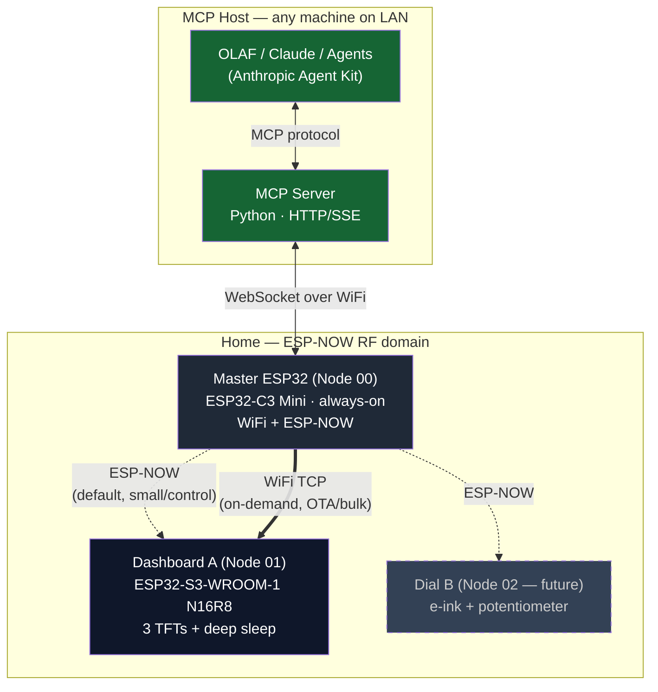
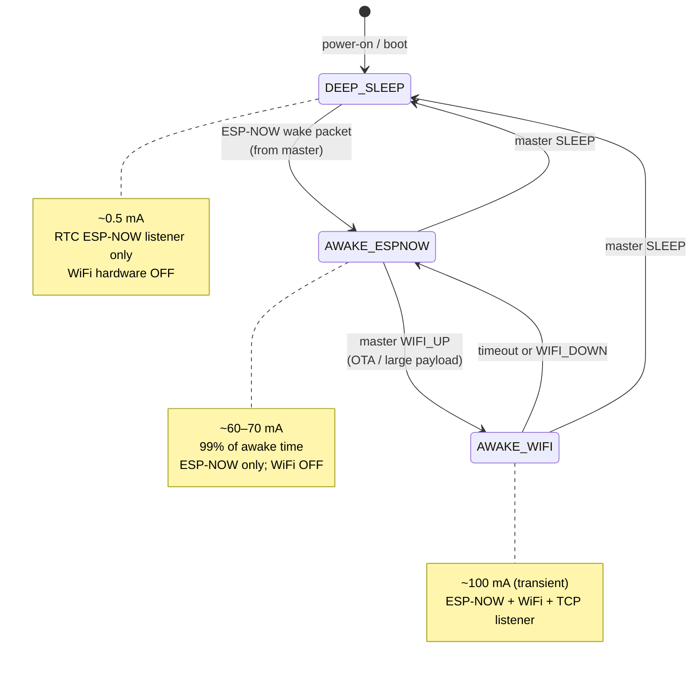

# Product Requirements Document - olaf_external_support

**Author:** Kamal
**Date:** 2026-04-18

## Executive Summary

OLAF External Support is a platform of custom ESP32-based hardware nodes that extend OLAF — Kamal's open-source companion robot — into rooms OLAF cannot physically occupy. Nodes are commanded via **MCP tool calls routed through a Master ESP32** (ESP-NOW primary, WiFi TCP on-demand) and share a common spine (ESP32 + last-known-good caching + deep sleep). Each node is a dumb renderer; OLAF is the smart brain. Node form factors differ, but the platform contract does not. *(Transport revised in architecture v2, 2026-04-22. PRD below uses MQTT terminology for logical payload shapes — these map 1:1 to ESP-NOW opcodes in the wire protocol.)*

This PRD defines **Node 1: the Health Dashboard** — a wall-mounted ambient instrument that renders health data OLAF pushes. Three SPI displays in a single 3D-printed black faceplate (one 2.8" ILI9341 portrait for charts, two 2.28" GC9A01 rounds for metrics) rotate through OLAF-defined categories on a configurable interval. All three displays transition together, holding a coherent single-domain snapshot at any moment. The dashboard is glanceable from across the room, calm enough to live on a wall, and honest when data is stale.

**Primary user:** Kamal — builder, daily viewer, aesthetic arbiter. **Secondary users:** family members, once OLAF matures — no phone, no voice, no controls required.

**The real problem:** OLAF's own body is too small for 30-day charts, confined to one room, and voice is expensive for passive glances. Family members shouldn't have to ask for information that should simply be visible. Ambient beats conversational for state you check twenty times a day.

### What Makes This Special

- **Dumb renderer, smart brain.** Firmware has zero content-domain semantics — no knowledge of what "glucose" or "fasting" means. OLAF pushes values, thresholds, status strings, chart types. The node obeys. This separation is load-bearing, not stylistic.
- **One spine, many forms.** The MQTT + ESP-NOW + last-known-good + deep-sleep spine is the platform contract. Node 1 proves it works; Nodes 2–N inherit it. A 2-year-old node must remain directable by OLAF in ways Kamal didn't anticipate — within the primitive vocabulary shipped in firmware.
- **AI-directed hardware.** Switching a chart type, adding a category, reordering rotation, adjusting brightness — all MCP tool calls (routed by master over ESP-NOW), zero firmware release. Genuinely new primitives (a novel animation) require OTA; one OTA then unlocks that primitive for every future OLAF directive.
- **Ambient, not conversational.** Principled rejection of "ask the AI every time." The dashboard is pushed-to, not asked. No voice interaction on nodes.
- **Apple-Watch-grade aesthetic conviction.** OLED-deep black, disciplined minimalism, vivid per-domain accent colour, ring-as-status. Three displays dissolve into one faceplate. Not a maker-project look — an instrument.
- **Honest over clever.** A node must never be more wrong than honestly stale. Grey rings, visible timestamps, "waiting for OLAF" placeholders — degraded states never blank or mislead.

**Core insight:** The durable interface between OLAF and its external hardware is not a wire protocol or a C API — it is **MCP tools + a primitive vocabulary shipped in firmware**, with a Master ESP32 carrying the fleet-routing burden. This is what makes AI-directed, compositionally-extensible ambient hardware possible without a firmware release per change. *(Interface shape revised in architecture v2 from MQTT-broker-mediated to MCP-master-mediated, 2026-04-22.)*

**Why now:** OLAF is maturing and needs hands and eyes beyond its own body. The 3D-printed enclosure already exists. Hardware build window is ~2 days; firmware develops at Kamal's pace alongside OLAF's data-ingestion capabilities.

### System Topology (v2)



## Project Classification

- **Project Type:** `iot_embedded` — ESP32-S3 firmware with coordinated SPI displays, WiFi + MQTT for data, ESP-NOW for wake, OTA firmware channel, deep-sleep power profile.
- **Domain:** `general` (personal/consumer IoT). Health *data* is rendered, but no clinical logic, thresholds, or regulatory surface lives in firmware — OLAF resolves all semantics server-side. No FDA/HIPAA obligations.
- **Complexity:** Medium — product scope is lean (one user, one node, one room) but the technical surface includes coordinated three-display rendering, dual-radio operation, forward-compatible MQTT schema, and a strict offline/staleness contract.
- **Project Context:** Greenfield — 3D-printed enclosure exists; firmware and hardware assembly do not.

## Success Criteria

### User Success

- **Glanceable in ≤2 seconds.** From across the room, Kamal or a family member can read the current metric, its status, and its trend without stopping or squinting. No focal reacquisition per display.
- **Ritual-free.** Zero touch, zero app, zero voice query required to get a health update. If a viewer has to *do* something to see the state, the product has failed.
- **Staleness is visible, never deceptive.** A viewer can always distinguish fresh, stale, and missing data without thinking — via status ring colour, timestamp text, or "waiting for OLAF" placeholder. A node is never more wrong than honestly stale.
- **Aesthetic silence.** The dashboard lives on a wall without visual friction. It looks like an instrument, not a project. Passes the "would this survive in a Teenage Engineering / Apple showroom" gut check.

### Business Success

(Personal project — "business" here means *platform validation* and *household adoption*, not commercial outcomes.)

- **Installed and running 24/7** in Kamal's home within the project timeline, with no "I should fix that" pending issues.
- **Platform spine validated.** After Node 1 ships, Kamal can spec Node 2 (any archetype) reusing the same MQTT + ESP-NOW + last-known-good + deep-sleep spine without re-architecting it.
- **Zero-firmware-release changes succeed.** Adding a 5th category, swapping a chart type, adjusting thresholds, reordering rotation, tuning brightness, and pausing a category are all verified as MQTT-only operations with no firmware rebuild.
- **OLAF composes the dashboard.** OLAF is the sole controller. Kamal never edits firmware constants to change what's shown.

### Technical Success

- **Coordinated transitions.** At category rotation, all three displays clear and redraw together with no viewer-perceptible staggering or tearing. Coordination verified via video recording against a reference clock.
- **Deep sleep current ≤0.5 mA** measured with ESP-NOW RTC receiver active.
- **Wake-to-first-render ≤3 seconds.** ESP-NOW wake packet to first coherent frame on all three displays (re-rendering last-known-good from OLAF re-push).
- **Offline contract holds.** With OLAF unreachable, broker down, or WiFi down, the dashboard continues to render last-known-good and dims status rings after N minutes to signal staleness. Never blanks. Never shows misleading numbers.
- **Payload schema forward-compatibility.** Adding a new category (ID 5+) or a new chart type from the catalog requires **zero firmware change**. Verified by test: push category 5 to a node flashed before category 5 existed as a concept; it renders. *(Applies regardless of wire transport — MQTT in v1 framing, ESP-NOW opcode envelope in v2.)*
- **OTA operational.** Firmware can be updated without physical reflash, validated end-to-end.
- **RF performance preserved.** WiFi RSSI and ESP-NOW reliability measured inside the 3D-printed enclosure with shared antenna; no metal obstructions.

### Measurable Outcomes

| Metric | Target | Verification |
|---|---|---|
| Glance-to-read time (primary metric + status) | ≤2 s | Self/family timed test |
| Deep sleep current | ≤0.5 mA | Multimeter at USB-C input |
| Backlight-0 idle current | ~100 mA (±10%) | Multimeter |
| Backlight-100% active current | ~380 mA (±10%) | Multimeter |
| Wake-to-first-render latency | ≤3 s | Logic analyser / timestamp log |
| Transition coordination | No perceptible stagger | Slow-motion video review |
| Runtime-directive change success rate (no rebuild) | 100% for all payload types in schema | Test matrix |
| OTA success | Firmware updates without physical access | End-to-end test |
| Uptime after installation | ≥99% over first 30 days | Broker-side connection log |

## Product Scope

### MVP — Minimum Viable Product

Everything required for the dashboard to be honestly shippable on the wall with OLAF driving it.

- **Hardware:** ESP32 + 2× GC9A01 + 1× ILI9341 wired on shared SPI bus, USB-C power, assembled inside existing 3D-printed enclosure.
- **Rendering:** All 4 reference categories (Weight, Glucose, Cycling, Fasting) render correctly — Round A (headline), Round B (secondary), Rectangle (chart). Status rings, centre metrics, timestamps, units, labels all per the UX spec.
- **Chart catalog (v1, semantic):** Line graph, scatter plot, bar chart — sufficient for the 4 reference categories. Chart type and data selected by OLAF via `health/category/{n}/chart` payload.
- **Category rotation:** Configurable via `health/rotation_interval`, `health/category_order`, `health/active_categories`, `health/pause_category`. Default 10s, instant transition.
- **MQTT topic tree:** Full implementation of all topics defined in the brief (`health/cmd`, `health/brightness`, rotation/order/active/pause, per-category metric_a / metric_b / chart).
- **Radios:** WiFi + MQTT for data; ESP-NOW RTC receiver for wake.
- **State machine:** Fresh boot → connect → subscribe → render last-known-good (OLAF re-push). Sleep command over MQTT → backlight off → stop rendering → disconnect → deep sleep. Wake via ESP-NOW.
- **Last-known-good cache:** All topic payloads cached in RAM; display continues rendering on OLAF/broker/WiFi loss.
- **Degraded states:** Grey status rings, visible timestamps, "waiting for OLAF" placeholder on fresh boot with no data.
- **Brightness control:** PWM via `ledcWrite()` responsive to `health/brightness` (0–255). Backlight-0 is primary idle state.
- **OTA channel:** Operational — firmware updates without physical access.

### Growth Features (Post-MVP)

- **Transition animations:** Fade and wipe, selectable per-rotation via OLAF directive.
- **Category overlay:** Name/index briefly displayed at start of each slot, with configurable duration.
- **Privacy mode:** OLAF-controlled "ambiguous display" — status ring only, no numbers, for when the room has guests.
- **Additional chart types** in the semantic catalog (stacked bar, heat strip, sparkline variants).
- **Night/day theme profiles** tied to brightness band.
- **RSSI & health telemetry publishing** from node back to OLAF for observability.

### Vision (Future — Deferred, Not Abandoned)

- **Compositional primitive vocabulary:** Full drawing DSL (arcs, fills, tweens, easing) so OLAF can sequence drawing primitives directly, not just select from a catalog.
- **Multi-node coordination:** Multiple Health Dashboards (or other node archetypes) on the same broker staying in sync via `health/#`, with per-node overrides via `health/{node_id}/#`.
- **Cross-node choreography:** Sunrise routines, movie-mode cascades, presence-aware directives.
- **Additional node archetypes:** Presence sensors, controllers (IR remote, smart-home), media (MP3, ambient audio).
- **OLAF-side data ingestion pipeline:** Wearable integrations, voice entry, CSV, webhooks — OLAF's problem, not the dashboard's.

## User Journeys

### Journey 1 — Kamal, Morning Glance (Primary Happy Path)

**Opening Scene.** 7:15 AM. Kamal walks past the hallway where the dashboard hangs. He's mid-thought about something unrelated — coffee, the day's calendar. He does not stop.

**Rising Action.** In half a second his peripheral vision catches the rightmost round display showing a big white number on OLED-black: **84.1 kg**, with a vivid green ring at the edge. Below it, the second round reads **−0.3 kg** against a 7-day trend label. On the left, a 30-day line graph curves gently downward.

**Climax.** He has not broken stride. He knows his weight this morning, he knows he's trending the right way, and the green rings mean nothing is off. Total viewing time: under two seconds.

**Resolution.** He continues to the kitchen. Ten seconds later, as he pours coffee, the dashboard rotates to Glucose — all three displays transition together. He glances once more from the kitchen: **5.6 mmol/L**, green. Done.

**Requirements revealed:**
- Glanceability at room distance (typography scale, contrast, status ring visibility)
- Coordinated three-display rotation (no staggered transitions that would fragment attention)
- Status ring colour as primary pre-attentive signal (green/amber/red/grey distinguishable peripherally)
- Rotation cadence honest to slot length (10s default)

### Journey 2 — Family Member, Passive Evening Check (Secondary Viewer)

**Opening Scene.** 9:40 PM. Kamal's wife walks past the hallway carrying laundry. She has no technical relationship with OLAF, the dashboard, or any of this. She wasn't told to look.

**Rising Action.** The cycling category is showing. Big number: **47.3 km**. Below it: **Last ride 22.1 km · 2 days ago**. A bar chart on the left shows weekly mileage bars, the most recent one taller than the last few. A green ring frames both rounds.

**Climax.** She registers, without thinking about it, "he rode this week and it's going up." No interpretation required. She does not need to know what a mmol/L is, does not need to know what "good" means, does not need a legend. The colour says enough.

**Resolution.** She keeps walking. She never touched anything. She never asked.

**Requirements revealed:**
- Family-usable: zero-explanation legibility, no training required
- Self-evident status (colour + value, not value + separate status indicator)
- Readability without brand/clinical/domain jargon in centre text (labels are human, not units-first)
- No controls, no invitations to interact, no affordances that suggest touch

### Journey 3 — Kamal, Degraded State Trust (Primary, Edge Case)

**Opening Scene.** Thursday afternoon. The home WiFi router rebooted itself earlier. Kamal didn't notice. He walks past the dashboard.

**Rising Action.** Something feels different. The rings are not green — they are **dim grey**. The centre numbers are still there: **84.1 kg**, **5.4 mmol/L**. But the timestamp text reads **"this morning · 6 hrs old"**. Not **"just now"** or **"live"**.

**Climax.** He does not believe the numbers are current. He is not misled. He thinks, "ah, something's up with the network," and not "my glucose dropped." The dashboard has not lied to him. It has told him what it knows and how old that knowledge is.

**Resolution.** He restarts the router. Within 30 seconds he sees a ring flick from grey to green, then another, then the chart redraws. The system has come back and he knows it.

**Requirements revealed:**
- Last-known-good cache persists through network / broker / OLAF outage
- Staleness indicator (ring dim, timestamp explicit) — automatic, not OLAF-dependent
- Recovery is visible: viewer sees state return, not just "it's working again"
- Fresh-boot placeholder state differs from stale-cached state differs from live state (three distinct visual states)

### Journey 4 — OLAF, Pushing a New Category (Agent-as-Integrator)

**Opening Scene.** Kamal has started tracking sleep. He asks OLAF to "show sleep on the dashboard too." OLAF has never pushed a sleep category before. The firmware running on the ESP32 has never heard the word "sleep" and never will.

**Rising Action.** OLAF publishes:
```
health/category/5/metric_a  → {"value":"7h 12m","unit":"","label":"Sleep","status":"good",...}
health/category/5/metric_b  → {"value":"6h 48m","unit":"","label":"Weekly avg","status":"warn",...}
health/category/5/chart     → {"type":"bar","points":[...],"unit":"h","label":"Last 14 nights",...}
health/category_order       → [1,2,3,4,5]
health/active_categories    → [1,2,3,4,5]
```

**Climax.** On the next rotation, the dashboard advances to category 5 along with the others. Both rounds show sleep values; the rectangle draws a 14-day bar chart of sleep hours. The ring on metric_b is amber because this week is below last week's average. No firmware release. No restart. No USB cable.

**Resolution.** Kamal had to decide nothing about firmware. OLAF decided everything: labels, status, thresholds, chart type, rotation placement. The platform thesis held.

**Requirements revealed:**
- MQTT schema extensibility: adding category N+1 requires zero firmware change
- Semantic chart catalog (line / scatter / bar) selectable from payload `type` field
- Status string resolved by OLAF, rendered without interpretation by firmware
- `category_order` and `active_categories` re-applied immediately on arrival
- Firmware treats every category slot identically — no category 1-hardcoded branches

### Journey 5 — Kamal, First Boot & Installation (One-Time Setup)

**Opening Scene.** Saturday afternoon. Hardware assembly is done — ESP32 wired to three displays, USB-C connected, enclosure closed. Kamal plugs it in for the first time. OLAF is not yet reachable because Kamal hasn't configured the topic publisher on OLAF's side yet.

**Rising Action.** The dashboard boots. Three OLED-black displays come alive. The rings are **grey**. The rounds show **"—"** where numbers would be. The chart panel shows a minimal "waiting for OLAF" placeholder with a small pulsing indicator. No values fabricated. No "hello world" garbage.

**Climax.** Kamal brings up the OLAF-side publisher and pushes the first category. Within a second the grey rings flick to colour and the numbers appear. The dashboard knew it didn't know, and then it knew.

**Resolution.** Installation complete. The node has not been told what categories exist, what thresholds apply, or what colours mean. It has been told what to render, and only that.

**Requirements revealed:**
- Fresh-boot state is honest and visually calm — no fake data, no loading spinners that look permanent
- WiFi credentials and broker config provisioned via [TBD mechanism — typically NVS / serial / captive portal; needs decision]
- Node subscribes on boot and waits; it does not fabricate, default, or guess content
- Ring colour on fresh boot is grey (distinct from all four status states)

### Journey 6 — Kamal, OTA Firmware Update (Maintenance)

**Opening Scene.** Six months after installation. Kamal has added a new chart type to the firmware catalog (say, a ring-chart for fasting-window visualisations). The node has been happily on the wall the whole time.

**Rising Action.** Kamal publishes a firmware build to the OTA channel. The node, while awake and idle, detects the update, downloads it, verifies, and flashes.

**Climax.** The dashboard briefly goes to a minimal "updating" state (not a crash, not blank), reboots, reconnects, re-renders last-known-good from OLAF's re-push. Total visible downtime: seconds, not minutes.

**Resolution.** OLAF can now publish `chart.type = "ring"` and the node will render it. The new primitive is live without physical access to the hardware.

**Requirements revealed:**
- OTA channel operational: secure, verifiable, recoverable from failed flash (rollback / safe partition)
- Updating state is visually distinct from normal and degraded states
- Post-update recovery: last-known-good re-rendered from OLAF re-push, not from persisted state on the node
- Firmware version and OTA status topic (publish back to OLAF for observability) — [growth, not MVP]

### Journey Requirements Summary

Journeys reveal the following capability areas required of the node:

| Capability | Driven by Journey(s) |
|---|---|
| Glanceable three-display rendering (status ring + metric + chart) | 1, 2 |
| Coordinated rotation and transition across displays | 1 |
| Status-as-ring with colour mapping for all four states | 1, 2, 3, 5 |
| Last-known-good cache with staleness indication | 3 |
| Fresh-boot placeholder state distinct from stale state | 3, 5 |
| MQTT topic subscription and payload parsing per schema | 1, 3, 4 |
| Extensible category slots (N categories, OLAF-defined) | 4 |
| Semantic chart catalog (line, scatter, bar) driven by payload | 1, 4 |
| ESP-NOW wake reception in deep sleep | (implicit in 6 after sleep command) |
| Sleep command handling over MQTT | (implicit, inverse of 1) |
| Brightness PWM responsive to MQTT payload | (implicit ambient/night behaviour) |
| OTA firmware update channel with recovery | 6 |
| Provisioning path for WiFi + broker credentials on first boot | 5 |
| Forward-compatible schema — adding category / chart type requires no firmware change | 4 |

## Innovation & Novel Patterns

### Detected Innovation Areas

The innovation in OLAF External Support is architectural, not technological. No new silicon, no new radio, no edge-ML trick. What is unusual is the **division of responsibility**:

**The hardware ships with zero semantic knowledge and is directed at runtime by an AI brain over MQTT.**

Concretely, three deliberate inversions of the conventional IoT pattern:

1. **Dumb renderer, smart brain.** The ESP32 firmware does not know what "glucose" is, what a "good" range is, what units mean, or what the four reference categories represent. OLAF publishes values, status strings, thresholds, chart type, rotation order — all of it. The firmware's job is rendering, not domain logic. Most embedded dashboards invert this: domain logic lives on-device, the server delivers raw values. OLAF External Support pushes the line the other way, *hard*.

2. **AI-directed hardware as a durable contract.** The interface between OLAF (a Raspberry Pi running LLMs + classical code) and its hardware bodies is not a wire protocol or a C API — it is **MQTT topics + a primitive vocabulary shipped in firmware**. This makes behaviour change an act of publishing, not an act of flashing. Switching chart types, reordering categories, adjusting brightness, pausing — all MQTT. Only genuinely new primitives (e.g., a new animation class) require OTA, and one OTA unlocks that primitive for every future directive.

3. **Teachable longevity.** A 2-year-old node running old firmware remains directable by OLAF in ways Kamal didn't anticipate when flashing it — provided the new behaviour can be composed from the primitive vocabulary the node already has. This is the opposite of "IoT device reaches end-of-support because firmware stops updating." Here, the *brain* evolves; the *body* stays relevant for as long as its vocabulary is useful.

The secondary innovation is **one spine, many forms**: ESP32 + MQTT + ESP-NOW + last-known-good + deep sleep as a shared platform contract across a future family of heterogeneous nodes (display, sensor, controller, media). Node 1 proves the spine; Nodes 2–N inherit it.

### Market Context & Competitive Landscape

- **Commercial health dashboards** (Withings Home, Apple Home, Fitbit displays) are closed ecosystems tied to a single vendor's data pipeline. They do not accept an external "brain" pushing arbitrary categories and chart types.
- **ESPHome / Home Assistant** covers the "flash firmware, get a dashboard" pattern for smart-home instrumentation. Already considered and documented in the brief as rejected for this use case because the three-display coordinated rotation would require custom C++ components anyway — negating the low-code benefit.
- **Conventional MCU dashboards** put domain logic in firmware. Switching a chart type or adding a category means a firmware release. That is the pattern this project is *explicitly* rejecting.
- **AI-agent-controlled ambient displays** (the pattern this project pioneers for Kamal's use case) have no obvious commercial precedent. Open-source LLM-directed embedded systems exist as experiments; none target ambient household ritual.

This is not a commercial claim — the project is not open-source, not productised. The competitive context matters only to verify that the architectural stance is genuinely unusual and not a reinvention of standard practice.

### Validation Approach

The platform thesis is falsifiable. Validation equals passing these tests:

- **Journey 4 end-to-end:** OLAF publishes a category the firmware has never heard of (e.g., Sleep as category 5). The node renders it correctly without a firmware rebuild. If this fails, the dumb-renderer separation leaked domain knowledge into firmware somewhere.
- **Schema extension tests from Success Criteria:** chart type swap, category reorder, threshold change, rotation-interval change, brightness change, pause/resume — all MQTT-only, zero rebuild. Any item that requires firmware change is a design bug.
- **2-year node simulation (thought experiment, validated during design review):** For every "what-if OLAF does X in 2027?" scenario Kamal can dream up, check whether X is expressible in the v1 primitive vocabulary. Items that aren't go into a backlog; items that are prove the vocabulary is sufficient.
- **Spine reuse verification (deferred, validated at Node 2):** When Node 2 is spec'd, the spine modules (ESP-NOW wake, WiFi/MQTT client, last-known-good cache, sleep manager, OTA) should be copy-paste-reusable. If they aren't, the spine is leaking form-factor assumptions.

### Risk Mitigation

- **Risk: Semantic vocabulary proves insufficient.** If OLAF wants a visualisation the fixed chart catalog can't express (say, a radial polar plot), firmware must gain a new primitive. Mitigation: design the MQTT chart schema to be forward-compatible with compositional primitives from day one (explicitly noted in the brief). A `chart.type` catalog today; a `chart.sequence` of drawing ops tomorrow — without breaking existing payloads.
- **Risk: OLAF unreliability undermines ambient-trust.** If OLAF is down more than it's up, the "dumb renderer" bet looks foolish. Mitigation: last-known-good cache with honest staleness indication (already in scope). The node remains useful during OLAF outages; trust degrades gracefully, not catastrophically.
- **Risk: MQTT payload schema drift.** OLAF evolves; old nodes in the field may receive payloads with fields they don't understand or missing fields they expect. Mitigation: firmware treats unknown fields as additive (ignore), missing fields as grey/unknown state. Never crash, never mis-render.
- **Risk: Temptation to "just hardcode one thing" under time pressure.** During firmware build-out, it will be tempting to hardcode category labels or threshold defaults "to get it working." Mitigation: treat this as a design test during implementation — if firmware needs knowledge of a specific category's meaning, the MQTT schema is wrong, not the firmware. Fix the schema.
- **Escape hatch (documented, not triggered):** If the semantic-catalog approach proves insufficient within 6 months of operation, the compositional-primitive vocabulary (already on the Vision list) becomes the next step. The MQTT schema is designed to accept this expansion without a breaking change.

## IoT / Embedded Specific Requirements

### Project-Type Overview

OLAF External Support Node 1 is an ESP32-based ambient display node. Single-MCU, three SPI displays on a shared bus, dual-radio (WiFi + ESP-NOW), USB-C always-on power, WiFi-enabled OTA, inside an existing 3D-printed plastic enclosure. No battery. No local controls. No on-device UI for configuration.

All on-device behaviour is composable via MQTT per the platform thesis documented above. This section defines the hardware envelope, connectivity model, power profile, security posture, and update mechanism the firmware must honour.

### Hardware Requirements

**MCU.** ESP32-S3-WROOM-1 N16R8 DevKit, **PCB-trace antenna**. Required because metal enclosure is prohibited for RF reasons; PCB antenna works through plastic/acrylic. Dual-core Xtensa LX7, 512 KB internal SRAM + 8 MB OctalPSRAM, 16 MB flash. *(Upgraded from ESP32 WROOM per architecture decision 2026-04-22 — more flash for dual-partition OTA + SPIFFS, PSRAM enables full-screen double-buffered framebuffer rendering.)*

**Displays.**
- **2× GC9A01** — 2.28" round TFT, 240×240 px, SPI, coloured annulus rendered on edge (outer radius 118 px, inner 106 px, centre at 120, 120).
- **1× ILI9341** — 2.8" TFT, 240×320 px native, **operated in portrait orientation** per UX spec (chart canvas on the left of the faceplate).

**Shared SPI bus wiring:**
- Shared: MOSI (1 GPIO), SCLK (1 GPIO), VCC (fan-out via JST splitter), GND (fan-out), BL (PWM backlight, 1 GPIO), RST (shared or per-display — firmware should support both)
- Per-display: CS (3 GPIO), DC (3 GPIO)
- **Minimum GPIO budget:** 10 signal pins (2 shared SPI + 3 CS + 3 DC + 1 BL + 1 RST). ESP32 DevKit has enough with margin for I²C / debug.

**Faceplate.** 3D-printed single black panel containing all three displays. Left: ILI9341 in portrait. Right: two GC9A01 stacked vertically, aligned along the faceplate's horizontal midline with the rectangle's centre. OLED-deep-black surfaces dissolve into faceplate. Enclosure already exists.

**Power input.** USB-C 5V / 2A wall adapter. Regulation via ESP32 DevKit's on-board 3.3 V LDO; displays directly on 5V or via board. Peak current budget: ~380 mA at full brightness (within USB-C 2 A envelope with 5× headroom).

**RF material constraint.** Plastic / acrylic enclosure only. No metal brackets, no foil shielding near the module. WiFi and ESP-NOW share the PCB antenna.

### Connectivity Protocol

> **Revision note (architecture v2, 2026-04-22):** The following describes the logical communication behavior of Node 1. Physical wire transport was revised in `architecture.md` — there is **no MQTT broker**. Instead: **MCP server → Master ESP32 → target nodes via ESP-NOW (default) + WiFi TCP (on-demand)**. MQTT topic names and payload shapes described below map 1:1 to ESP-NOW opcode envelopes; the logical contract is unchanged, only the wire. WiFi on the target node is **off by default**, brought up only on master directive for OTA or large-payload bursts.

**Transport channels (v2):**

| Channel | Direction | Protocol | Purpose | Active when |
|---|---|---|---|---|
| Wake | Master → Node | ESP-NOW (peer MAC + RTC receiver) | Wake from deep sleep | Node in deep sleep |
| Data (small / default) | Master ↔ Node | ESP-NOW (encrypted, AES-CCM) | Content, config, commands, diag | Node awake |
| Data (large / on-demand) | Master ↔ Node | WiFi TCP | OTA firmware, sustained streams | Node in `AWAKE_WIFI` state |
| Sleep | Master → Node | ESP-NOW (`SLEEP` opcode) | Put node to sleep | Node awake |
| Control plane | MCP ↔ Master | WebSocket over WiFi | Tool calls + events | Master always-on |

**Enforcement:** ESP-NOW is always available when the target has any radio active. Once the ESP32 enters deep sleep, WiFi hardware is fully off; only the RTC ESP-NOW receiver listens. Target WiFi only comes up when master explicitly commands `WIFI_UP` (for OTA or large payloads); auto-teardown on timeout. A sleep command published after sleep is silently lost (acceptable).

**WiFi.** 2.4 GHz only (ESP32 limitation). 802.11b/g/n. Station mode. On target, **brought up on-demand** only (by master's `WIFI_UP` command); fast-connect via NVS-cached BSSID. On master, persistent (connected at boot, reconnects automatically on AP recovery). *(Revised v2: target no longer maintains MQTT broker connection.)*

**Logical payload contract (MQTT-styled — v2 wire is ESP-NOW opcodes + WiFi TCP).**

- ~~Broker~~: *Superseded in v2 — no broker. MCP server ↔ Master ESP32 via WebSocket; Master ↔ target via ESP-NOW.*
- ~~QoS~~: *Superseded in v2 — ESP-NOW unicast with MAC ACK + application-level retry via `util_backoff`.*
- ~~Retained messages~~: *Superseded in v2 — master holds per-target state in routing table; on target wake, master re-pushes current state via ESP-NOW. Equivalent behaviour, different mechanism.*
- ~~Subscribe pattern~~: *Superseded — target's `target_dispatcher` handles all opcodes that arrive over ESP-NOW envelope.*
- ~~LWT~~: *Superseded in v2 — master's routing table tracks per-target online/offline state via ESP-NOW keepalives; exposed via MCP resources.*

**ESP-NOW.**
- Used only for wake packets from OLAF's ESP32 (OLAF's own hardware) to the dashboard ESP32.
- Peer MAC address pre-programmed at flash time (OLAF's ESP-NOW MAC is stable).
- RTC-level receiver active during deep sleep.
- Single packet type: "wake". No payload interpretation needed.

**Shared antenna.** WiFi and ESP-NOW share the PCB trace antenna. No antenna switching needed; both protocols use 2.4 GHz and the ESP32 radio time-slices internally.

### Power Profile

| State | Current draw | Trigger | Primary use |
|---|---|---|---|
| Active — full brightness | ~380 mA | `health/brightness: 255` | Day, OLAF active |
| Active — 50% brightness | ~200 mA | `health/brightness: ~128` | Dimmed ambient |
| Backlight 0% — WiFi on | ~100 mA | `health/brightness: 0` | **Primary idle state** |
| Deep sleep | ≤0.5 mA | `health/cmd: "sleep"` | Overnight, OLAF off |

**Design principles:**
- **Backlight-0% is idle, not deep sleep.** During "idle" the ESP32 remains reachable via ESP-NOW (master link), ready to respond instantly to a brightness-up command. No wake latency. *(v2: ESP-NOW link replaces always-on MQTT connection.)*
- **Deep sleep is exceptional.** Used overnight or when OLAF explicitly takes the house offline. Only way back: ESP-NOW wake from master.
- **No sleep on schedule.** The node never self-sleeps. Sleep transitions are always master-directed (OLAF → MCP → Master ESP32 → target). Firmware has no concept of "night."
- **Brightness is PWM-driven** on the shared BL pin, 8-bit resolution (0–255). All three displays share backlight channel.

### Target Node State Machine (v2)



Target never self-transitions — every state change is master-directed. Matches the dumb-renderer thesis end to end.

### Security Model

Personal project, local network, single trusted household. Security is proportionate — not casual, not enterprise.

**In scope for MVP:**
- **No default passwords.** WiFi credentials and broker address provisioned per Journey 5's path (decided below); not hardcoded in the default build for redistribution.
- **Credentials at rest.** Stored in ESP32 NVS (non-volatile storage). Encrypted NVS (via ESP32 flash encryption + secure boot v2) **considered but not required for MVP** given the enclosure lives inside Kamal's home and physical access implies trust. (Open decision — see below.)
- **Transport security.** *Revised v2:* ESP-NOW peer links use **AES-CCM encryption** (built-in, per-target key). MCP ↔ Master WebSocket is plain TCP on LAN; TLS available if master is ever reachable externally. No MQTT in v2.
- **OTA integrity.** Firmware binary **must be verified** before activation. Recommended: dual-partition (app0/app1) with rollback on failed boot (standard ESP32 OTA pattern), plus at minimum a SHA-256 hash check against a known-good value. Code signing (RSA signature verification via ESP secure boot v2) is **recommended for Growth**, not MVP.
- **No exposed debug surfaces in production firmware.** No open telnet, no default web debug console, no unauthenticated OTA endpoint. Serial console output is acceptable (useful for Kamal) but should not accept commands in production build.
- **MAC whitelist for ESP-NOW wake.** Only OLAF's ESP32 MAC is allowed to wake this node. Unexpected ESP-NOW packets are dropped without waking the CPU beyond the RTC listener. Prevents random 2.4 GHz chatter from draining sleep current.

**Out of scope:**
- HIPAA / PCI-DSS / any regulated-data handling (no such data in the system — health figures are rendered, not transmitted outside the home).
- Multi-user access control (single household, single OLAF).
- Audit logs.

### Update Mechanism

**OTA channel is MVP.** Validated end-to-end before the project is considered complete.

**Approach.**
- **Transport:** HTTP(S) pull. Node checks an OTA endpoint on a schedule (or on MQTT trigger) and downloads a new firmware binary. *MQTT trigger preferred — OLAF publishes `health/cmd: "ota"` with a payload pointing to the binary URL. Pull-based avoids maintaining an OTA push server.*
- **Storage layout:** ESP32 dual-partition OTA (`app0` / `app1` + factory). Active partition runs; inactive receives the new binary. On successful verify + boot, the inactive becomes active. On failed boot, rollback.
- **Verification:** SHA-256 hash of downloaded binary compared against an expected value published by OLAF in the OTA trigger payload. Mismatch = abort, keep running current firmware.
- **Post-update state:** Node reboots → reconnects → re-subscribes `health/#` → re-renders last-known-good from OLAF's re-push. Journey 6 end state.
- **Updating state indicator:** A visually distinct "updating" state (not blank, not a normal status). Keeps the dashboard visibly alive during the 5–15 second download + flash window.
- **Firmware version reporting:** Node publishes `health/node/{id}/fw_version` (retained) after each boot. Useful for OLAF to confirm an update landed. *[Growth — observability.]*

**Out of scope for MVP:**
- Delta OTA (downloading only changed bytes) — full-binary OTA at ~1 MB over 2.4 GHz WiFi is fast enough for a personal node.
- Automatic scheduled OTA — Kamal triggers updates manually via OLAF; the node does not self-update on a cron.
- Signed firmware (RSA / ECDSA) — deferred to Growth, as above.

### Implementation Considerations

**GPIO assignment.** Lock in a stable pin map early (MOSI, SCLK, RST, BL, 3× CS, 3× DC, plus strap pins to avoid). Reassigning later means re-routing inside the enclosure.

**SPI bus performance.** At ESP32's typical 40 MHz SPI clock, a full-screen GC9A01 frame (240×240×16-bit = ~115 KB) transfers in ~23 ms — plenty for any transition animation. ILI9341 at 240×320×16-bit = ~154 KB = ~31 ms. Headroom exists for 30+ FPS transition sequences on any single display; coordination across three displays is a scheduler concern, not a bandwidth concern. *Verify early; if SPI contention surprises us, fall back to sequential redraws with a "transition window" pattern.*

**Memory.** ESP32-S3-WROOM-1 N16R8 provides 512 KB internal SRAM + 8 MB OctalPSRAM. Full framebuffer for all three displays at 16-bit (~384 KB combined) fits comfortably in PSRAM with abundant headroom. Firmware uses double-buffered full-screen framebuffers in PSRAM; small DMA ping-pong buffers stay in internal SRAM. *(Strategy resolved in architecture per N16R8 upgrade — tile-rendering concern obsolete.)*

**Task model.** *Resolved in architecture (2026-04-22):* WiFi/MQTT/application on core 0; single LVGL render task on core 1 serving all three `lv_disp_t` instances via `esp_lvgl_port`; ESP-NOW RTC receiver active in the RTC domain during deep sleep.

**Firmware framework.** **ESP-IDF 5.5 via PlatformIO** — decided in architecture phase (2026-04-22). Chosen for native power/radio/OTA APIs critical to the dense NFR surface: ≤0.5 mA deep sleep with RTC ESP-NOW receiver, dual-partition OTA with rollback, no-serial-in-field posture requiring robust crash capture.

**Logging.** Serial debug over USB during development. Production firmware logs at reduced verbosity; no remote logging to OLAF in MVP.

### Open Decisions Surfaced

Rolled up for visibility — these need to be pinned before or during architecture:

1. **Provisioning mechanism.** *Resolved in architecture:* factory NVS pre-write via `make factory-flash` (`wifi/ssid`, `wifi/pwd`, `mqtt/host`, `mqtt/port`, `olaf/mac`). Serial port is a one-shot factory channel only; WiFi-only in field. No captive portal, no runtime re-provisioning.
2. **Flash encryption + secure boot v2.** Deferred to Growth (confirmed in architecture).
3. **Firmware framework.** *Resolved:* ESP-IDF 5.5 via PlatformIO.
4. **MQTT retain policy per topic.** *Resolved in architecture:* OLAF retains state topics (category metric_a/b/chart, rotation config); node retains its own `status` (LWT), `fw_version`, `diag`, `coredump`; commands (`sleep`, `ota`) not retained.
5. **Broker location.** Assumed colocated with OLAF on the home LAN; anonymous MQTT confirmed in architecture.
6. **Node ID assignment.** *Resolved in architecture:* `health_<6 hex lowercase from MAC>` via `esp_read_mac(ESP_MAC_WIFI_STA, ...)`.

## Project Scoping & Phased Development

### MVP Strategy & Philosophy

**MVP approach: dual-aim — Platform MVP + Experience MVP.**

The Node 1 MVP is not an experience MVP alone and not a platform MVP alone. Both aims must be met, and neither admits compromise.

- **Platform MVP.** Node 1 must *prove the spine*. Its firmware architecture, MQTT schema, offline contract, and OTA channel must all be re-usable for Node 2 with zero re-architecting. The MVP validation is Journey 4 end-to-end: OLAF pushes a category the firmware has never heard of, and it renders. If that fails, the platform thesis fails, and the project's reason-for-being is gone.
- **Experience MVP.** Node 1 must *survive on Kamal's wall*. The aesthetic standard (OLED-deep black, Apple-Watch-grade typography, ring-as-status, coordinated transitions, honest degraded states) is non-negotiable. A node that works but looks like a maker project fails the "would my wife tolerate this in the hallway" test — and with it, the family-usable pillar.

**Rejected alternative MVPs:**
- *Problem-solving MVP alone* (get any health data on any screen, ugliness acceptable) — would strand Kamal with a prototype he can't put up. Rejected.
- *Platform MVP alone* (pretty schema, no physical node) — validates nothing about the rendering layer, which is half the innovation. Rejected.

**Revenue MVP is not a concept here.** The project is non-commercial. Validation is internal: does it run on the wall, does OLAF direct it, can Kamal spec Node 2 without redesigning the spine.

**MVP scope summary.** Full feature list is in **Product Scope → MVP** above. In one line: all four reference categories rendering, coordinated rotation with instant transition, full MQTT topic tree, WiFi + ESP-NOW + deep-sleep state machine, last-known-good cache with staleness indication, brightness control, OTA channel operational, inside the assembled enclosure. Covers Journeys 1 through 6.

### Resource Requirements

- **Team:** 1 person (Kamal) + AI coding assistance. No external dependencies.
- **Hardware build window:** ~2 days focused time.
- **Firmware:** Own pace, evenings/weekends, alongside OLAF's data-ingestion maturation.
- **Components:** ESP32 DevKit, 2× GC9A01, 1× ILI9341, USB-C wall adapter, JST splitters, ribbon cables — all assumed on-hand or trivially sourced.
- **Infrastructure:** Home 2.4 GHz WiFi; MQTT broker colocated with OLAF (Kamal's existing home lab).
- **Skills required:** ESP32 embedded C/C++ (Arduino or ESP-IDF), SPI display drivers, MQTT client integration, ESP-NOW, basic RF sanity. Kamal has all of these or can pair-program them.

### Post-MVP Phase Framing

Feature inventories for Growth and Vision are in **Product Scope → Growth** and **Product Scope → Vision** above. Strategic triggers:

- **Phase 2 (Growth) — "polish and observability".** Triggered when Node 1 is stable on the wall and Kamal has early feel for what's missing. No dependency between items; each is independently shippable. Expected cadence: whenever Kamal or family names a specific gap.
- **Phase 3 (Vision) — "platform multiplies".** Triggered when Kamal wants Node 2, or when OLAF's own capabilities grow enough to stress the semantic vocabulary. Not time-bound.

### Risk Mitigation Strategy

**Technical risks:**

| Risk | Why it matters | Mitigation |
|---|---|---|
| Coordinated transitions look staggered across the three displays | Aesthetic bet collapses — ugly transitions are worse than no transitions | Prototype transitions on bench before enclosure assembly; verify with slow-motion video. Fall back to instant transitions for MVP (already the default). |
| RF performance degrades inside enclosure (multiple displays + shared antenna) | ESP-NOW wake reliability or WiFi reconnection suffers — dashboard becomes flaky | Measure WiFi RSSI and ESP-NOW wake latency inside the closed enclosure during hardware build day. If marginal, relocate ESP32 module within enclosure or add external antenna variant. |
| ESP32 SRAM insufficient for the rendering approach | Firmware won't fit or crashes under WiFi+MQTT+rendering concurrency | Design rendering tile-by-tile, not full-framebuffer (noted in Implementation Considerations). Verify in first firmware iteration before adding features. |
| OTA channel fails or bricks a flashed node | No remote recovery path; physical re-flash required | Dual-partition OTA with rollback on failed boot (ESP32 standard); SHA-256 verify before commit. Test OTA end-to-end *before* mounting the node permanently on the wall. |

**Schedule risks:**

| Risk | Why it matters | Mitigation |
|---|---|---|
| 2-day hardware build slips (component issue, enclosure fit, SPI fan-out pain) | Project momentum stalls at physical assembly | Pre-verify component inventory; dry-fit displays in enclosure before soldering; keep a spare ESP32 DevKit on hand. If slip occurs, acceptable — no external deadline. |
| Firmware-own-pace drifts indefinitely (no external pressure) | MVP never lands; node sits on bench | Use success-criteria checklist (deep sleep current, wake latency, coordinated transitions, MQTT-only change tests) as explicit done-gates. Ship MVP when all gates pass, not when "feels ready." |
| OLAF-side publisher is not ready when Node 1 hardware is | Can't validate end-to-end; node has nothing to render | Build a tiny **stand-in publisher** (Python + `paho-mqtt`, ~50 lines) that emits reference payloads for all four categories. Kamal uses this to drive the node during development; real OLAF integration slots in later unchanged because the MQTT interface is the contract. |

**Scope-creep risk (personal-project tax):**

The aesthetic standard is high, which will tempt mid-MVP additions — "while I'm in here, let me also add the fade transition." Mitigation: the MVP list in **Product Scope** is **locked as written**. Anything not on that list goes to the Growth list by default. Kamal can relax this rule any time he chooses, but the default posture is hold-the-line.

**Validation learning (de-risk through MVP):**

The MVP exit gate is not "it works" — it is:
1. Node runs 72 hours continuously on the wall without manual intervention.
2. Journey 4 test passes (new category renders with no rebuild).
3. OTA flashes successfully at least once from OLAF directive.
4. All four reference categories render cleanly with both rounds + chart.
5. Deep sleep + wake cycle works end-to-end (measure ≤0.5 mA sleep, ≤3 s wake).

If all five gates pass, the platform thesis is validated and Phase 2 begins. If any fail, the failure mode itself informs the next design decision — that is the de-risking learning.

## Functional Requirements

The functional requirements below are the binding capability inventory for Node 1. Each requirement states WHAT capability must exist, not HOW it is implemented. Implementation choices (framework, library, task model, wiring) live in the architecture document. Actors: **Viewer** (Kamal or family — passive, cannot interact), **OLAF** (the controlling AI agent, publishes directives and content over MQTT), **Operator** (Kamal in the role of installer / maintainer), and **Node** (the dashboard system — used when describing firmware-internal capabilities that are not actor-driven).

### Content Rendering

- **FR1:** The Node can render a **headline metric** (value, unit, label, timestamp) on the upper round display for the currently active category.
- **FR2:** The Node can render a **secondary metric** (value, unit, label, timestamp) on the lower round display for the currently active category.
- **FR3:** The Node can render a **chart** (type, data points, axis label, unit) on the rectangular display for the currently active category.
- **FR4:** The Node can render a **status ring** around the edge of each round display, using a status token supplied by OLAF (good / warning / bad / unknown).
- **FR5:** The Node can render the **timestamp / staleness indicator** alongside a metric, using human-readable text supplied in the metric payload (e.g., "this morning", "2 days ago").
- **FR6:** The Node renders **centre content and status ring independently**: a ring status change does not trigger a redraw of centre metric content, and vice versa.
- **FR7:** The Node can render a chart for each **supported chart type in the v1 semantic catalog** (line, scatter, bar).
- **FR8:** The Node can render using the **typography and colour palette defined in the UX Design Specification** (OLED-deep black backgrounds, category accent colours, ring colour system).

### Category Management & Rotation

- **FR9:** The Node can **store N category slots** in memory, each holding the most recent `metric_a`, `metric_b`, and `chart` payloads received from OLAF.
- **FR10:** The Node can **accept a category payload for any category slot** (current MVP or future slots) without firmware modification. The firmware treats all slots uniformly.
- **FR11:** The Node can **rotate through active categories** on a cadence defined by a rotation interval directive.
- **FR12:** The Node can **re-order the rotation sequence** in response to a category-order directive from OLAF.
- **FR13:** The Node can **enable or disable individual categories** in the rotation in response to an active-categories directive from OLAF.
- **FR14:** The Node can **pause rotation** on a specific category in response to a pause directive from OLAF, and resume rotation when released.
- **FR15:** The Node **transitions all three displays simultaneously** when the active category changes (no per-display staggered transitions).
- **FR16:** The Node supports **instant transitions** between categories as the default and only MVP transition style. (Fade/wipe are Growth.)

### Dashboard Configuration

- **FR17:** The Node can **adjust backlight brightness** across all three displays in response to a brightness directive from OLAF (0–255 range).
- **FR18:** The Node treats **backlight = 0** as the primary idle state: displays are visually off while the node remains MQTT-connected and responsive.
- **FR19:** The Node applies **configuration directives immediately** on receipt (rotation interval, category order, active categories, brightness, pause) without requiring restart.

### State & Power Management

- **FR20:** The Node can **enter deep sleep** in response to a sleep command from OLAF. On entering sleep, the display backlight is off, rendering stops, MQTT disconnects, and WiFi powers down. Only the ESP-NOW RTC receiver remains active.
- **FR21:** The Node can **wake from deep sleep** in response to an ESP-NOW wake packet from OLAF, reconnect WiFi and MQTT, re-subscribe to topics, and render last-known-good state from OLAF's re-push.
- **FR22:** The Node **only self-initiates sleep or wake transitions in response to explicit OLAF directives or wake packets** — it has no internal schedule or timer that triggers sleep.
- **FR23:** The Node **rejects ESP-NOW wake packets from any MAC address other than OLAF's** (whitelist-based).

### Network & Communication

- **FR24:** The Node can **connect to a 2.4 GHz WiFi network** using credentials provisioned prior to operation.
- **FR25:** The Node can **connect to an MQTT broker** at a pre-configured address and subscribe to the `health/#` topic wildcard.
- **FR26:** The Node can **re-associate with WiFi and reconnect to the MQTT broker automatically** after disconnection without operator intervention.
- **FR27:** The Node can **receive and parse MQTT payloads** on every topic defined in the platform MQTT schema (commands, configuration, per-category metric_a / metric_b / chart).
- **FR28:** The Node **ignores unknown fields** in MQTT payloads rather than rejecting the payload or crashing. Unknown status values default to "unknown" rendering.
- **FR29:** The Node can **receive ESP-NOW wake packets** while in deep sleep without requiring WiFi to be active.

### Degraded & Recovery Behaviour

- **FR30:** The Node **caches the last-received payload for every topic in RAM** (last-known-good cache).
- **FR31:** The Node **continues rendering from last-known-good cache** when OLAF becomes unreachable, the MQTT broker disconnects, or WiFi drops.
- **FR32:** The Node can **indicate staleness** by dimming status rings after a configurable period without fresh data for a given category.
- **FR33:** The Node renders a **distinct "no data" placeholder state** on fresh boot when no category payloads have been received yet — grey rings, dash or blank where numbers would be, "waiting for OLAF" indication. Under no condition does the node fabricate or default to example values.
- **FR34:** The Node **never displays numeric values without their corresponding timestamp and status indication** — the three together form a single rendering unit.

### Firmware Lifecycle

- **FR35:** An **Operator can provision the Node with WiFi credentials and MQTT broker address** via an agreed provisioning mechanism (final mechanism decided in architecture).
- **FR36:** An **Operator can trigger an OTA firmware update** by publishing an OTA directive via OLAF (binary URL + expected hash).
- **FR37:** The Node can **download, verify, and flash a new firmware image**, activate it on the next boot, and roll back on failed boot.
- **FR38:** The Node can **render a visually distinct "updating" state** during firmware download and flash, keeping the dashboard non-blank throughout.
- **FR39:** The Node can **boot cleanly from first power-on** without requiring operator interaction beyond the one-time provisioning step.

### Observability (MVP-light; fuller coverage in Growth)

- **FR40:** The Node can publish a **Last Will & Testament** (`health/node/{id}/status: offline`, retained) on MQTT disconnect, enabling OLAF to detect node loss. *(Cheap to include; noted as growth-adjacent but recommended for MVP.)*
- **FR41:** The Node can publish its **firmware version** on boot (`health/node/{id}/fw_version`, retained). *[Growth — included in FR list so OTA validation can reference it.]*

## Non-Functional Requirements

Only categories that genuinely shape Node 1 are included. Each NFR is testable. User-facing aesthetic quality is governed by the UX Design Specification and referenced, not duplicated here.

### Performance

- **NFR-P1 (Glance time).** A Viewer can read the primary metric value, unit, and status from 3 m away in **≤2 seconds** of visual contact. Verified by timed observation test with Kamal and one family member per category.
- **NFR-P2 (Wake-to-first-render).** From ESP-NOW wake packet receipt to first coherent frame on all three displays, **≤3 seconds**. Verified by instrumented timestamp log + logic-analyser capture.
- **NFR-P3 (Transition coordination).** At category rotation, all three displays begin redraw within **≤50 ms** of each other. No viewer-perceptible stagger. Verified by slow-motion video (240 fps) against a visible reference clock.
- **NFR-P4 (Configuration directive responsiveness).** MQTT-delivered config directives (brightness, rotation interval, category order, pause, active categories) take effect within **≤500 ms** of broker receipt. Verified by instrumented timestamp test.
- **NFR-P5 (Rendering frame budget).** A single display redraw (any supported chart type + ring + metric text) completes in **≤100 ms** on the ESP32 at 40 MHz SPI clock. Verified per chart type.
- **NFR-P6 (Boot-to-first-render on fresh power-on).** From USB-C power applied to first honest placeholder frame on all three displays, **≤5 seconds** (fresh boot is expected to be slightly slower than wake because WiFi association runs from scratch).

### Reliability

- **NFR-R1 (Uptime).** Node runs **≥99% of wall-clock time** over any rolling 30-day window, measured by broker-side connection log. Planned sleep windows and OTA updates are excluded from downtime.
- **NFR-R2 (Automatic recovery).** Node reconnects to WiFi and MQTT broker automatically on any transient drop, **without operator intervention**. Recovery time **≤60 seconds** from network restoration.
- **NFR-R3 (Degraded state correctness).** Under any combination of OLAF unreachable / broker down / WiFi down / all three simultaneously, the Node continues rendering last-known-good with honest staleness indication. **Zero tolerance** for blank displays, fabricated values, or misleading "current" indicators.
- **NFR-R4 (Memory stability).** No memory leaks that degrade the rendering loop over a 7-day continuous run. Verified by heap-free monitoring during the MVP exit-gate 72-hour run.
- **NFR-R5 (Graceful OTA failure).** A failed OTA (bad hash, power loss mid-flash, corrupted download) must **never brick the node**. Rollback to previous firmware on failed boot. Verified by deliberate failure-injection testing before first wall installation.
- **NFR-R6 (Payload robustness).** Malformed or truncated MQTT payloads must not crash the firmware. Invalid payloads are logged and discarded; the last-known-good cache for that topic is retained.

### Power & Thermal

- **NFR-Pw1 (Active full brightness).** Current draw at 5V input ≤**420 mA** at 100% backlight across all three displays (brief states ~380 mA; tolerance of ~10% above). Verified by multimeter at USB-C input.
- **NFR-Pw2 (Active dimmed).** Current draw at 5V input ≤**220 mA** at 50% backlight. Verified by multimeter.
- **NFR-Pw3 (Backlight-0 idle).** Current draw at 5V input ~**100 mA (±10%)** with backlight off, WiFi + MQTT active. Verified by multimeter.
- **NFR-Pw4 (Deep sleep).** Current draw at 5V input **≤0.5 mA** with only the ESP-NOW RTC receiver active. Verified by multimeter, 5-minute average.
- **NFR-Pw5 (Thermal).** Enclosure external surface temperature is **≤20 °C above room ambient**, with an absolute ceiling of **60 °C**, after 24 hours of continuous full-brightness operation in a 25 °C room. Verified by IR thermometer.
- **NFR-Pw6 (Cold-start draw spike).** Inrush current at USB-C power-on does not exceed USB-C source 2 A limit, avoiding upstream brown-out or hub protection. Verified by oscilloscope capture on first builds.

### Security

- **NFR-S1 (Credential confidentiality at rest).** WiFi and MQTT credentials stored in ESP32 NVS, not hardcoded in redistributable firmware binaries. Flash encryption is deferred to Growth; physical access to the node is assumed to imply trust for MVP.
- **NFR-S2 (MQTT transport).** MQTT broker on LAN — plain TCP acceptable for MVP. TLS (port 8883) is **required** if broker is ever reachable outside the LAN. Firmware must support both and select based on broker config.
- **NFR-S3 (OTA integrity).** Every OTA image is verified by SHA-256 hash against an expected value supplied by OLAF in the OTA directive. Hash mismatch aborts the flash and retains the running firmware.
- **NFR-S4 (ESP-NOW wake authentication).** Only ESP-NOW packets from OLAF's whitelisted MAC wake the node. Other source MACs are dropped at the RTC receiver without further processing.
- **NFR-S5 (No unauthenticated remote surfaces).** Production firmware exposes no open TCP listener, no web UI, no telnet, no unauthenticated OTA endpoint. Serial console is read-only for production builds (debug builds may accept input).
- **NFR-S6 (Secrets never logged).** WiFi passwords, broker credentials, and any future secrets are redacted or absent from serial log output at all log levels.

### Integration

- **NFR-I1 (MQTT schema compliance).** Node parses every topic in the platform MQTT schema (documented in the brief) without firmware change for schema additions that reuse existing field types.
- **NFR-I2 (Forward schema compatibility).** Addition of new category slots (IDs beyond current MVP), new chart types within the semantic catalog, or new optional fields within existing payloads must be renderable by already-deployed firmware. Verified by Journey 4 test.
- **NFR-I3 (Payload leniency).** Node treats **unknown fields** in a payload as additive (ignore); **missing required fields** default the renderer to an unknown/grey state for that element; **unknown enum values** (status tokens, chart types) render as a safe default (grey ring, no chart / placeholder chart).
- **NFR-I4 (Wire protocol compliance).** *Revised v2:* Target firmware parses ESP-NOW opcode envelopes as specified in `docs/espnow-wire-protocol.md`; no broker involved. Master firmware exposes a WebSocket JSON protocol (`docs/master-ws-protocol.md`) consumed by the MCP server. Wire compliance verified by protocol conformance tests.
- **NFR-I5 (ESP-NOW contract stability).** Wake packet format is a single byte / fixed-size beacon. Format is frozen for MVP; changes require a coordinated OLAF + Node firmware release.
- **NFR-I6 (Stand-in publisher compatibility).** The node must function identically whether driven by real OLAF or by a stand-in publisher that emits compliant payloads on the same MQTT topic tree.

### Maintainability

- **NFR-M1 (Kamal-in-6-months test).** Firmware source is organised so that Kamal, returning to the codebase after six months, can add a new chart type to the semantic catalog with **a single-file change** to the chart module (no branching into state machine, networking, or rendering plumbing).
- **NFR-M2 (Module boundaries match brief).** Firmware modules correspond 1:1 with the architecture breakdown in the brief (ESP-NOW receiver, WiFi/MQTT client, category manager, rotation timer, round renderer, chart renderer, transition controller, backlight controller, sleep manager). Boundaries are enforced by file organisation, not convention alone.
- **NFR-M3 (No magic category knowledge in firmware).** A code review must find **zero** references to category-specific strings ("glucose", "weight", "cycling", "fasting") anywhere in firmware source outside of test fixtures. Verified by grep at every commit.
- **NFR-M4 (Spine extraction friendly).** Platform-shared modules (ESP-NOW, WiFi/MQTT, last-known-good cache, sleep manager, OTA) are isolated from Node-1-specific modules (round renderer, chart renderer, rotation timer, faceplate layout) — enabling clean extraction when Node 2 begins.

### Aesthetic & UX Quality

All visual and motion quality requirements are governed by the **UX Design Specification** (`documents/planning-artifacts/ux-design-specification.md`) and are binding on firmware implementation:

- **NFR-U1 (Typography and colour palette).** Rendering must match the typography scales, font weights, and exact hex colour palette defined in the UX spec.
- **NFR-U2 (Ring geometry).** Status rings on GC9A01 displays follow the geometry locked in the UX spec (outer/inner radii, centre, band width).
- **NFR-U3 (Motion timing).** Transition and state-change animations follow the duration and easing curves defined in the UX spec.
- **NFR-U4 (OLED-black faceplate unity).** All display backgrounds are OLED-deep black matching the UX spec's defined value to preserve the three-displays-as-one-faceplate effect.

Explicit UX NFR values are not duplicated here to prevent drift between documents. The UX spec is canonical.
