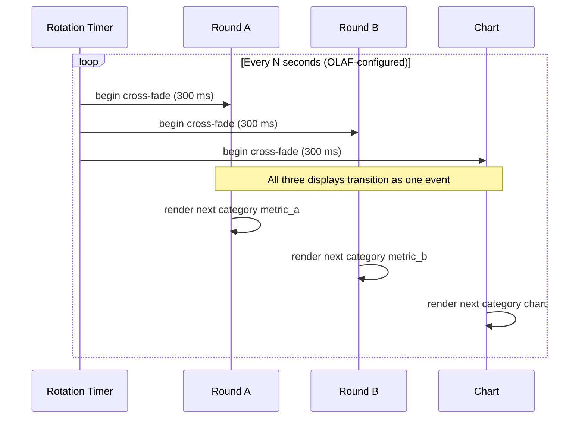
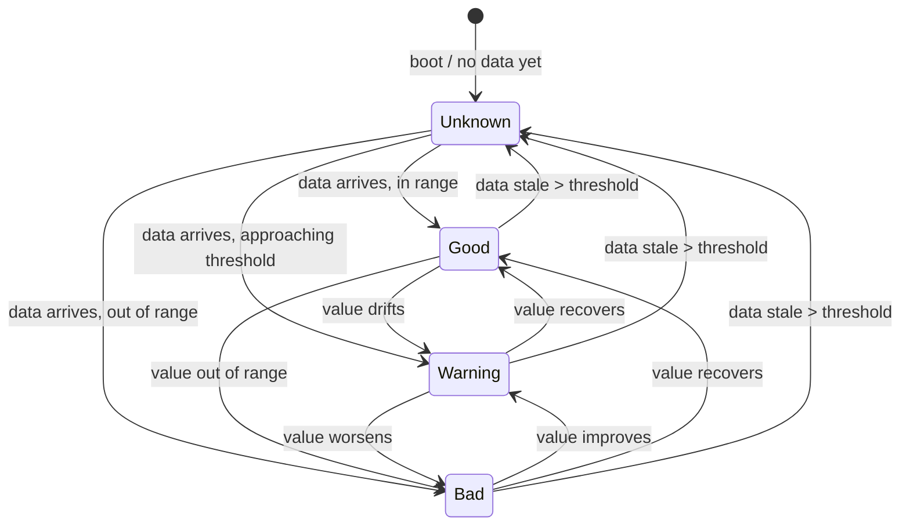
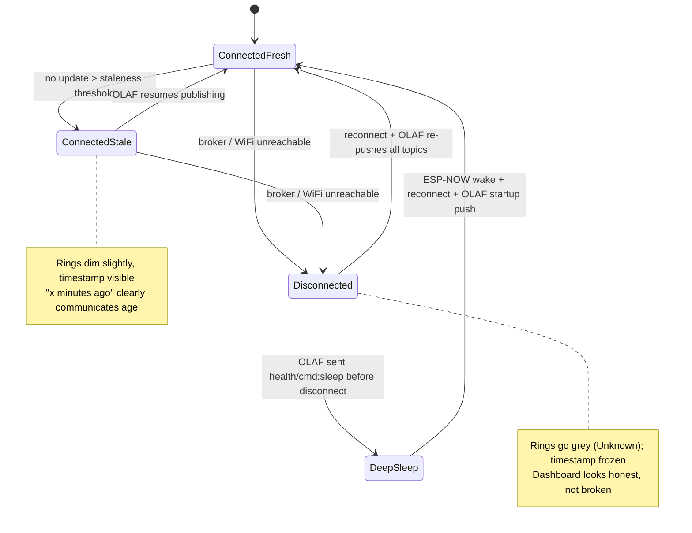

# UX Design Specification: OLAF External Support — Health Dashboard

**Author:** Kamal
**Date:** 2026-04-18

---

## Executive Summary

### Project Vision

A wall-mounted ambient health dashboard that renders OLAF's voice visually. Three displays mounted in a single black 3D-printed faceplate: a 2.8" rectangular TFT (ILI9341) on the **left in portrait orientation** for the chart, and two 1.28" round TFTs (GC9A01) stacked vertically on the **right** for the headline and secondary metrics. The arrangement is vertically symmetric — the two stacked rounds align along the faceplate's horizontal midline with the rectangle's centre. All three displays carry deep-black backgrounds so the surfaces dissolve into the faceplate and read as one continuous instrument.

The aesthetic is **modern and Apple-Watch-inspired**: OLED-deep black, bold high-contrast typography, vivid accent colour per domain, ring-as-status, disciplined minimalism, subtle motion. Categories rotate together every ~10 seconds (OLAF-controlled).

The interaction model has one direction only: **OLAF pushes, the dashboard renders.** No touch input, no voice on the device, no user controls. OLAF puts the dashboard to sleep and wakes it. The dashboard's job is to be beautiful, calm, and honest — nothing more.

### Target Users

- **Kamal** — builder, daily viewer, aesthetic arbiter. Modern sensibility, uncompromising on calm-over-noisy, values architectural elegance matched by visual elegance.
- Family presence is acknowledged as eventual incidental viewership but is not a design driver in this specification.

### Key Design Challenges

1. **Three-display unity within one black faceplate** — surfaces must feel like one instrument, not three gadgets.
2. **Glanceability at room distance** — a 10-second slot per category means each frame must be parseable peripherally, across the room, in passing.
3. **Status ring × centre content on 240×240 rounds** — two independent visual systems harmonizing inside the same 240×240 circle.
4. **Coordinated transitions across heterogeneous displays** — round dissolves and rectangle redraws in the same breath, not as three disconnected events.
5. **Consistency across four very different data shapes** — a kilogram number, a mmol/L concentration, a distance with date, a 16:30 duration — held together by one typographic and structural logic.
6. **Chart minimalism on a portrait 2.8" rectangle** — 240×320 px (portrait orientation) is a tight, vertically-oriented canvas for 30-day lines and 14-day scatter plots; ruthless subtraction is required, and chart aspect favours vertical value range over horizontal time range.
7. **Honest degraded states** — OLAF is still in development; the dashboard must communicate "I don't know" without breaking the calm or looking broken.
8. **Day vs night** — the same design, brightness-scaled, readable at 7 AM and gentle enough at 2 AM (though OLAF may simply sleep it overnight).

### Design Opportunities

- **OLED-black fusion.** Backgrounds match the faceplate. The screens disappear into the object, leaving only data glowing — the dashboard stops looking like electronics and starts looking like *presence*.
- **Apple-Watch visual language.** The activity-ring metaphor is already the status ring; bold SF-style typography lives easily on black; vivid accent colours carry domain identity without noise.
- **Motion as presence.** A slow ring breath, a soft number tween on update, whisper transitions between categories — makes the dashboard feel alive without being animated-for-its-own-sake.
- **Per-category accent colour.** Each of the four domains gets a signature hue (weight, glucose, cycling, fasting) while the black spine and typographic system hold the family together.
- **The rectangle as breathing room.** Chart becomes an elegant data sketch — no gridlines, no axis ticks, minimal labels — the *shape* of the truth.

## Core User Experience

### Defining Experience

The Health Dashboard is a **mirror with a conscience** — a wall-mounted ambient surface whose purpose is not to inform Kamal of his health data (he already knows the numbers), but to keep him in daily relationship with his own intentions around body weight, glucose, cycling, and fasting. Its value is measured in motivation, not information.

There is no user action to design. The user does not tap, speak, or input anything. The "interaction" is a **2-second glance** that either reinforces alignment ("I'm on track") or surfaces drift ("I've slipped — remember") — honestly, without shame, without nagging.

The dashboard is always on. It lives in the viewer's peripheral awareness, becoming a constant, quiet witness to trajectory.

### Platform Strategy

- **Hardware-native, single-device product.** ESP32 firmware driving three SPI TFT displays (2× GC9A01 1.28" rounds on the right, 1× ILI9341 2.8" rectangle in portrait on the left) inside a single 3D-printed black faceplate. Wall-mounted, always-on, USB-C powered.
- **Zero direct user input.** No touch, no buttons, no voice on the device. Not an oversight — a stance. All control flows from OLAF via MQTT.
- **Output-only to the viewer; input-only from OLAF.** The dashboard is a pure rendering surface for OLAF-pushed content, thresholds, directives, and state transitions.
- **No multi-platform concerns.** No web view, no companion app, no mobile mirror. The dashboard is exactly one physical object and nothing else.

### Effortless Interactions

Because there is no interaction to design, "effortless" here means **effortless comprehension**. The viewer should not read the dashboard — they should *know what it says* without cognitive effort.

- **Colour lands before the number.** Status ring is perceived emotionally before the number is read cognitively. Even a half-second peripheral glance delivers the core signal.
- **Chart shape lands before chart detail.** The shape of a 30-day weight trend — rising, falling, flat — should be legible at 3m without reading a single axis label.
- **The headline number is brutal and large.** One number, maximum hierarchy, no decoration between eye and value.
- **Transitions do not interrupt.** When the dashboard rotates from weight to glucose, the viewer's attention is not seized — the change simply arrives.
- **Degraded states look honest, not broken.** When OLAF is down, the grey ring and stale timestamp tell the truth clearly without causing alarm.

### Critical Success Moments

These are the moments that determine whether the design succeeds or fails:

- **The motivating glance.** "I see I'm on track." — Green ring, improving trend. Feels quietly good. Reinforces the next behaviour.
- **The re-engaging glance.** "I see I'm slipping." — Amber ring, declining trend. Feels like a gentle challenge, not a scolding. Motivates a course correction rather than triggering avoidance.
- **The attention-grabbing glance.** "Something's off." — Red ring catches peripheral vision from across the room. Not panic — clarity. Invites a closer look.
- **The boring glance.** "Steady." — Doesn't demand attention. Fades into the background. This is success, not failure.
- **The honest-absence glance.** "OLAF is down, data is stale." — Grey ring, timestamp visible. The dashboard does not lie; it admits what it doesn't know. Trust preserved.

### Experience Principles

These guide every subsequent design decision:

1. **Glanceability over detail.** Every frame must work peripherally at 2–3m. If it requires staring, we've failed.
2. **Honesty over certainty.** Stale data looks stale. Unknown looks unknown. The dashboard never presents confidence it doesn't have.
3. **Calm over alarm.** Even bad news delivered without drama. The ring communicates; it doesn't shout.
4. **Beauty over utility.** The dashboard is always in view. A utility object tolerated for its data is a failure. It must be worth looking at.
5. **Presence over interaction.** The dashboard IS. It does not DO. Its value is in its continuous, quiet, truthful existence.
6. **Motivation without nagging.** It reflects; it does not lecture. It surfaces truth; it does not demand response. Agency remains with Kamal.

## Desired Emotional Response

### Primary Emotional Goals

The dashboard's job, emotionally, is to evoke exactly one feeling: **motivation**. Motivation that arises from Kamal seeing the truth of his own body's trajectory, without being insulated from it and without being dramatized at.

Everything downstream of this is a supporting actor. The dashboard does not celebrate, console, encourage, or nag. It reflects. Motivation emerges from Kamal's relationship with what he sees — not from the dashboard's emotional performance on his behalf.

### Emotional Journey Mapping

- **First install & power-on.** Quiet pride. "My creation lives on my wall." The aesthetic should reward the builder's eye immediately — this is a moment of craft satisfaction, not a moment of utility.
- **The daily motivating glance** (green, improving). Quiet reinforcement. "Good. Staying the course." Not celebration. Not fanfare. A silent nod.
- **The daily re-engaging glance** (amber, drifting). Honest acknowledgement. "Right — that's where I am." No softening, no warm-tone sympathy, no coaching message. The truth, without cushion.
- **The attention-grabbing glance** (red, out of range). Clarity, not alarm. Red is red; it does what red does. But the *delivery* is calm: no pulse, no bounce, no escalating animation. The information is sharp; the drama is absent.
- **The honest-absence glance** (grey, stale, OLAF down). Trust preserved. "The dashboard is being honest about what it doesn't know." Feels like integrity, not brokenness.
- **The boring glance** (steady state). Indifference by design. The dashboard fades into peripheral awareness. This is not failure — this is the dashboard doing its job without demanding attention.
- **Returning daily.** Familiarity. A constant, quiet witness on the wall. The dashboard becomes part of the room's emotional texture — always there, always true.

### Micro-Emotions

Critical micro-emotional states to get right:

- **Trust > Skepticism.** When the ring says good, it is good. When the timestamp says "2 hours ago," it is 2 hours ago. No exaggeration, no reassurance theatre.
- **Respect > Sympathy.** Kamal is treated as an adult capable of handling his own truth. The dashboard does not soften bad news to protect him.
- **Calm > Anxiety.** Even the most alarming metric is delivered without visual shouting. The red ring is present, not panicked.
- **Agency > Guidance.** The dashboard never tells Kamal what to do. Never suggests. Never advises. The next move is always his.
- **Familiarity > Novelty.** The dashboard is the same dashboard today as yesterday as tomorrow. Predictability is a feature. Surprise is avoided.

**Emotions to actively avoid:**

- **Shame** — the amber/red states must never feel like judgment.
- **Anxiety** — no pulsing, no alarm animations, no escalation.
- **Nag-fatigue** — the dashboard never "reminds"; it simply *is*.
- **Guilt** — the dashboard reflects data, not morality.
- **Indifference** — the aesthetic must reward looking; a glance that returns nothing is the one failure mode we cannot accept.

### Design Implications

Specific UX consequences of the honest-mirror stance:

- **Colour saturation is consistent across good and bad.** Green, amber, and red are equally vivid. Bad news is not desaturated to be "kinder" — that would be a lie. But none of them are oversaturated to shout.
- **Motion is minimal and symmetric.** No state has special animation for bad news. Transitions, breath on rings, number tweens — all treated equally regardless of what the data says.
- **Typography weight is constant.** A red-ring reading uses the same font weight as a green-ring reading. Emphasis does not shift with sentiment.
- **No textual encouragement or warning.** No "you're on track!" No "needs attention." The labels are neutral descriptors (Body Weight, Glucose, Cycling, Fasting) — never editorialized.
- **The chart shows decline honestly.** No smoothing, no "helpful" axis rescaling, no aspirational target lines that hide current reality.
- **Staleness is shown, not hidden.** When data ages, the timestamp makes it plain. The dashboard would rather look uncertain than look wrong.
- **Ring colour transitions are instant or near-instant.** No dramatization of the moment a status crosses a threshold.

### Emotional Design Principles

These are the emotional commitments the dashboard makes to Kamal every day:

1. **Tell the truth, without cushion.** Softening bad news is a form of lying, and the dashboard will not lie to him.
2. **Do not perform.** The dashboard does not emote *at* Kamal. It reflects. Emotion arises in the viewer, not in the surface.
3. **Respect adulthood.** Kamal does not need coaching, warnings, encouragement, or guidance from his wall. He needs a mirror.
4. **Calm carries the truth.** Even the sharpest reality is delivered without drama. The information is the point; the delivery is invisible.
5. **Silence over speech.** The dashboard never writes a sentence it doesn't need to. Labels, units, timestamps — never encouragement.
6. **Presence without demand.** The dashboard does not ask to be looked at. It is simply there, reliable, waiting to be glanced at.

## UX Pattern Analysis & Inspiration

### Inspiring Products Analysis

**Apple Watch** (faces: Modular, Simple, Chronograph Pro; activity rings; complications): the primary reference. Activity rings as a soul indicator — colour-first, detail-second. Bold SF Pro numerals on OLED-black. Complication density that never feels crowded. Subtle, purposeful motion. Vivid accent colour on black reads across a room. The round displays on this dashboard are direct descendants of this visual language.

**Braun / Dieter Rams industrial design** (ET66 calculator, LE1 speaker, alarm clocks, ABR21): "Less, but better." Disciplined geometry — perfect circles, perfect rectangles, nothing decorative. Neutral foundation plus one or two strong accents. Typography as the visual, never decoration. One clear primary element, everything else recessive. The stance, not the specific look — Rams is the *discipline* we're inheriting, not the beige. *(Note: Braun watches were explicitly rejected; industrial-design reference only.)*

**Teenage Engineering** (OP-1, Pocket Operators, TX-6): vivid accent colours on black and grey. Playful-but-disciplined typography. Instrument-as-object aesthetic — the device feels like a piece of equipment you'd want to own. Modular visual language shared across different products — the same DNA at different scales. This informs how all three displays become one family.

**Nest Learning Thermostat**: round ambient display with status-ring metaphor. Rotating information on a single circular surface. Large central number, contextual periphery. Calm domestic presence — proves that a health-domain display can live on a wall without feeling medical.

**Nothing Phone / Nothing OS**: deep black + white hierarchy. Dot-matrix crossed with SF typography. Minimalism with character — proof that restraint and personality can coexist. Structured data on black, monochrome with judicious colour.

**Tesla / Polestar vehicle UIs**: single-colour line charts on deep-black backgrounds, no gridlines, minimal axis labels. Calm at 100 km/h — proves the "readable in motion, at a glance" principle we need for the rectangular chart. Demonstrates that a small display with ruthless subtraction can show a lot of information without feeling cluttered.

### Transferable UX Patterns

**For the round displays (GC9A01 240×240):**

- **Activity-ring-as-status** (Apple Watch + Nest): 12 px outer annulus in the status colour, metric content centred inside. Ring speaks emotion; content speaks fact.
- **Big bold numeral, unit subordinate** (Apple Watch Modular + Nest): a single dominant number fills the centre, with the unit tucked to the right at smaller size and same colour — a tight, legible pair.
- **Timestamp as quiet complication** (Apple Watch): data age lives as small recessive text at the bottom of the circle, present but un-shouting.
- **Vivid accent on OLED-black** (Apple Watch + Teenage Engineering + Nothing): status colours saturated enough to communicate from 3 m, but never oversaturated to shout. Black is true black.

**For the rectangular display (ILI9341, 240×320 portrait):**

- **Single-colour line chart on black** (Tesla + Polestar): the chart shape is the subject. Stroke is the category's accent colour. No fill gradient, no shadow, no glow.
- **No gridlines, minimal axes** (Tesla + Braun): subtraction over addition. Start/end labels and extremes only — no tick clutter.
- **Chart shape = shape of truth** (Rams): the trend must be legible at 3 m as *rising, falling, flat* without reading a single label.
- **Tiny title + dominant chart** (Apple Watch Modular + Nest): name the category quietly at the top-left; let the data own the rest.

**Cross-display system patterns:**

- **One design DNA across three screens** (Teenage Engineering): rounds and rectangle share typography, colour logic, and hierarchy — they feel like family, not three gadgets in a faceplate.
- **Coordinated rotation** (Nest ambient rotation): all three screens transition together. The act of changing category is a single event of the whole dashboard, not three separate redraws.
- **Calm motion vocabulary** (Apple Watch tween discipline): numbers tween gently on update, ring colour changes are crisp but unhurried, transitions are wipes or fades — never bounces, slides, or elastic physics.

**Colour system patterns:**

- **Four category accents × four status colours × OLED black** — a carefully bounded palette that communicates both "which domain" and "how am I doing" without ever needing text to explain.
- **Ring = status, centre = domain accent** (Apple Watch + Nest): the two colour systems live in different zones so they never fight — status on the periphery, domain accent in the content.

**Typography patterns:**

- **Sans-serif with strong numerals** (SF Pro, Inter, IBM Plex Sans) (Apple Watch + Nest): the workhorse.
- **Tabular/monospaced numerals** (Teenage Engineering + Nothing): numbers don't shift position as digits update — essential for a live-updating display.
- **Weight hierarchy** (Rams): bold for headline numerals, regular for labels, light for timestamps. Weight does all the work colour doesn't.
- **Tight letter-spacing, confident capitals in labels** (Nothing + Apple Watch): labels feel intentional, not incidental.

### Anti-Patterns to Avoid

Extracted both from bad patterns in the space and from our own Emotional Response principles:

- **Gamification.** Streaks, badges, levels, "you earned 100 XP!" — MyFitnessPal and Fitbit territory. Directly conflicts with no-performance and no-nagging. The dashboard is not a game.
- **Encouragement text.** "Keep it up!" "You've got this!" "Great job!" — conflicts with silence-over-speech. The dashboard does not cheer.
- **Alarm theatre.** Pulsing red, flashing warnings, escalating animation — medical-device UX. Conflicts with calm-carries-truth.
- **Chart chrome.** Excel-style gridlines, tick marks, legends, double-axis clutter. Conflicts with ruthless-subtraction.
- **Desaturated bad news.** Softening amber/red to be "kinder" — conflicts with honest-mirror. A lie about colour is still a lie.
- **Information density.** Six metrics on a screen, Garmin-style data pages — conflicts with glanceability. One domain at a time.
- **Cute illustrations / emoji / characters.** Duolingo-style mascots — conflicts with respect-adulthood.
- **Aspirational overlays.** Ghost lines showing "your goal" or "last month's better you" — conflicts with the stance that the dashboard shows what is, not what should be.
- **Skeuomorphic chrome.** Faux-leather, faux-brushed-metal, drop shadows pretending to be physical. Conflicts with OLED-native design.
- **Microinteractions for their own sake.** Bounce, elastic, rubber-band, particle effects — conflicts with motion-as-presence.

### Design Inspiration Strategy

**Adopt as-is:**

- Activity-ring metaphor → directly translated to status ring on rounds.
- OLED-deep-black backgrounds → universal across all three displays.
- SF-Pro-class sans-serif typography (or Inter / IBM Plex Sans) → system font family.
- Status colour language (green/amber/red/grey) → palette fixed, with OLED-optimized hexes.

**Adapt:**

- Apple Watch complication structure → simplified to one headline + timestamp. (We have two round displays, so secondary data lives on a separate screen rather than as a complication.)
- Nest rotating ambient → adapted into the 4-category rotation across three coordinated displays.
- Teenage Engineering accent vocabulary → four per-category accent colours instead of per-product, all on the same OLED-black substrate.
- Tesla chart minimalism → pushed further, because our canvas is a 2.8" rectangle, not a 15" console.
- Nothing monochrome-with-accent → applied to the health-dashboard context, with status ring as the one place colour is emotionally loaded.

**Avoid without exception:**

- Gamification, streaks, badges.
- Encouragement or warning text.
- Alarm escalation motion.
- Chart chrome — gridlines, tick marks, decorative legends.
- Desaturated bad-news colours.
- Aspirational overlays or ghost target lines.
- Skeuomorphic texture.
- Any motion vocabulary that says "play" rather than "presence."

## Design System Foundation

### Design System Choice

**A fully custom design token system implemented on LVGL** (Light and Versatile Graphics Library for embedded systems).

- **Graphics substrate:** LVGL on ESP32 (via ESP-IDF or Arduino-LVGL port)
- **Design tokens:** fully custom — no off-the-shelf system (Material, iOS HIG, etc.) is used or referenced. The aesthetic is *Apple-Watch-inspired*, not *Apple-Watch-derived*.
- **Theme:** a single custom LVGL theme named `olaf_dark` is defined once and applied uniformly across all three displays.

### Rationale for Selection

- **LVGL gives us a widget / theme / animation / chart engine for free.** Rebuilding those on TFT_eSPI would cost weeks of firmware work with no aesthetic benefit.
- **LVGL supports OLAF-directed layouts over MQTT.** Today: OLAF pushes widget property values (colour, text, chart data). Tomorrow: OLAF pushes full widget trees as JSON. This matches the product-brief principle of *"firmware provides primitives, OLAF composes them"* — no firmware release required to invent new visualisations.
- **LVGL's theme system enforces visual consistency across the three displays.** A single `olaf_dark` theme governs every pixel — the rounds and the rectangle cannot drift apart.
- **Custom design tokens because the aesthetic demands pixel-level control.** Activity-ring metaphor, tabular numerals, chart minimalism — none of these survive an off-the-shelf component library's opinions.
- **Trade-offs accepted:** ~150 KB flash footprint, LVGL learning curve, and the default LVGL look needs heavy overriding. All acceptable given the ESP32's resources and Kamal's embedded experience.

### Implementation Approach

- **One LVGL application, three display drivers.** All three TFTs (2× GC9A01 1.28" rounds + 1× ILI9341 2.8" rectangle) are registered as separate `lv_disp_t` instances within a single LVGL application. Shared SPI bus. The ILI9341 driver is configured with 90° rotation so the canvas is logically 240×320 portrait; LVGL rendering treats it as a portrait 240×320 display.
- **Custom theme `olaf_dark`** extends `lv_theme_default` and overrides colours, fonts, radii, borders on every widget class.
- **Widget primitives used:**
  - `lv_arc` — status ring on round displays
  - `lv_label` — all text (headline numeral, unit, category label, timestamp)
  - `lv_chart` — line / scatter / bar chart on rectangular display
  - `lv_obj` — layout containers
- **Animations via `lv_anim`** — number tweens, ring colour transitions, category fade transitions.
- **Pre-rasterised fonts** — Inter at specific sizes via `lv_font_conv`, compiled into firmware.
- **MQTT integration layer** — a thin module that receives topic updates and maps them to widget property changes (e.g., `lv_label_set_text`, `lv_arc_set_value`, `lv_chart_set_series_values`).

### Customisation Strategy

- **Theme-level** (`olaf_dark`): colour tokens, font family, default radii, default borders applied across all widgets.
- **Widget-level:** custom styles for status ring (full-arc, category-token colour), chart (no gridlines, no axes, single stroke), label (tabular numerals enabled).
- **OLAF-directable properties:** widget text, chart data series, ring value, theme colour overrides — all settable via MQTT without firmware changes.
- **Future path:** JSON-layout interpreter that lets OLAF push entire widget trees. Out of scope for v1; architecture leaves room for it.

---

### Design Tokens

#### Typography

- **Font family:** **Inter** (SIL Open Font License, free).
- **Weights used:** Regular (400), Medium (500), Bold (700).
- **Tabular numerals enabled** on all live-updating numeric displays.
- **Pre-rasterised** at each size via `lv_font_conv`; no runtime font rendering.

**Type scale — round displays (240×240):**

| Role | Size | Weight | Notes |
|---|---|---|---|
| Headline numeral | 56 px | Bold | Tabular |
| Unit suffix | 22 px | Medium | Baseline-aligned to numeral |
| Category label | 12 px | Medium | All-caps, +0.04em tracking |
| Timestamp | 10 px | Regular | Muted colour |

**Type scale — chart display (240×320 portrait):**

| Role | Size | Weight | Notes |
|---|---|---|---|
| Category title | 14 px | Medium | Top-left |
| Axis extremes | 10 px | Regular | Dim, start/end only |

#### Colour Palette

**Neutrals:**

| Token | Hex | Role |
|---|---|---|
| Background | `#000000` | True OLED black — universal |
| Foreground | `#F5F5F5` | Soft white — primary text |
| Muted | `#8A8A8A` | Labels, timestamps, secondary text |
| Dim | `#555555` | Axis marks, low-emphasis elements |

**Status colours** (status ring only — periphery of round displays):

| Token | Hex | Meaning |
|---|---|---|
| Good | `#30D158` | Within healthy target |
| Warning | `#FFB020` | Approaching threshold |
| Bad | `#FF3B30` | Outside healthy range |
| Unknown | `#6E6E6E` | No data / stale |

**Category accent colours** (centre content, chart stroke — never in the ring):

| Category | Hex | Personality |
|---|---|---|
| Body Weight | `#5AC8FA` | Sky blue — clinical, measurement |
| Glucose | `#FF6AD5` | Magenta/pink — medical, distinct from status red |
| Cycling | `#FFCC00` | Gold — kinetic, sporty |
| Fasting | `#B478FF` | Violet — temporal, contemplative |

*Colour discipline:* status colours live exclusively on the ring at the periphery of round displays. Category accents live exclusively in centre content (numerals may receive a category-accent tint) and chart strokes on the rectangle. The two systems never co-locate spatially, so they never fight.

#### Spacing Scale

- **Base unit:** 4 px
- **Scale:** 4, 8, 12, 16, 24, 32
- Applied uniformly to padding, gaps, margins across all layouts.

#### Ring Geometry (GC9A01 240×240)

| Spec | Value |
|---|---|
| Outer radius | 118 px |
| Inner radius | 106 px |
| Centre | (120, 120) |
| Annulus thickness | 12 px |
| Rendering | `lv_arc`, full 360° fill, colour = status token |

#### Motion

| Event | Duration | Easing | Notes |
|---|---|---|---|
| Category transition (all 3 displays) | 300 ms | Ease-out | Cross-fade |
| Numeric value update | 200 ms | Ease-out | Tween between values |
| Ring status colour change | 80 ms | Ease-out | Near-instant, never jarring |
| Chart redraw on category change | 0 ms | — | Instant (animation optional; default off) |

**Prohibited motion:** breath, pulse, bounce, elastic, rubber-band, alarm escalation, particle effects, or any animation whose tempo varies based on the data's emotional valence.

#### Component Vocabulary

| Component | LVGL Widget | Specification |
|---|---|---|
| Status ring | `lv_arc` | Full 360° fill, status-token colour, 12 px thick |
| Headline numeral | `lv_label` | Inter Bold 56 px, foreground colour, tabular |
| Unit suffix | `lv_label` | Inter Medium 22 px, same colour as numeral |
| Category label | `lv_label` | Inter Medium 12 px, all-caps, muted colour |
| Timestamp | `lv_label` | Inter Regular 10 px, muted colour |
| Chart | `lv_chart` | Single series, category-accent stroke, no gridlines, no axes, start/end extreme labels only |

#### Iconography

**None.** No icons, no symbols, no decorative glyphs. Typography plus colour plus position carry all meaning. This is an intentional constraint — every icon we don't draw is a moment of noise we didn't add.

## Core User Experience — Defined

### Defining Experience

The "**2-Second Glance**" — the dashboard's entire reason to exist. A moment of passive comprehension where the viewer, from peripheral attention or direct focus, extracts health status and trajectory without any action taken. The defining experience is not an interaction — it is a *successful transfer of truth across a room, in under two seconds, from a screen into a brain*.

If the 2-Second Glance succeeds, the dashboard works. If it fails, nothing else in the spec matters.

### User Mental Model

Users arrive at the dashboard with **zero learning required**. Three pre-installed mental models from other products do all the interpretive work:

- **Activity rings** (Apple Watch, Nike, Strava) — ring colour = status
- **Car dashboards / aviation HUDs** — big number = current value
- **Line charts** (universal since school) — shape = trajectory

The dashboard composes these known patterns in a new spatial arrangement across three displays. **No education, no onboarding, no tutorial.** If the viewer has ever seen a smartwatch or a graph, they already understand the dashboard.

### Success Criteria for the Defining Experience

- **Ring colour perceived within 200 ms** of visual contact at 3 m peripheral.
- **Headline numeral readable at 2 m** without squinting.
- **Chart trend shape (rising / falling / flat) legible at 3 m** without reading axis labels.
- **Category identity inferable from colour and chart shape** alone — the label is confirmation, not explanation.
- **Rotation transitions noticed but not attention-captured** (unless colour changes across the boundary — which is natural, not designed).
- **Degraded state** (grey ring, stale timestamp) communicates "honest unknown" in under 1 second, without looking broken.

### Novel vs Established Patterns

**Predominantly established.** Every individual pattern on the dashboard is something the user has seen before — rings, big numerals, line charts, rotating ambient info (Nest, airport boards).

**The novelty is compositional** — using these familiar patterns across three heterogeneous, coordinated displays with zero user interaction, in a home health context. The composition is new; the primitives are not. **No user training required.**

### Experience Mechanics — The Three Layers of Attention

The dashboard serves three distinct levels of viewer attention simultaneously. The design must reward every level proportionally, because the viewer — not the dashboard — decides how much attention to give.

#### Layer 1 — The Peripheral Glance (0.2–0.5 s, 3–5 m away)

- **User state:** doing something else; dashboard caught in peripheral vision.
- **What they extract:** the ring colour. Nothing else. Green = "all good, return to task." Amber/red = "something shifted, decide whether to look closer."
- **Design implication:** the ring is the **entire product** at this layer. Bold, fully saturated within discipline, instantly readable. If the ring fails here, nothing downstream matters.
- **Frequency:** dominant. Most glances at the dashboard are this.

#### Layer 2 — The Active Glance (1–3 s, 2 m away)

- **User state:** attention turned toward the dashboard, not yet committed.
- **What they extract:** category identity, headline number, trend direction from the chart's silhouette.
- **Design implication:** the headline numeral and chart shape carry the information load. Label and timestamp are present but subordinate. This is **the designed-for case.**
- **Frequency:** common. The "what am I at right now" glance.

#### Layer 3 — The Deep Glance (5–10 s, 1 m away)

- **User state:** the dashboard has captured attention; the viewer wants specifics.
- **What they extract:** exact number, unit, timestamp, chart detail, secondary metric on Round B.
- **Design implication:** all the detail must be there, readable and honest. The dashboard must reward depth without punishing the quick glance.
- **Frequency:** rare. Only when something has caught attention or during reflective moments.

### Initiation, Interaction, Feedback, Completion

- **Initiation:** passive. The dashboard is always on. The user initiates simply by looking. No wake gesture, no proximity sensor, no tap, no "activate."
- **"Interaction":** zero direct input. The viewer allocates attention; the dashboard responds with information already present.
- **Feedback:** the data *is* the feedback. There is no "you did it right" state because there is no doing.
- **Completion:** the glance ends when the viewer has extracted what they came for. The dashboard does not know, does not track, does not care.

### The Rotation Heartbeat

Every ~10 seconds (OLAF-controlled), all three displays transition together to the next category. This is the dashboard's **only active moment** — the pulse that distinguishes it from a static poster.

- **Coordinated** across all three displays as a single event, not three independent redraws.
- **300 ms cross-fade**, ease-out.
- **Does not capture attention** under normal circumstances. (If the incoming category shows a bad ring, the colour does its work naturally — no special animation required.)
- **Cumulative effect:** over a minute, a viewer moving through the room sees their whole body summarised across four domains. The dashboard becomes a slow, quiet recital of trajectory.

## Visual Design Foundation

*This section complements — and does not re-specify — the Design Tokens already committed in §Design System Foundation. It adds the spatial organisation, leading/line-height rules, and accessibility considerations that the token system implies but does not enumerate.*

### Color System

Colour tokens are fully specified in §Design System Foundation (neutrals, status colours, category accents).

**Semantic use-site rules (spatial discipline):**

| Zone | Colour system | Allowed tokens |
|---|---|---|
| Outer ring (round displays, r=106–118) | Status | `Good`, `Warning`, `Bad`, `Unknown` only |
| Centre content (round displays, r<106) | Category accent + neutrals | Category hex for numeral tint (optional); Foreground for neutral numeral; Muted for label/timestamp |
| Chart stroke (rectangle) | Category accent | Current category's accent hex |
| Chart body / background (rectangle) | Neutrals | `Background` only |
| Chart title / axis extremes (rectangle) | Neutrals | `Muted` / `Dim` |

The two colour systems (status vs category) are spatially segregated: they never occupy the same pixel zone. This eliminates any semantic collision between "the ring is red" and "the chart is red" — they cannot co-occur.

### Typography System

Typefaces, weights, and size scale are specified in §Design System Foundation.

**Line-height / leading rules:**

| Element | Leading |
|---|---|
| Headline numeral (56 px Bold) | 1.0 (single-line use only) |
| Unit suffix (22 px Medium) | Baseline-aligned to numeral baseline |
| Category label (12 px Medium, caps) | 1.2 |
| Timestamp (10 px Regular) | 1.2 |
| Chart title (14 px Medium) | 1.2 |
| Axis extremes (10 px Regular) | 1.2 |

**Alignment defaults:**

- Headline numeral: horizontally centred, fixed y-baseline per round layout.
- Unit: right-adjacent to numeral, baseline-aligned.
- Category label: horizontally centred, upper zone of round display.
- Timestamp: horizontally centred, lower zone of round display.
- Chart title: left-aligned at spacing unit 16 from rectangle edge.

### Spacing & Layout Foundation

Base unit and spacing scale are specified in §Design System Foundation.

**Round display composition zones** (GC9A01 240×240, centre (120, 120)):

| Zone | Y-range | Contents | Alignment |
|---|---|---|---|
| Ring | r = 106–118 | Status ring arc | Full 360° |
| Upper zone | y ≈ 40–70 | Category label (appears briefly at transition, optional persistent) | Centre |
| Centre zone | y ≈ 95–165 | Headline numeral + unit suffix | Centre |
| Lower zone | y ≈ 180–200 | Timestamp | Centre |
| Clip boundary | r < 106 | All content respects the inner ring boundary — no pixel crosses into the ring zone | — |

**Rectangle display composition zones** (ILI9341, 240×320 portrait):

| Zone | Bounds | Contents |
|---|---|---|
| Title bar | (16, 16) – (224, 32) | Category title, left-aligned |
| Chart body | (16, 48) – (224, 288) | Chart canvas (~208 × 240) |
| Axis extremes | (16, 296) – (224, 312) | Optional start/end labels at outer x |

**Physical faceplate arrangement:**

- **Left:** 2.8" ILI9341 in portrait orientation — rotated 90° so the long axis is vertical.
- **Right:** two 1.28" GC9A01 round displays stacked vertically, symmetric about the faceplate's horizontal midline.
- The two stacked rounds (≈ 65 mm total height) and the rect portrait (≈ 71 mm height) are height-matched — the faceplate's vertical centre passes through the rect's midpoint and the gap between the two rounds.

**Layout principles:**

- **Radial discipline on round displays** — all content is organised around the centre point, respecting the inner ring clip. No rectangular layouts that visually collide with the curved boundary.
- **Zonal discipline on the rectangle** — title, body, and extremes have fixed vertical zones. The chart dominates by area.
- **No cross-display layout dependencies** — each display's composition resolves independently so that any one can render even if another fails to redraw.
- **Generous negative space** — empty pixels are part of the design, not an absence. Crowding is a failure; breathing is default.

### Accessibility Considerations

The audience for this dashboard is a specific adult user (Kamal) with ordinary vision. The accessibility stance is *enough, not more* — but several points are worth naming:

**Contrast (all on `#000000` background):**

| Foreground | Ratio | Standard |
|---|---|---|
| `#F5F5F5` (foreground) | 19.8 : 1 | WCAG AAA (all sizes) |
| `#30D158` (good) | 11.2 : 1 | WCAG AAA |
| `#FFB020` (warning) | 10.4 : 1 | WCAG AAA |
| `#FF3B30` (bad) | 5.5 : 1 | WCAG AA normal / AAA large |
| `#6E6E6E` (unknown) | 4.2 : 1 | AA large text only |
| `#8A8A8A` (muted) | 6.0 : 1 | WCAG AA |
| `#555555` (dim) | 3.2 : 1 | Below AA; used only for decorative axis marks |

**Typography legibility at distance:**

- Headline numeral at 56 px Bold → legible at 3 m for a user with standard vision.
- Labels at 12 px → legible at 1 m; not designed to carry critical information at 3 m (that's the ring's job).
- Timestamps at 10 px → legible at <1 m; deliberately recessive.

**Colour-blindness:**

- The status ring relies on the red/amber/green axis — the classic protanopia/deuteranopia vulnerability.
- *Mitigations present by design:*
  - Status colours differ in luminance as well as hue (green is brightest, amber mid, red darker) — still distinguishable under hue-blindness.
  - The ring is always a full 360° fill — no "amount" ambiguity.
  - The numeric value is always visible alongside — the user can verify status by reading the number if colour is unclear.
- *Acknowledged limitation:* the dashboard does not render a redundant non-colour indicator (e.g., pattern, icon, fill-percentage). For this personal-project context with a known-sighted user, this is acceptable.

**Motion sensitivity:**

- No strobing, flashing, or rapid animation anywhere in the design.
- Maximum tween duration is 300 ms; easing is always ease-out.
- No vestibular or seizure triggers.

**Audio:**

- None. The dashboard is silent.

## Design Direction Decision

### Design Directions Explored

A single committed direction, not competing variations. The eight preceding steps had already narrowed the design space to one coherent vision by the time this step was reached — OLED-black, Apple-Watch activity-ring aesthetic, LVGL substrate, specific token palette. Producing 6–8 alternative mockups would have introduced theatre without introducing insight.

The single committed direction is visualised in full at: `documents/planning-artifacts/ux-design-directions.html` — a browser-renderable mockup of all four categories at the actual faceplate layout (rect portrait left, 1.28" rounds stacked right, vertically symmetric about the faceplate midline).

### Chosen Direction — "Honest Mirror, Modern Stone"

- **OLED-deep-black backgrounds** across all three displays — surfaces dissolve into the 3D-printed faceplate
- **Bold tabular Inter typography** — headline numerals dominate by weight and size; labels and timestamps recede
- **Apple-Watch-style status rings** on the round displays — 12 px annulus, full 360° fill, status colour
- **Tesla/Polestar-style minimalist charts** on the portrait rectangle — single accent-coloured stroke, no gridlines, no axis ticks, start/end extreme labels only
- **Spatial colour discipline** — status colour lives only in the ring; category accent lives only in centre content and chart stroke; the two systems never co-locate
- **Zero chrome** — no icons, no decorative glyphs, no encouragement text, no alarm animations, no aspirational overlays

### Design Rationale

- **Visual discipline matches emotional stance.** The committed "honest mirror, no cushion" stance from §Desired Emotional Response demands an aesthetic with no softening. OLED-black + disciplined typography + clean rings is that aesthetic.
- **Zero learning curve.** OLED-black + Inter + activity-ring metaphor is a pre-installed mental model from Apple Watch — viewers recognise it instantly.
- **Implementable in one LVGL theme.** The committed direction maps cleanly to `lv_arc`, `lv_label`, and `lv_chart` with a single custom `olaf_dark` theme — low firmware burden, high consistency.
- **Semantic collision eliminated by spatial discipline.** Status colour and category colour never occupy the same pixel zone, so "red ring" and "red chart" cannot visually conflict.
- **Forward-compatible simplicity.** When OLAF eventually gains compositional primitives, the restrained base direction absorbs new vocabulary without clashing. The design ages well.

### Implementation Approach

- **Mockup artifact:** `ux-design-directions.html` — full-size browser-renderable reference matching the actual faceplate layout (rect portrait left, 1.28" rounds stacked right). Circles rendered smaller than rect to reflect the physical 1.28" vs 2.8" size difference.
- **Firmware direction:** LVGL custom theme `olaf_dark` applied to widget primitives (`lv_arc`, `lv_label`, `lv_chart`). ILI9341 driver configured for 90° rotation (portrait). Inter pre-rasterised at 56 / 44 / 36 / 22 / 14 / 12 / 10 px via `lv_font_conv`.
- **Status state demonstrations in the mockup:** Weight (good), Glucose (warning — demonstrating mixed ring states across the two rounds), Cycling (good), Fasting (good). All four status colours appear in the token reference.
- **Known refinement flagged:** the glucose numeral at 56 px overflows the round canvas with "mmol/L" unit — addressed in the mockup by reducing to 48 px. Decision deferred to firmware-build time: (a) accept 48 px numeral for glucose only, (b) abbreviate unit to "mmol", (c) rethink the numeral-unit pairing for longer units.
- **Deliberate scope note:** HTML mockup is static. Motion (category transitions, number tweens, ring colour changes) is specified in §Design System Foundation and will be implemented against the LVGL animation API.

## User Journey Flows

Since the Health Dashboard is an ambient zero-interaction product, traditional user journeys do not apply — the viewer does not navigate, click, or input anything. The flows worth documenting are **Dashboard Life Journeys**: the dashboard's own temporal behaviours, which the viewer experiences passively. All journeys originate either from OLAF (data, directives) or from the passage of time (rotation timer, staleness thresholds).

### Journey 1 — The Rotation Cycle (Primary)

Every rotation interval (default 10 s, OLAF-configurable), all three displays cross-fade together to the next category. This is the dashboard's heartbeat.



### Journey 2 — Data Update

When OLAF publishes new data on any category, the node updates its cached state. If the category is currently visible, the viewer sees the update tween in real time; if not, the update is invisible until rotation reaches it.

```mermaid
sequenceDiagram
    participant O as OLAF
    participant B as MQTT Broker
    participant N as Node (ESP32)
    participant D as Active Display(s)
    O->>B: publish health/category/{n}/metric_a {value, status, ts}
    B->>N: deliver
    N->>N: update cache for category n
    alt category n is currently displayed
        N->>D: number tween (200 ms ease-out)
        N->>D: ring colour transition (80 ms ease-out)
    else category n is not displayed
        Note over N: no render; update applied silently to cache
    end
```

### Journey 3 — Status State Transitions

Each round display's ring reflects the resolved status pushed by OLAF. Transitions are immediate (80 ms colour tween) and symmetric — good-to-bad and bad-to-good use the same motion, by design.



### Journey 4 — OLAF Unavailability & Recovery

OLAF is under active development and will disconnect periodically. The dashboard degrades honestly and recovers automatically.



### Journey 5 — First Boot & Wake from Sleep

A fresh boot or ESP-NOW wake has no prior data. The dashboard renders placeholders while awaiting OLAF's initial push — "waiting for OLAF," not false numbers.

```mermaid
sequenceDiagram
    participant E as ESP32
    participant W as WiFi / Broker
    participant O as OLAF
    E->>E: Power on or ESP-NOW wake
    E->>E: Render placeholder: grey rings, "—" in numerals, empty chart
    E->>W: WiFi connect, MQTT subscribe health/#
    O->>W: Publish all current category data (startup sequence)
    W->>E: Deliver cached + current values
    E->>E: Render all 4 categories with data; begin rotation cycle
    Note over E,O: From wake to first-rendered-data target < 2 seconds
```

### Journey 6 — Day / Night Brightness Modulation

OLAF modulates backlight PWM over the course of the day via `health/brightness` (0–255). The dashboard applies changes instantly; no restart, no rotation interruption.

```mermaid
sequenceDiagram
    participant O as OLAF
    participant N as Node
    Note over O: Morning ramp (e.g. 06:30)
    O->>N: health/brightness: 255 (full)
    N->>N: ledcWrite(255) immediately
    Note over O: Evening dim (e.g. 21:00)
    O->>N: health/brightness: 80 (dim)
    N->>N: ledcWrite(80) immediately
    Note over O: Night-off (optional; if OLAF chooses to sleep the node)
    O->>N: health/brightness: 0 (visually off, still connected)
    Note over N: Node remains WiFi-connected; ready to resume instantly
```

### Journey Patterns

- **OLAF or timer triggered, never user-triggered.** Every state change in every journey originates either from an MQTT publish by OLAF or from the rotation timer.
- **Coordinated multi-display events.** Category change, data update for the active category, status change — never a single display acting alone. Transitions are whole-dashboard moments.
- **Honest transitions.** Every state change — including degradation — is shown, not hidden. Stale becomes Unknown, not "fresh with old numbers."
- **Symmetric motion.** Good→Bad and Bad→Good use identical motion. The dashboard does not dramatise bad news with special animation.

### Flow Optimization Principles

- **Zero cognitive load by design.** There are no decisions for the viewer to make, no navigation to consider, no progressive disclosure to tune. Optimisation means making every dashboard transition feel inevitable.
- **Preserve trust during degradation.** The Unknown state is as important as the Good state. Both must feel deliberate; neither must feel broken.
- **Bounded transition times.** Every motion is committed: 300 ms fade, 200 ms number tween, 80 ms ring transition. Nothing instantaneous that would be jarring; nothing slow that would feel laggy.
- **Recovery is automatic and silent.** When OLAF returns, the dashboard catches up without announcement. No "reconnected!" banner, no fanfare. Integrity, not attention-seeking.

## Component Strategy

### LVGL Foundation Components (Built-In)

The `olaf_dark` theme styles the following LVGL built-in widgets; all are used off-the-shelf with theme overrides:

| Widget | Role |
|---|---|
| `lv_arc` | Status ring on round displays |
| `lv_label` | All text — numerals, units, labels, timestamps, chart titles, axis extremes |
| `lv_chart` | Line / scatter / bar chart on the rectangle |
| `lv_obj` | Layout containers for per-display compositions |
| `lv_anim` | All motion — number tweens, ring colour transitions, category cross-fades |

No third-party component library is used beyond LVGL itself.

### Custom Visual Compositions

Each "component" below is an LVGL style group + layout template + state-mapping rule — not a new widget implemented from scratch. They are structured, named bundles of LVGL primitives.

#### StatusRing

- **Purpose:** Outer ring on each round display, reflecting the current metric's health status.
- **Anatomy:** `lv_arc` widget, full 360° angular range, 12 px thickness, outer r = 118 and inner r = 106, centre (120, 120).
- **States:** `Good` (`#30D158`), `Warning` (`#FFB020`), `Bad` (`#FF3B30`), `Unknown` (`#6E6E6E`).
- **Transitions:** 80 ms ease-out colour tween between states.
- **Variants:** none. Geometry is fixed.

#### HeadlineNumeral

- **Purpose:** Primary data value on a round display.
- **Anatomy:** `lv_label` Inter Bold 56 px (default), tabular numerals, foreground colour (`#F5F5F5`) by default or category-accent tint when designated. Optional child `lv_label` Inter Medium 22 px for the unit suffix, baseline-aligned to the numeral.
- **Variants:** `default` (56 px), `secondary` (44 px for Round B when value is shorter), `small-secondary` (36 px for Round B when value includes supplementary text), `compact` (48 px) — used when the unit string is long (e.g., "mmol/L").
- **States:** static value, tweening value (200 ms ease-out between old and new numeric values).
- **Accessibility:** not applicable (no screen reader on embedded).

#### SecondaryNumeral

- Functionally identical to HeadlineNumeral but used on Round B for the secondary metric. Typically rendered with the category's accent colour tint rather than foreground white, reinforcing domain identity.

#### CategoryLabel

- **Purpose:** Brief textual identifier of the currently rendered category (e.g., "BODY WEIGHT", "GLUCOSE").
- **Anatomy:** `lv_label` Inter Medium 12 px, all-caps, +0.04em tracking, muted colour (`#8A8A8A`).
- **Placement:** horizontally centred in the round display's upper zone (y ≈ 40–70).
- **States:** present / fading in at category transition. Optionally persistent, or optionally shown only briefly after each rotation.

#### Timestamp

- **Purpose:** Communicates data age honestly.
- **Anatomy:** `lv_label` Inter Regular 10 px, muted colour.
- **Placement:** horizontally centred in the round display's lower zone (y ≈ 180–200).
- **Content:** human-relative string pushed by OLAF ("this morning", "2 min ago", "today", "2 days ago"). The node does not compute this — OLAF provides the rendered string.

#### RoundComposition

- **Purpose:** Parent container that lays out the four round-display components (StatusRing, CategoryLabel, Numeral, Timestamp) inside a 240×240 canvas, respecting the inner-ring clip at r = 106.
- **Variants:** `variant=primary` (used for Round A — headline metric) and `variant=secondary` (used for Round B — secondary metric, category-accent tinted numeral).

#### ChartTitle

- **Purpose:** Quiet identifier of the current category on the rectangle display.
- **Anatomy:** `lv_label` Inter Medium 14 px, muted colour.
- **Placement:** top-left at padding 16 px from display edges.

#### ChartCanvas

- **Purpose:** Renders the line, scatter, or bar chart for the current category.
- **Anatomy:** `lv_chart` widget, 208 × 240 px area, themed with no gridlines, no axis ticks, single-series stroke in the category's accent colour.
- **Chart-type variants:**
  - `line` (Weight): single polyline, 2 px stroke, rounded joins.
  - `scatter` (Glucose): points at 3 px radius, optional subtle range band at 5% fill opacity.
  - `bar` (Cycling, Fasting): vertical bars, gap 4 px, accent fill.
- **States:** rendered (data present), empty (no data — subtle dim placeholder text "waiting for OLAF").

#### AxisExtremes

- **Purpose:** Minimal temporal context for the chart — start-of-range and end-of-range labels only.
- **Anatomy:** two `lv_label` widgets, Inter Regular 10 px, dim colour (`#555555`).
- **Content:** pushed by OLAF in the chart payload (e.g., "30d ago", "now"). The node does not format these.

#### RectangleComposition

- **Purpose:** Parent container laying out ChartTitle + ChartCanvas + AxisExtremes inside the 240×320 portrait canvas.

### Non-Visual Orchestration Modules

These are firmware modules, not widgets — but they are "components" of the runtime system and belong in the component strategy.

| Module | Responsibility |
|---|---|
| **CategoryRotator** | Holds active-category index, runs the rotation timer (default 10 s, MQTT-configurable). On expiry, triggers coordinated cross-fade. |
| **TransitionOrchestrator** | Executes synchronous 300 ms cross-fades across all three displays as one event, ensuring no display acts alone. |
| **MQTTHandler** | Subscribes to `health/#`. Maps incoming topic payloads to cached state and widget updates. Implements the MQTT integration contract committed in §Design System Foundation. |
| **StalenessMonitor** | Tracks last-update timestamp per topic. Dims ring or promotes to `Unknown` status after configurable thresholds. |

### Component Implementation Strategy

- **All custom compositions are styled via the `olaf_dark` theme.** No inline style overrides outside the theme. If a composition needs a new style variant, the variant is added to the theme — never hardcoded in the composition.
- **Token values are referenced, never duplicated.** Hex codes, font sizes, spacing, ring geometry all live in one `olaf_tokens.h` (or equivalent) file — compositions reference tokens, not literals.
- **Compositions are parameterised for OLAF directives.** Numerals accept value + unit + tint-on / tint-off. Charts accept type + points[] + stroke colour. This parameterisation is what enables the product-brief principle: *OLAF composes via MQTT, firmware does not hardcode visualisations.*
- **No accessibility layer.** No ARIA, no keyboard navigation, no screen-reader hooks. The product is an unattended physical surface with no input channel.

### Implementation Roadmap

Phases ordered by dependency and demonstrable progress:

**Phase 1 — Round Display Core (minimum viable single screen):**

- StatusRing
- HeadlineNumeral
- CategoryLabel
- Timestamp
- RoundComposition (primary variant)
- `olaf_dark` theme scaffolding + token file

Milestone: a single round display renders a hardcoded metric with a styled ring, numeral, label, timestamp. All tokens applied. No MQTT yet.

**Phase 2 — Chart Display:**

- ChartTitle
- ChartCanvas (line variant first, scatter + bar added iteratively)
- AxisExtremes
- RectangleComposition

Milestone: rectangle display renders a hardcoded line chart in the category's accent colour with start/end labels. No MQTT yet.

**Phase 3 — Rotation and Transitions:**

- CategoryRotator
- TransitionOrchestrator

Milestone: three displays rotate through four hardcoded categories at 10 s interval with coordinated 300 ms cross-fades.

**Phase 4 — MQTT Integration:**

- MQTTHandler
- StalenessMonitor

Milestone: OLAF can push all category data, threshold states, chart payloads, brightness, rotation_interval, and pause_category directives. The dashboard behaves end-to-end as specified.

**Phase 5 — Polish:**

- SecondaryNumeral variants (44 px / 36 px / 48 px / 36 px-compact decision for Glucose)
- ChartCanvas scatter and bar variants if not yet implemented
- Motion tuning (number tween easing, ring transition duration fine-tune)
- OTA firmware update channel (flagged in §Product Brief Open Questions)

## UX Consistency Patterns

This product is a zero-interaction ambient display. The pattern categories normally covered in this step — buttons, forms, navigation, modals, search, validation — **do not exist on this dashboard** and are deliberately out of scope.

What matters here is the opposite discipline: ensuring that every transition, state change, and data update across three displays feels like one coherent instrument. The patterns below are codified "always / never" rules that enforce consistency.

### Pattern 1 — Rotation Transitions

- **Always** cross-fade all three displays together as one 300 ms event.
- **Always** use ease-out.
- **Never** transition one display at a time.
- **Never** accompany the transition with extra motion (spin, slide, scale).
- **Never** announce the category change with text or icon overlay (category labels are part of the committed content, not an overlay).

### Pattern 2 — Value Updates (Numeric Tween)

- **Always** tween between old and new numeric values over 200 ms ease-out.
- **Always** render numerals with tabular digits so figures do not shift horizontally during the tween.
- **Never** snap a value instantly (would feel jarring) or tween longer than 300 ms (would feel laggy).
- **Never** add a "pulse" or "flash" to highlight that a value changed. The tween itself is sufficient.

### Pattern 3 — Status Changes (Ring Colour)

- **Always** transition ring colour over 80 ms ease-out.
- **Always** use identical timing and easing regardless of direction (Good→Bad and Bad→Good are animated identically).
- **Never** pulse, flash, or loop the ring during or after a status change.
- **Never** layer a secondary colour or glow underneath the ring to dramatise bad news.

### Pattern 4 — Degraded-State Entry and Recovery

- **Always** show staleness honestly via the timestamp and/or ring colour shift toward Unknown.
- **Always** recover silently when data resumes — values tween in, ring colour transitions, no announcement.
- **Never** display an error icon, warning badge, or text banner.
- **Never** hide the data that the dashboard currently has — stale is better than blank.

### Pattern 5 — Category Identity

- **Always** reserve the ring for status colours only (Good / Warning / Bad / Unknown).
- **Always** use the category accent for: chart stroke, SecondaryNumeral tint (Round B), and no other location.
- **Never** colour the status ring with a category accent.
- **Never** colour a headline numeral with a status colour.
- **Never** use a category accent for a label, timestamp, or chart title.

### Pattern 6 — Typographic Hierarchy

- **Always** structure each round display as: (1) category label, (2) headline numeral + unit, (3) timestamp — in decreasing visual weight.
- **Always** use Bold for numerals, Medium for units and labels, Regular for timestamps and axis extremes.
- **Never** swap these weights to "emphasise" something contextually. Hierarchy is fixed by role, never by momentary importance.
- **Never** use italic, underline, or strikethrough.

### Pattern 7 — The Absence of Chrome

- **Always** render on pure `#000000` background.
- **Never** draw borders, panels, cards, dividers, drop shadows, glows, gradients, faux-material textures, or any non-informational pixel.
- **Never** render icons, symbols, emoji, or decorative glyphs. Typography + colour + position carry all meaning.

### Pattern 8 — Alignment Discipline

- **Always** centre-align content horizontally on round displays.
- **Always** left-align chart titles and left-/right-align axis extremes on the rectangle.
- **Always** use the committed spatial zones (y-positions on rounds, bounding boxes on rectangle) — never free-flowing placement.
- **Never** cross the inner ring boundary (r < 106) with content on rounds.

### Pattern 9 — Motion Discipline

- **Always** use ease-out for every animation.
- **Always** keep motion within the committed duration budget (300 ms max).
- **Never** use linear, ease-in, ease-in-out, or spring physics.
- **Never** stagger animations across the three displays — coordinated simultaneous motion only.
- **Never** animate for decoration alone. Every animation communicates a state change.

### Pattern 10 — The Absence of Feedback Patterns

Because there is no user interaction, there is nothing to confirm, correct, or guide.

- **Never** display success messages, confirmations, "saved" indicators, "updated" banners, or connection-state announcements.
- **Never** display loading spinners (aside from the boot-time grey-ring placeholder until first data arrives).
- **Never** prompt, request, or solicit anything from the viewer.

### Out-of-Scope Pattern Categories

The following pattern categories are named here explicitly so that future work does not accidentally introduce them without reconsidering the product's stance:

- **Buttons** — no user input; no buttons exist.
- **Forms, inputs, validation** — no user-submitted data.
- **Navigation** — the "navigation" is the rotation timer, fully specified in §User Journey Flows.
- **Modals, overlays, dialogs** — incompatible with the ambient-surface stance.
- **Search and filtering** — no query input; OLAF decides what to show.
- **Notifications** — the dashboard does not interrupt or announce.
- **Onboarding** — no user onboarding; the viewer needs no introduction.

Introducing any of these in the future is a reversal of the design stance and should only happen after revisiting §Core User Experience and §Desired Emotional Response.

## Responsive Design & Accessibility

### Responsive Strategy

**Not applicable.** The Health Dashboard renders to three fixed-pixel physical displays (two 240×240 round, one 240×320 portrait) mounted in a single 3D-printed faceplate. There is no viewport to adapt to, no browser, no varying screen size, no orientation change beyond the committed ILI9341 90° rotation to portrait.

Consequently:

- **No breakpoints.** Pixel geometry is fixed by hardware.
- **No relative units.** All dimensions are absolute pixels at design time.
- **No device detection.** Same firmware on every unit.
- **No mobile-first** or desktop-first — there is no "device" in the web sense. There is one physical product.

The closest analogue to responsiveness is **OLAF's ability to direct content via MQTT** (covered in §Design System Foundation). OLAF reconfiguring what appears on the displays is a form of runtime adaptation — but it is not responsive design in the conventional sense.

### Multi-Node Consideration (Future)

If additional nodes are ever built with different display configurations (a single-round bedroom node, a triple-screen kitchen node — all listed as "possibility space" in the product brief), each will have its **own fixed layout**, not an adaptively-shrunk version of this dashboard. Each node type gets its own composition; we do not "responsively collapse" this dashboard's layout onto a smaller form factor.

### Accessibility Strategy

Contrast, typography legibility, colour-blindness mitigation, and motion sensitivity were defined in §Visual Design Foundation → Accessibility Considerations. This step consolidates and reiterates.

**Target compliance level:** informal, contextual. This is a personal-project hardware device with no legal or commercial accessibility obligations. The product is designed for a known-sighted adult user (Kamal) with ordinary vision. WCAG levels apply only partially because the product is not web-based.

**What is covered:**

- **Contrast:** all primary foreground/status combinations on `#000000` meet WCAG AAA or AA (committed table in §Visual Design Foundation).
- **Typography legibility:** 56 px Bold Inter headline at 240×240 on a physical 1.28" display is ~7.6 mm character height — readable at 1–2 m, marginal at 3 m. Documented honestly rather than over-claimed.
- **Colour-blindness:** status colours differ in luminance as well as hue, mitigating red/green protanopia/deuteranopia ambiguity. The numeric value alongside the ring provides a redundant non-colour signal.
- **Motion sensitivity:** no strobing, no pulsing, no rapid animation. All easing is ease-out; all durations bounded ≤ 300 ms.
- **Audio:** none.

**What is categorically inapplicable (deliberately not covered):**

- **Screen readers** — no interactive layer; nothing to announce.
- **Keyboard navigation** — no input.
- **Focus indicators** — no focus concept.
- **Touch target sizes** — no touch.
- **Alternative text** — no user-navigable content.
- **Text resize / zoom** — fixed display.
- **ARIA roles and labels** — no semantic tree.

Their absence is not a failure; they are inapplicable to a zero-interaction physical surface with no input channel.

### Testing Strategy (Embedded-Appropriate)

The usual web/app testing matrix (browsers, device labs, screen readers, keyboard paths) does not apply. Testing for this product falls into four categories:

**1. Hardware verification:**

- Each of the 3 TFT displays renders correctly individually after wiring.
- SPI bus sharing works at the committed clock speed without conflicts.
- ESP-NOW wake completes in under 2 seconds to first-rendered-content.
- Deep-sleep current draw matches spec (~0.5 mA).
- Backlight PWM (ledcWrite 0–255) responds to MQTT brightness directives.

**2. Visual inspection:**

- Each of 4 categories renders correctly on all 3 displays with hardcoded data (pre-MQTT).
- Rings render as 12 px annulus with correct geometry (outer r = 118, inner r = 106).
- Typography renders correctly — no clipping, no misalignment, tabular numerals aligned.
- Colour hexes match spec under real OLED conditions (photograph vs. reference).
- Legibility check at 1 m, 2 m, 3 m from the mounted dashboard.

**3. Behaviour verification (with OLAF):**

- All MQTT topics accepted; payload mappings correct.
- Category rotation runs at configured interval.
- Number tweens run at committed durations (200 ms ease-out).
- Ring colour transitions run at committed durations (80 ms ease-out).
- Transition events coordinate across all 3 displays as one event.
- `health/pause_category` directive freezes rotation correctly.
- Brightness PWM responds to 0–255 correctly.
- Sleep/wake cycle over ESP-NOW works without data loss.

**4. Degraded-state verification:**

- When the MQTT broker is stopped: dashboard continues showing last-known-good with honest staleness indicator.
- When WiFi is lost: dashboard continues showing last-known-good.
- When OLAF is restarted: dashboard reconnects automatically and OLAF's startup re-push refreshes all data.
- When no data has ever arrived: dashboard shows "waiting for OLAF" placeholder, grey rings, no misleading numbers.

### Implementation Guidelines

- **Fixed pixel coordinates everywhere.** No `%`, `vw`, `vh`, `rem`, `em` in any form. LVGL supports absolute positioning; use it exclusively.
- **Tokens, not literals.** Hex codes, font sizes, spacing, ring geometry live in `olaf_tokens.h` and are referenced by name throughout firmware.
- **Real hardware is the only acceptance venue.** The LVGL desktop simulator does not faithfully represent OLED colour response or the physical-size legibility of small displays. Sign-off happens on the mounted dashboard.
- **Physical distance testing.** Mount the dashboard in its intended location and inspect from 1 m, 2 m, 3 m. If a numeral is unreadable at 2 m, either the typography is wrong or the intended viewing distance was overestimated — adjust one or the other honestly.
- **Do not "fix" accessibility with web patterns that do not apply.** Adding ARIA labels to LVGL widgets (for example) is a category error; there is no accessibility tree to expose them to.
